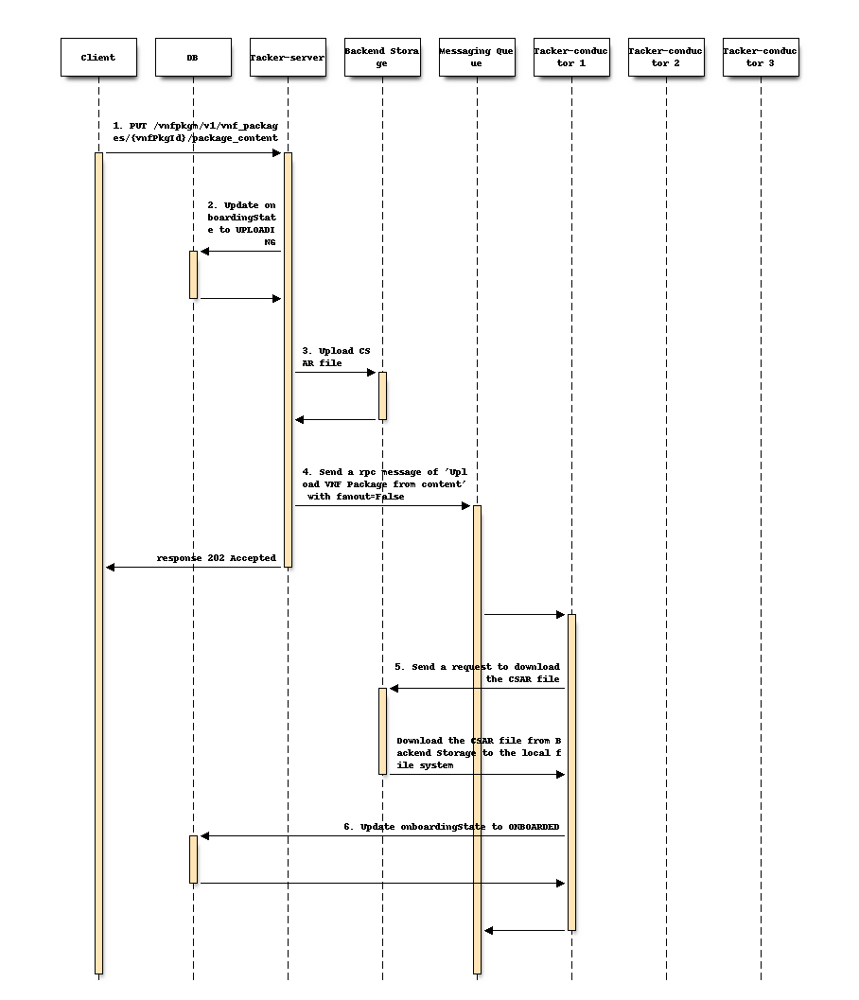
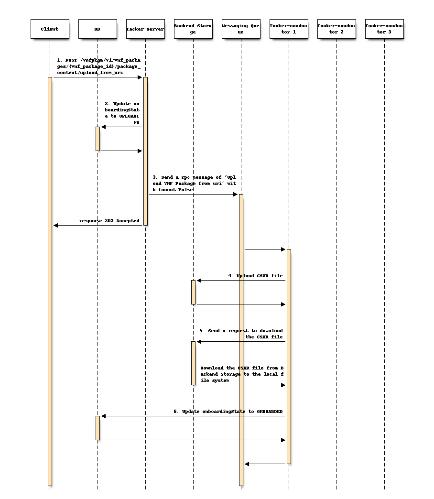
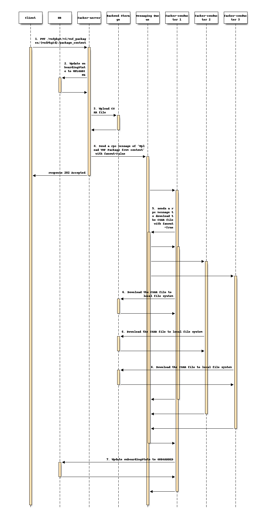
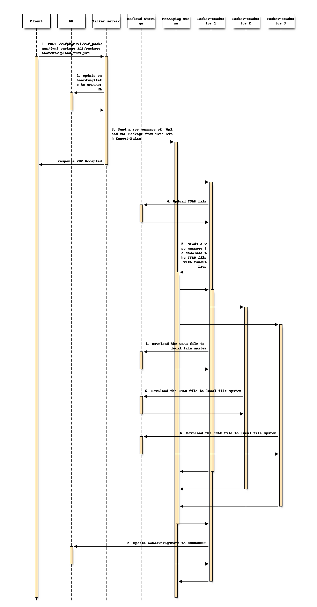
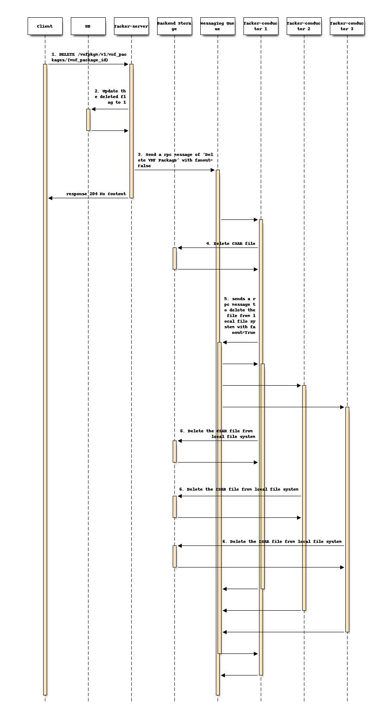

=====================================================
Support Onboarding In Multiple Conductors Environment
=====================================================

https://blueprints.launchpad.net/tacker/+spec/support-multi-conductors-onboarding

In current implementation,
onboarding process doesn't work when using Tacker as N-Act cluster.

This specification describes enhancement of managing VNF packages
by multiple Tacker conductors.

Problem description
===================

In current implementation, onboarding process are as follows.

- when receiving the
  "PUT /vnfpkgm/v1/vnf_packages/{vnfPkgId}/package_content" request.

  #. Tacker-server receives
     "PUT /vnfpkgm/v1/vnf_packages/{vnf_package_id}/package_content" request.

  #. Tacker-server updates the onboardingState on DB to "UPLOADING".

  #. Tacker-server uploads a CSAR file to a backend storage.

  #. Tacker-server sends a rpc message of
     `Upload VNF Package from content` with ``fanout=False``

  #. The Tacker-conductor that gets the message first downloads
     the CSAR file to its local file system.

  #. Tacker-server updates the onboardingState on DB to "ONBOARDED".

The sequence of the process is as follows.

- when receiving the "POST /vnfpkgm/v1/vnf_packages/{vnf_package_id}
  /package_content/upload_from_uri" request.

  #. Tacker-server receives "POST /vnfpkgm/v1/vnf_packages/
     {vnf_package_id}/package_content/upload_from_uri" request.

  #. Tacker-server updates the onboardingState on DB to "UPLOADING".

  #. Tacker-server sends a rpc message of
     `Upload VNF Package from uri` with ``fanout=False``.

  #. The Tacker-conductor that gets the message first
     uploads a CSAR file to a backend storage.

  #. The same Tacker-conductor downloads the CSAR file
     to its local file system.

  #. The same Tacker-conductor updates
     the onboardingState on DB to "ONBOARDED".

The sequence of the process is as follows.

.. note:: Configurations of a backend storage are defined in
          ``[glance_store]`` section in ``tacker.conf``.
          For example, the type of a backend storage is configured by
          ``stores`` in ``[glance_store]``.
          Configurations of a local file system for VNF packages are defined
          in  ``[vnf_package]`` section in ``tacker.conf``.
          For example, the path where vnf packages are downloaded
          is configured by ``vnf_package_csar_path`` in ``[vnf_package]``.

If conductors are running on multiple nodes,
the only conductor that will receive the onboarding request first
can download a CSAR file to its local file system
following the process above.
But other conductors that don't receive the request
can't download a CSAR file at the time,
and so these conductors can't operate instantiation
because they can't refer to the CSAR file.

Consider a user who wants to use external storage
such as Object Storage to store VNF packages
and make it shareable by multiple conductors,
it is necessary to enable all conductors to download CSAR files.

Proposed change
===============

We would enable all conductors in the N-Act cluster
to download a CSAR file at the onboarding process.

The process of onboarding VNF package
-------------------------------------

We would change the process of onboarding as follows.

- when receiving the "PUT /vnfpkgm/v1/vnf_packages/{vnf_package_id}/
  package_content" request.

  #. Tacker-server receives
     "PUT /vnfpkgm/v1/vnf_packages/{vnf_package_id}/package_content" request.

  #. Tacker-server updates the onboardingState to "UPLOADING".

  #. Tacker-server uploads a CSAR file to a backend storage.

  #. Tacker-server sends a rpc message of ``Upload VNF Package from content``
     with ``fanout=False`` to Tacker-conductor.

  #. The Tacker-conductor that gets the message first sends a rpc message to
     download the CSAR file with ``fanout=True`` to
     all Tacker-conductors including itself.

  #. All Tacker-conductors that get the message download the CSAR file to
     their local file system and return a result via rpc.

  #. The Tacker-conductor that sends a message to all Tacker-conductors
     updates the onboardingState to "ONBOARDED".

- when receiving the "POST /vnfpkgm/v1/vnf_packages/{vnf_package_id}/
  package_content/upload_from_uri" request.

  #. Tacker-server receives "POST /vnfpkgm/v1/vnf_packages/{vnf_package_id}
     /package_content/upload_from_uri" request.

  #. Tacker-server update the onboardingState to "UPLOADING".

  #. Tacker-server send a rpc message of
     ``Upload VNF Package from uri`` with ``fanout=False``

  #. The Tacker-conductor that gets the message first
     uploads a CSAR file to a backend storage.

  #. The same Tacker-conductor sends a rpc message to download the CSAR file
     with ``fanout=True`` to all Tacker-conductors including itself.

  #. All Tacker-conductors that get the message download the CSAR file to
     their local file system and return a result via rpc.

  #. The Tacker-conductor that sends a message to all Tacker-conductors
     updates the onboardingState to "ONBOARDED".

.. note:: If even one of the Tacker-conductor fails to download CSAR file,
          the ``onboardingState`` is not being updated to "ONBOARDED".

The process of deleting VNF packages
------------------------------------

We would change the process of deleting VNF packages as follows.

- when receiving "DELETE /vnfpkgm/v1/vnf_packages/{vnf_package_id}" request.

  #. Tacker-server receives
     "DELETE /vnfpkgm/v1/vnf_packages/{vnf_package_id}" request.

  #. Tacker-server update the delete flag of the related record to 1.

  #. Tacker-server send a rpc message of
     "Delete VNF Package" with ``fanout=False``.

  #. The Tacker-conductor that gets the message first
     delete the file from backend storage.

  #. The same Tacker-conductor send a rpc message to delete the file
     from local file system with ``fanout=True``
     to all Tacker-conductors including itself.

  #. All Tacker-conductors that get the message delete the file from
     their local file system and return a result via rpc.

If a Tacker-conductor is newly added to the cluster,
the following process should be executed
to download onboarded VNF package to its local file system.

#. The Tacker-conductor get the list of VNF packages
   whose state is `ONBOARDED`.

#. The Tacker-conductor downloads the VNF packages to its local file systems.

.. note:: Tacker-conductor must not receive any requests
          until the above process is completed.

Data model impact
-----------------

The `downloading` field is added to `VnfPackage` table.
This field counts the number of conductors downloading VNF packages
to determine whether all conductors could download or not.

* | **Table**: VnfPackage

  .. list-table::
    :header-rows: 1
    :widths: 18 10

    * - Name
      - Type
    * - downloading
      - int

REST API impact
---------------

None

Security impact
---------------

None

Notifications impact
--------------------

None

Other end user impact
---------------------

None

Performance Impact
------------------

None

Other deployer impact
---------------------

None

Developer impact
----------------
None

Implementation
==============

Assignee(s)
-----------

Primary assignee:
  Masaki Oyama <ma-ooyama@kddi.com>

Other contributors:
  Hitomi Koba <hi-koba@kddi.com>

  Yukihiro Kinjo <yu-kinjou@kddi.com>

  Xu Hongjin <ho-xu@kddi.com>

Work Items
----------
* Implement onboarding function
* Add unit test
* Add functional test

Dependencies
============

None

Testing
=======

Unit test and functional test will be added.

Documentation Impact
====================

None

References
==========

None
