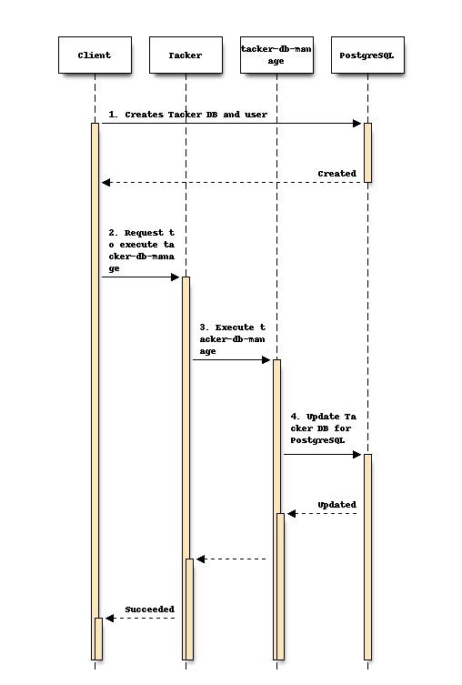

..
 This work is licensed under a Creative Commons Attribution 3.0 Unported
 License.
 http://creativecommons.org/licenses/by/3.0/legalcode

=======================================
Support PostgreSQL as Tacker DB backend
=======================================

.. Blueprints:

https://blueprints.launchpad.net/tacker/+spec/support-multidb-backend

This specification proposes tacker-db-manage improvements to
support Multi-DB backends, especially PostgreSQL as Tacker DB backend.

Problem description
===================

OpenStack Tacker has supported MySQL for database backends.
When initializing DB, ``tacker-db-manage`` upgrades the database and
run any corresponding database migrations to the DB backend type.

.. code-block:: console

  $ /usr/local/bin/tacker-db-manage --config-file \
  /etc/tacker/tacker.conf upgrade head

DevStack [#Dev-stack]_ that includes a set of scripts and utilities
to develop OpenStack environments also support MySQL and PostgreSQL.
However, the current Tacker and ``tacker-db-manage`` does not support
PostgreSQL and cause some practical errors due to differences
in the implementation between MySQL and PostgreSQL.

Proposed change
===============

This specification proposes the following changes.

- Support PostgreSQL by tacker-db-manage
- Support PostgreSQL by Tacker
- Add configuration to set PostgreSQL as Tacker DB backend
  and PostgreSQL install manuals to Tacker Installation Guide

Support PostgreSQL by tacker-db-manage
--------------------------------------

Add initialization functions for PostgreSQL
and adapt to the differences in the implementation
between MySQL and PostgreSQL. These functions will be
implemented by changing parameters or
using branching process in tacker-db-manage.

The following items will be fixed and added for PostgreSQL.

.. list-table::
  :widths: 40 50
  :header-rows: 1

  * - Problems
    - Implementations for PostgreSQL
  * - Boolean Type Error (MySQL use ``tinyint(1)`` as Boolean.)
    - Replace smallint(1).
  * - Text Type Error (PostgreSQL does not set upper value in TEXT(length).)
    - Replace VARCHAR(length).
  * - MEDIUMTEXT could not be used in PostgreSQL.
    - Replace TEXT.
  * - PostgreSQL ENUM type requires a name.
    - Add a name attribute (e.g name=`verbosity`).
  * - Json common functions (e.g, json_extract(), json_length()) could not be used in PostgreSQL.
    - Replace decode(), json_array_length() and json search methods.
  * - SQL words such as CHANGE and GENERATED could not be used in PostgreSQL.
    - Replace other SQL commands.
  * - ifnull() could not be used in PostgreSQL.
    - Replace coalesce().
  * - index ``auth_url`` does not exist in PostgreSQL.
    - Replace op.drop_constraint().

.. note::

  Tacker provides VNF version upgrading tools
  from v1 API to v2 API by ``tacker-db-manage`` [#Db-migration]_.
  However, PostgreSQL environments provided in this specification
  do not support VNF version upgrading functions.

Support PostgreSQL by Tacker
----------------------------

To support PostgreSQL, Tacker also needs to be fixed.
These functions will be implemented by changing parameters
or using branching process in Tacker.
The following items will be fixed and added.

.. list-table::
  :widths: 40 50
  :header-rows: 1

  * - Problems
    - Implementations for PostgreSQL
  * - jsonutils.dump_as_bytes() converts json to binary data.
    - Use jsonutils.dumps(value).
  * - <class `dict`> initialization is different (NULL and empty).
    - Support empty dict.
  * - Type comparison errors in ``deleted`` column.
    - Fix the type of comparison destinations.

Add configuration to set PostgreSQL as Tacker DB backend
--------------------------------------------------------

The configuration of PostgreSQL (`postgresql.conf`)
and Tacker (`tacker.conf`) also need to be changed
when Tacker uses PostgreSQL as a DB backend.

* postgresql.conf

.. code-block:: console

  $ vi /etc/postgresql/12/main/postgresql.conf
  bytea_output = 'escape'

* tacker.conf

.. code-block:: console

  $ vi /etc/tacker/tacker.conf
  [database]
  connection = postgresql://tacker:<POSTGRES_PASSWORD>@<POSTGRES_IP>/tacker?client_encoding=utf8

.. note::

  Since users need to set the above configurations by themselves when they use PostgreSQL,
  example configurations for PostgreSQL will be described in the Installation Guide.

Flow of initializing PostgreSQL as Tacker DB backend
----------------------------------------------------

The following sequence diagram describes initializing PostgreSQL as Tacker DB backend.

#. The Client creates Tacker DB and user in PostgreSQL.
#. The Client requests Tacker to execute tacker-db-manage
   for PostgreSQL.
#. Tacker executes tacker-db-manage.
#. Tacker-db-manage updates Tacker DB in PostgreSQL.

Data model impact
-----------------

None

REST API impact
---------------

None

Security impact
---------------

None

Notifications impact
--------------------

None

Other end user impact
---------------------

None

Performance Impact
------------------

None

Other deployer impact
---------------------

Deployer need to set the usage of PostgreSQL from tacker.conf.

Developer impact
----------------

When adding new tables to the Tacker DB in the future,
developer should support multi db such as MySQL and PostgreSQL.

Implementation
==============

Assignee(s)
-----------

Primary assignee:
  Yuta Kazato <yuta.kazato.nw@hco.ntt.co.jp>

Other contributors:
  Shun Higuchi <higuchis@intellilink.co.jp>

  Reina Yoshitani <yoshitanir@intellilink.co.jp>

  Tetsuro Kaneko <kaneko_te@tdc.co.jp>

Work Items
----------

* Add PostgreSQL migration functions to tacker-db-manage.
* Add PostgreSQL migration functions to Tacker.
* Add PostgreSQL install manuals to Tacker Installation Guide.

Dependencies
============

None

Testing
========

Unit test cases for tacker-db-manage and Tacker will be used.

Documentation Impact
====================

PostgreSQL configuration in Tacker Installation Guide will be added.

References
==========
.. [#Dev-stack]
  https://docs.openstack.org/devstack/latest/
.. [#Db-migration]
  https://docs.openstack.org/tacker/latest/user/db_migration_tool_usage_guide.html
