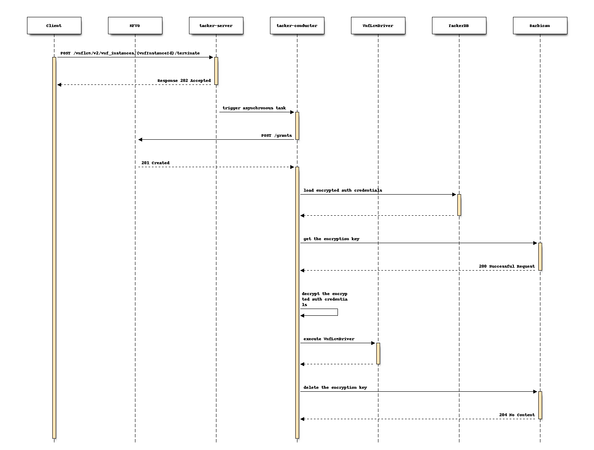

..
 This work is licensed under a Creative Commons Attribution 3.0 Unported
 License.

 http://creativecommons.org/licenses/by/3.0/legalcode

==============================================================
Support an external key manager for authentication credentials
==============================================================

This specification describes the encryption and decryption methods
for authentication credentials in Tacker by using an external key manager
service such as OpenStack Key Manager (barbican) [#OpenStack_Key_Manager]_.

Problem description
===================

Tacker stores some authentication credentials in Tacker DB.
However, in the case of the actual NFV operation of Tacker,
these information should be encrypted for secure NFV
management and security requirements to prevent
eavesdropping and data exploitation by attackers.

The following is a sample of VnfInstanceV2.vimConnectionInfo (Kubernetes):
authentication credentials are password, bearer_token and client_secret.

.. code-block::

  {
      "vim1": {
          "vimType": "ETSINFV.KUBERNETES.V_1",
          "accessInfo": {
              "username": "nfv_user",
              "password": "password",
              "bearer_token": "bearer_token",
              "client_secret": "client_secret"
          },
          "interfaceInfo": {
              "endpoint":"http://123.124.64.6:8443",
              "ssl_ca_cert": "ssl_ca_cert"
          }
      }
  }

This specification proposes an encryption and decryption implementations
using a common key scheme using "cryptography" library and an external
key management service to manage credentials and keys securely.

Proposed change
===============

The following changes will be proposed:

#. Add utility functions to integrate with an external key manager.
#. Add sample implementations with v2API and OpenStack Key Manager.
#. Add configuration options.

Add utility functions to integrate with an external key manager
---------------------------------------------------------------

Since Tacker stores sensitive credentials in multiple DB tables,
this specification will implement common utility functions to
encrypt and decrypt the credentials in cooperation with
an external key manager are required for both v1 and v2 API.

Examples of authentication credentials to be encrypted
~~~~~~~~~~~~~~~~~~~~~~~~~~~~~~~~~~~~~~~~~~~~~~~~~~~~~~

The following is a list of examples of authentication credentials
to be encrypted in Tacker.

* accessInfo in VimConnectionInfo:
  password, bearer_token, and client_secret

* paramsBasic and paramsOauth2ClientCredentials in authentication:
  password and clientPassword

* metadata.targetsInfo.authInfo in Prometheus Plugin:
  ssh_password

.. note::
  This function will use generically for other sensitive information too.

  We will analysis and add more detailed target data
  if new targets are found during our implementation.

common utility functions include three main roles:

1. Manage encryption keys in cooperation with an external key manager.
   It enables the registration and deletion of encryption keys.
2. Encrypt the authentication credentials using the encryption key
   and store them to Tacker DB.
3. Decrypt the authentication credentials stored in Tacker DB
   by the decryption key and use them for VNF operations.

Users can perform VNF operations without awareness of this process.
On the other hand, the authentication credential is encrypted in tacker DB
and the possibility of eavesdropping or data data exploitation is reduced.

Two types of encryption keys are created: master key and table key.
The table key is used to encrypt authentication information,
and the master key is used to encrypt the table key.
The table key is created when authentication information
is saved in the DB, and the master key is created when Tacker is started.
The table key and master key are stored in
a new table created to store the encryption key.

Add sample implementations with v2API and Barbican
--------------------------------------------------

In this specification, it implements a sample usecase for
encryption and decryption of authentication credentials
to integrates with barbican [#OpenStack_Key_Manager]_
in v2 API.

Example of proposed sequences in VNF LCM
~~~~~~~~~~~~~~~~~~~~~~~~~~~~~~~~~~~~~~~~
The following is an example of sequence for encryption and decryption
of authentication credentials in VNF LCM operations under consideration.

The following is a flow of Instantiation of a VNF instance
with barbican under consideration.

The following is a flow of Termination of a VNF instance
with barbican.

Add configuration options
--------------------------

As the function defined in this specification changes the default sequences,
it is suggested to add a configuration option to the
``tacker.conf`` file.
Therefore, users can choose whether to enable this function or not.

+ Boolean value of "use_credential_encryption"
  This parameter determines whether using encryption.

  Default value: "false"

+ String value of "keymanager_type"
  This parameter determines the type of external key management service.

  Default value: "barbican"

+ String value of "crypt_key_dir".
  This parameter specifies the path where the encryption key is stored.

  Default value: ""

  .. note::
    barbican will be supported in Tacker Bobcat cycle.
    If other external key management services will be supported in the future,
    this parameter allows the target service to be changed.

As a suggested implementation, when the ``use_credential_encryption`` is True,
the function of encryption and decryption of authentication credentials takes effect;
When ``use_credential_encryption`` is False, this function will not performed.

Alternatives
------------

None

Data model impact
-----------------

The key-related information (e.g., key type, key id)
of the external key manager needs to be added in the data model.

.. list-table::
  :widths: 15 10 30
  :header-rows: 1

  * - Attribute name
    - Data type
    - Parameter description
  * - id
    - String
    - id of key information (primary key)
  * - secret_uuid
    - String
    - uuid of master key registered in barbican
  * - encrypted_key
    - String
    - table key for tacker
  * - key_type
    - String
    - how to retain master key. local or barbican
  * - in_use
    - Boolean
    - Flag of the latest key is used

REST API impact
---------------

None

Security impact
---------------

If this change will be applied, the authentication credentials in Tacker DB
will be encrypted with the encryption key, so encryption keys must
be secured by an external key manager.
The option to store encryption keys in the local is also allowed,
but is deprecated in the production environment.

In addition, encryption keys need to be backup so that users can
decrypt the credentials in case of failure or disaster recovery.
The following is an example of key backup when using barbican [#OpenStack_Key_Manager]_
as an external key manager.

Key backup methods by Barbican
~~~~~~~~~~~~~~~~~~~~~~~~~~~~~~

The process for backup and restore of encryption keys will
vary depending on the type of backend.
Two separate components need to be backed up for simple
crypto back end: the Key Encryption Key (KEK) and the database.

* Backup and restore KEK.

For the simple crypto back end, to backup the ``barbican.conf`` file
that contains the master encryption key; KEK is written.
This file must be backed up to a security hardened location.
The actual data is stored in the Barbican database.

To restore the key from a backup, it needs to copy the restored
``barbican.conf`` over the existing ``barbican.conf``.

* Backup and restore the barbican database.

Run the following steps while logged in to the ``controller-0`` node.

1. Retrieve barbican user password
2. Backup the barbican database
3. Database backup is stored in ``/home/heat-admin``
4. Restore the databases

.. note::
  Only the user barbican has access to the barbican database.
  So the barbican user password is required to backup or
  restore the database.

  For more information, please refer to the
  OpenStack Key Manager backup documentation [#OpenStack_Key_Manager_Backup]_.

Notifications impact
--------------------

None

Other end user impact
---------------------

None

Performance Impact
------------------

Tacker needs to access an external key manager service for
both encryption and decryption of authentication credentials.
The performance impact might be ``LOW`` if there are few
cases to use the encrypted authentication credentials that
each time the Rest API is called.

However, the impact might be ``HIGH`` if it needs access to
an external key manager for every single data in the DB table.

Implementation policies need to be carefully decided.

Other deployer impact
---------------------

None

Developer impact
----------------

None

Implementation
==============

Assignee(s)
-----------

Primary assignee:
  Kenta Fukaya <kenta.fukaya@ntt.com>

  Yuta Kazato <yuta.kazato@ntt.com>

Other contributors:
  Yusuke Niimi <niimi.yusuke@fujitsu.com>

  Yoshiyuki Katada <katada.yoshiyuk@fujitsu.com>

  Ayumu Ueha <ueha.ayumu@fujitsu.com>

Work Items
----------

+ Implement Tacker to support:

  + Add utility functions to integrate with an external key manager
  + Add sample implementations with v2API and OpenStack Key Manager
  + Add a configuration option.

+ Add new unit and functional tests.
+ Write Tacker documentation to explain how to use
  the function described in this specification.

Dependencies
============

+ Encryption methods for authentication credentials

  Depends on Secret Stores API in barbican [#Barbican_Stores_API]_.

+ Decryption methods for authentication credentials

  Depends on Secret Get by UUID API in barbican [#Barbican_Get_API]_.

Testing
=======

Unit and functional tests will be added to cover cases required
in this specification.

Documentation Impact
====================

Add how to use external key management services via this function
to Tacker User guide.

References
==========

.. [#OpenStack_Key_Manager]
  https://docs.openstack.org/barbican/latest/
.. [#OpenStack_Key_Manager_Backup]
  https://access.redhat.com/documentation/en-us/red_hat_openstack_platform/17.0/html/manage_secrets_with_openstack_key_manager/assembly-managing-secrets-and-keys_rhosp
.. [#Barbican_Stores_API]
  https://docs.openstack.org/barbican/latest/api/reference/store_backends.html
.. [#Barbican_Get_API]
  https://docs.openstack.org/barbican/latest/api/reference/secrets.html
