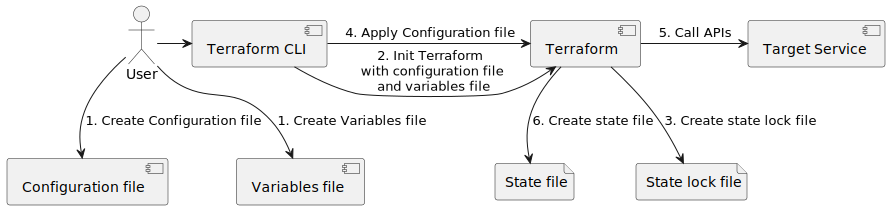
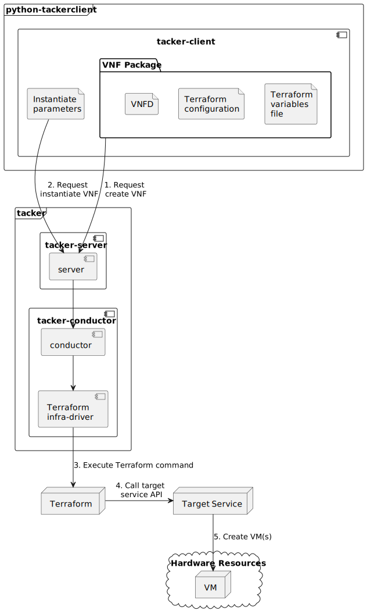
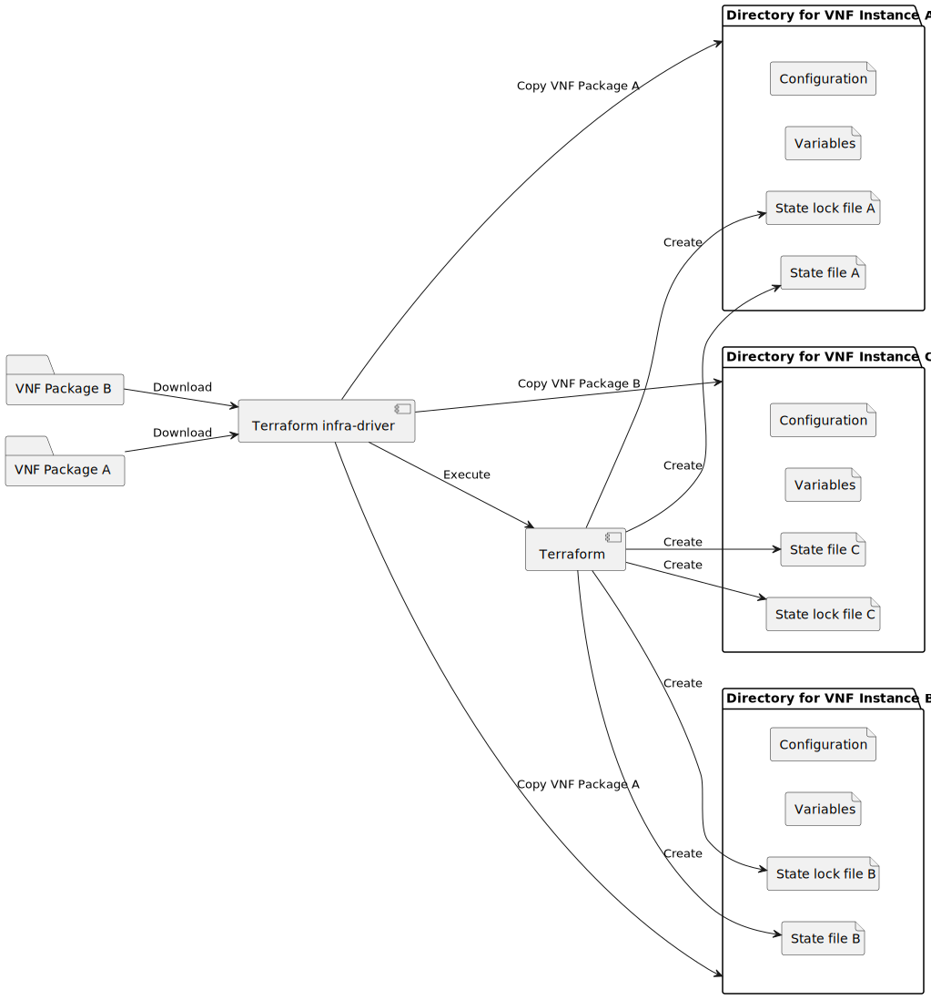

..
 This work is licensed under a Creative Commons Attribution 3.0 Unported
 License.

 http://creativecommons.org/licenses/by/3.0/legalcode


============================================================
Terraform Infra-driver for VNF Instantiation and Termination
============================================================

This specification describes Terraform Infra-driver in Tacker. The scope of the
present document includes VNF instantiation and termination with this new
infra-driver, using AWS as an example NFVI.

https://blueprints.launchpad.net/tacker/+spec/terraform-infra-driver


Problem description
===================

Tacker is designed as a G-VNFM that supports both VNF and CNF LCM. However,
OpenStack is the only platform where Tacker can deploy VNF among the variety of
cloud platforms. Given the recent multi-cloud trends in cloud computing, Tacker
have to overcome this potential disadvantage by implementing additional
infra-driver.


Proposed change
===============

This spec proposes to support Terraform infra-driver. Terraform [#terraform]_
is the de-facto standard in the IaC area, it's platform-agnostic, declarative
and open source. Using Terraform as a backend tool enables Tacker to create
virtual resources on several platforms that Terraform has already supported,
such as AWS. Terraform has its own configuration language to define virtual
resources, like manifest in Kubernetes or Helm chart in Helm. Users can easily
create VNF packages for Terraform infra-driver by including the configuration.

For this to happen, the following items have to be implemented.

* VNF Instantiation with Terraform Infra-driver
* VNF Termination with Terraform Infra-driver
* Adding DB table/field to store Terraform state (optional)
* Sample VNF packages for Terraform infra-driver
* Updating user document

Terraform
---------

HashiCorp Terraform is an infrastructure as code tool that lets you define both
cloud and on-prem resources in human-readable configuration files that you can
version, reuse, and share. Put simply, you can see Terraform as generic
OpenStack Heat that can be used among several cloud platforms. Terraform
supports a number of cloud infrastructure providers such as:

* Amazon Web Services
* Cloudflare
* Microsoft Azure
* IBM Cloud
* Serverspace
* Google Cloud Platform
* DigitalOcean
* Oracle Cloud Infrastructure
* Yandex.Cloud
* VMware vSphere
* OpenStack
* Kubernetes
* Helm

Terraform uses declarative configuration to describe the desired final state
and its client-side is provided only a CLI tool, similar to Helm. Therefore,
the basic architecture of Terraform infra-driver can be similar to Helm
infra-driver.

The following are the characteristics of Terraform:

#. Configuration file
    Terraform has its own language HCL for the resource definition. The files
    containing Terraform code are often called configuration files. These files
    correspond to the Helm chart in Helm.
#. Variables
    Terraform allows users to define variables in configuration files.
    Variables can be set as a file or parameters of Terraform CLI. This is a
    similar mechanism to the values in Helm.
#. State file and state lock file
    Terraform creates a state file and a state lock file [#tf_state]_ when
    Terraform creates actual resources. This might be the biggest difference
    from Helm. This state file records the information of resources created by
    Terraform. The state lock file prevents others from acquiring the lock and
    potentially corrupting your state in the case where multiple users manage
    the same resources with Terraform in different places.

.. note:: In Kubernetes, the state file corresponds to the resources on
   Kubernetes worker nodes which store all information of actual resources
   managed by Kubernetes. As there's no entity corresponding to the worker
   nodes, Terraform creates state files.

This figure shows the overview of the operation of Terraform, and input/output
files.



Terraform Infra-driver
----------------------

This figure shows an overview of Instantiate VNF with the Terraform
infra-driver. Terminate VNF is omitted as it is almost the same as the
Instantiate VNF.

Instantiate VNF consist of the following steps:

#. Request create VNF
    Users request create VNF with a VNF package that contains Terraform config
    and variable files in addition to VNFD.
#. Request instantiate VNF
    Users request instantiate VNF with an instantiate parameters that can
    overrides variables defined in Terraform variables file.
#. Execute Terraform command
    Terraform infra-driver executes terraform command to apply configuration
    files to Terraform.
#. Call target service API
    Terraform calls target service APIs according to the configuration file.
#. Create VM(s)
    Target service (e.g., OpenStack Nova, AWS EC2, etc) creates VM(s).



State file management
`````````````````````

Given that terraform config file is located in VNF packages, state files are
created and managed for each VNF instance. Terraform provides several options
(i.e., backend) to store the state file [#tf_state_backend]_. Based on the
available backend, the available options for Tacker are the following:

#. Store state files as a local file
#. Store state files in InstantiatedVnfInfo
#. Store state files in a new DB table/field
#. Store state files in Kubernetes Secret
#. Store state files in PostgresDB

The first option is the easiest way. As Tacker extracts a VNF package into a
local directory, we can place a state file in that local directory. However,
this makes creating more than one VNF instance from one VNF package almost
impossible. Thus, practically, we need to create another directory for each VNF
instance, copy all contents of a VNF package and keep the state file there.

If the first option is not possible, for example, there is no way to create
temporal directories, we can manage the state file on the InstantiatedVnfInfo
field. Since the data type of this field is structure [#sol003]_ and the state
file is written in JSON, we can directly store the state file in that field.
This field is also suitable in the sense that the lifecycle of the state file
matches that of the VNF Instance.

The rest of the options are not recommended as it incurs changes on the data
model of Tacker or requires another component to manage the state file.

This figure shows the basic idea of the first option.



State lock file management
``````````````````````````

Ideally, we can disable generating state lock files [#tf_lock]_ as Tacker is
only the entity that manages the resources associated with the instantiated
VNF. If we need to use the lock file, we have the similar options as the state
file as follows:

#. Store state files as a local file
#. Store state files in InstantiatedVnfInfo
#. Store state files in a new DB table/field

Alternatives
------------

Implementing infra-driver for individual platform can be an alternative.

Data model impact
-----------------

None. One possible reason for data model changes is to make new table/field to
store state and state lock files. As described in the State file management
section, we have several alternative ways.

REST API impact
---------------

None.

Security impact
---------------

Terraform uses sensitive data in some scenes. For example, Terraform requires
credentials to make API requests. In general, we can avoid exposure of
sensitive data by using environment variables. However, at the same time, we
need to carefully make configuration files.

Potential risks are listed as follows, but there can be more:

* Hardcoded credentials for the target services
* Hardcoded credentials for the backend of the state file [#tf_state_sec]_

See the best practice for details [#tf_sec]_

Notifications impact
--------------------

None. However, if state files are stored in InstantiatedVnfInfo, they can be
omitted from LcmOpOccNotification.

Other end user impact
---------------------

None.

Performance Impact
------------------

None. Terraform itself and the state file (might be located on DB) might use
storage, but it is negligibly small. As the infra-drivers are abstracted by
Tacker's VNF LCM driver, Terraform infra-driver does not affect to the overall
performance.


Other deployer impact
---------------------

After merging this feature, the following points must be considered:

* Users need to install Terraform when using Terraform infra-driver
* Tacker community should add installation of Terraform in Zuul to tests
  Terraform infra-driver

No effects on existing deployments as this is a new feature independent of the
existing ones.

Developer impact
----------------

* Developers may need to update Terraform infra-driver according to the update
  of Terraform.
* Developers may need to fix bugs of Terraform infra-driver caused by the
  Terraform.
* Developers may need to be careful to change other components than Terraform
  infra-driver, such as VNF package format, controllers, conductor, etc, so
  that it works in Terraform infra-driver.


Implementation
==============

Assignee(s)
-----------

Primary assignee:
  * Hiromu Asahina (hiromu) <hiromu.asahina@ntt.com> <hiromu.a5a@gmail.com>

Other contributors:
  * TBD

Work Items
----------

* VNF Instantiation with Terraform Infra-driver
* VNF Termination with Terraform Infra-driver
* Adding DB table/field to store Terraform state (optional)
* Sample VNF packages for Terraform infra-driver
* Updating user document


Dependencies
============

* Terraform v1.4.0 or later


Testing
=======

Terraform supports several providers including OpenStack [#tf_os]_, Kubernetes
[#tf_k8s]_, Docker [#tf_local]_ and local files [#tf_docker]_. The easiest way
is to use OpenStack in the functional tests. As terraform infra-driver is
transparent for VNF packages, its normality must not be affected by the
difference of used providers. In this sense, we can test its normality with
other available providers, such as Kubernetes, docker or local provider.

Alternatively, we can use LocalStack [#localstack]_ that acts as a stub of AWS
services.


Documentation Impact
====================

Need to explain the use cases of Terraform infra-driver.


References
==========

.. [#terraform] https://www.terraform.io/
.. [#tf_state] https://developer.hashicorp.com/terraform/language/state
.. [#tf_state_backend] https://developer.hashicorp.com/terraform/language/settings/backends/configuration#available-backends
.. [#sol003] https://www.etsi.org/deliver/etsi_gs/NFV-SOL/001_099/003/03.05.01_60/gs_NFV-SOL003v030501p.pdf
.. [#tf_lock] https://developer.hashicorp.com/terraform/language/state/locking
.. [#tf_os] https://registry.terraform.io/providers/terraform-provider-openstack/openstack/latest
.. [#tf_k8s] https://registry.terraform.io/providers/hashicorp/kubernetes/latest
.. [#tf_docker] https://registry.terraform.io/providers/kreuzwerker/docker/latest
.. [#tf_local] https://registry.terraform.io/providers/hashicorp/local/latest
.. [#tf_state_sec] https://developer.hashicorp.com/terraform/language/settings/backends/configuration#credentials-and-sensitive-data
.. [#tf_sec] https://cycode.com/7-terraform-security-best-practices/
.. [#localstack] https://localstack.cloud/
