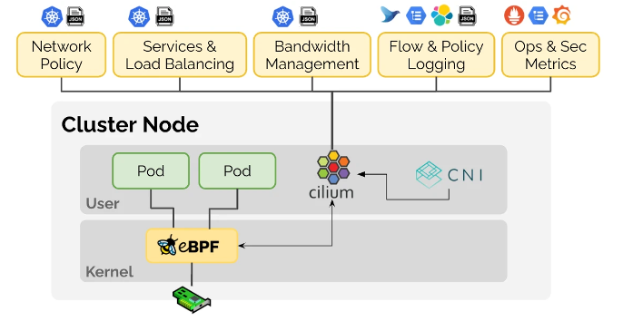
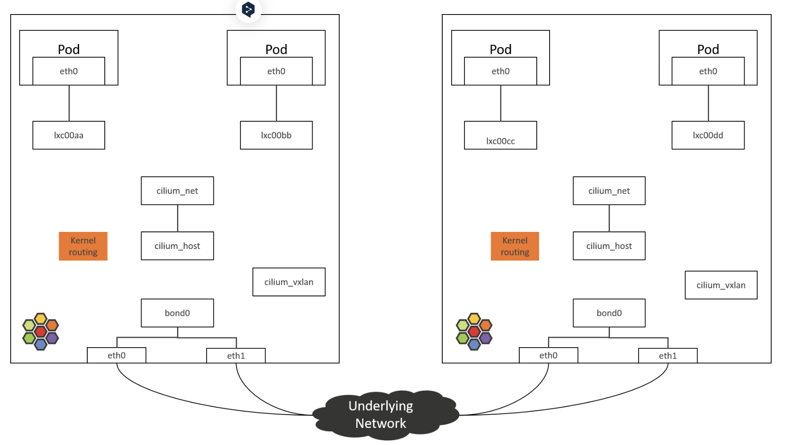
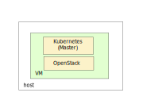
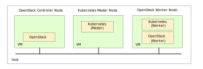
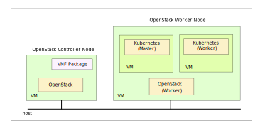

..
 This work is licensed under a Creative Commons Attribution 3.0 Unported
 License.

 http://creativecommons.org/licenses/by/3.0/legalcode

================================================================
Cilium CNI for high-performance network connectivity for VNF/CNF
================================================================

Introducing Cilium CNI for high-performance network connectivity for VNF/CNF.

https://blueprints.launchpad.net/tacker/+spec/intro-cilium

Problem description
===================

One of the pain point of tacker is that it hasn't been implemented any
network optimization mechanism by default while we've targeted vRAN usecases
in which high performance network connectivity is required.
It's available for VMs or containers to attach any dedicated hardware
acceleration device such as virtio or SR-IOV via neutron or OVN.

However, such a network acceleration technology is not so suitable for a
case in which so many entities are run on distributed nodes for covering
wide area of data plane. Especially for container usecase, it's more difficult
because implementation of virtual device is not so mature or routing is
not designed well as known as a complexity in service mesh.

Cilium is for providing, securing, and observing network connectivity between
workloads, fueled by the revolutionary Kernel technology eBPF [#cilium]_.
Although the performance of network throughput is less than other
technologies, it's still not so bad comparing with.

Use Cases
---------

Cilium supports several kind of usecases of networking including
high-performance CNI, L4 load-balancer or BGP based on eBPF technology.
One of the effective usage is to avoid a complexity of traditional service mesh
as described in the previous section.

Cilium Service Mesh is for replacing traditional service mesh frameworks
by the mesh layer directly into the kernel using eBPF without sidecar proxies.
It manages connectivity at both the networking and application protocol layers,
handling protocols like IP, TCP, UDP, HTTP, Kafka, gRPC, and DNS with greater
efficiency.

With Cilium's Cluster Mesh for multi-cluster networking, you can connect the
networks of multiple clusters in such as way that pods in each cluster can
discover and access services in all other clusters of the mesh,
provided all the clusters run Cilium as their CNI [#cilium_mesh]_.
This allows effectively joining multiple clusters into a large unified network,
regardless of the Kubernetes distribution or location each of them is running.

Although there are a lot of useful example usecases for Tacker's service
scope, we focus on the most basic usecases to be implemented as
samples in this spec.
In the all usecases, Tacker is able to deploy VNFs/CNFs on nodes in which
Cilium CNI is activated.

Single Kubernetes node on All-in-one devstack environment
^^^^^^^^^^^^^^^^^^^^^^^^^^^^^^^^^^^^^^^^^^^^^^^^^^^^^^^^^

The first usecase is to deploy a single Kubernetes node on all-in-one devstack
environment. It's one of the simplest usecase and supposed to mainly be used
for development for test Cilium networking.

Multi-nodes Kubernetes cluster on multi-node OpenStack
^^^^^^^^^^^^^^^^^^^^^^^^^^^^^^^^^^^^^^^^^^^^^^^^^^^^^^

The second usecase is to deploy a multi-node Kubernetes node on multiple
OpenStack nodes for running some more complex or realistic scenarios of
Cilium networking.

In this usecase, Kubernetes master node is separated from OpenStack controller
node because of duplicated default port of cilium and an OpenStack service.

Multi-nodes Kubernetes nodes from a VNF package
^^^^^^^^^^^^^^^^^^^^^^^^^^^^^^^^^^^^^^^^^^^^^^^

The final usecase in this spec is to deploy a multi-node Kubernetes node
deployed with Tacker's VNF package for auto-healing or auto-scaling
OpenStack nodes for running some more complex or realistic scenarios of
Cilium networking.
All Kubernetes services are on the OpenStack worker node.

Proposed change
===============

The purpose of this spec is to introduce simple usecases using Cilium
networking with eBPF or XDP.
We need to update devstack scripts for installing Cilium not only in
Tacker's repo but also
devstack-plugin-container's repo [#devstack-plugin-container]_.

In this updated devstack script, ``CONTAINER_ENGINE`` should be set to
CRI-O because Docker is not supported as the default runtime in Kubelet
anymore and causes a trouble sometimes.

Alternatives
------------

None

Data model impact
-----------------

None

REST API impact
---------------

None

Security impact
---------------

None

Notifications impact
--------------------

None

Other end user impact
---------------------

None

Performance Impact
------------------

None

Other deployer impact
---------------------

None

Developer impact
----------------

None

Upgrade impact
--------------

None

Implementation
==============

Assignee(s)
-----------

Primary assignee:

* Yasufumi Ogawa <yasufum.o@gmail.com> <yasufumi.ogawa@ntt.com>

Work Items
----------

* Replace container runtime from docker to CRI-O.
* Support devstack script for installing cilium CNI instead of flannel.
* Fix compatible combination of versions of Kubernetes, container runtime and
  golang.
* Disable kuryr-kubernetes.

Dependencies
============

None

Testing
=======

None

Documentation Impact
====================

* Update a devstack setup guides for setting up cilium.
* Add an overview of usecases as an introduction.
* Add each instruction of deployment for the usecases as a detailed
  instruction.
* Add a cilium usage guides for operators considering cases such as trouble
  shooting of cilium or using eBPF functionalities directly.

References
==========

.. [#cilium] https://cilium.io/
.. [#cilium_mesh] https://cilium.io/use-cases/cluster-mesh/
.. [#devstack-plugin-container] https://opendev.org/openstack/devstack-plugin-container
