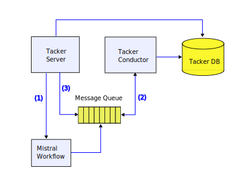
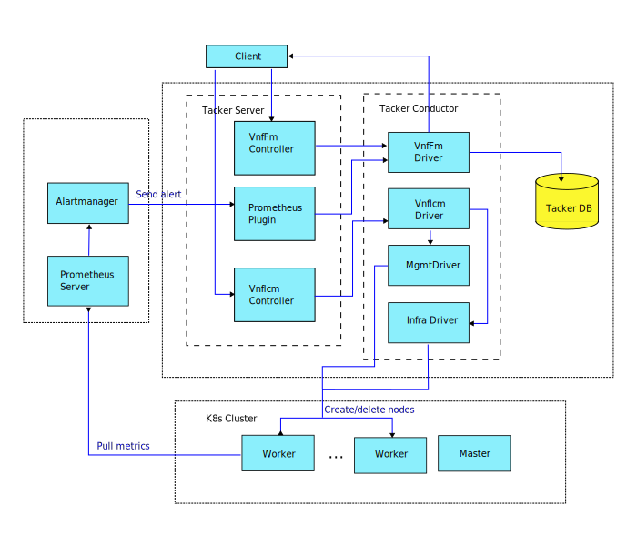
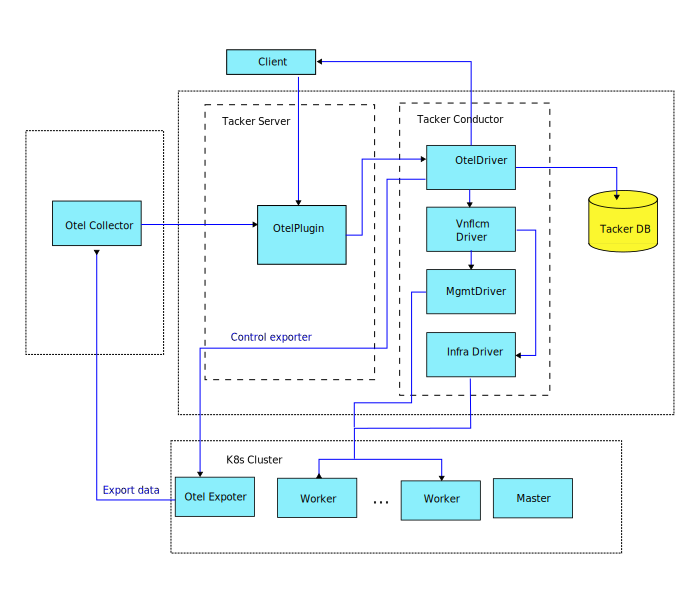

..
 This work is licensed under a Creative Commons Attribution 3.0 Unported
 License.

 http://creativecommons.org/licenses/by/3.0/legalcode

========================================
OpenTelemetry for monitoring VNF and CNF
========================================

OpenTelemetry is the one of the most popular observability framework
covering comprehensive usecases not only for VNF/CNF but also infra features.

https://blueprints.launchpad.net/tacker/+spec/otel-monitoring

Problem description
===================

In terms of tacker, there were some implementations for monitoring with
OpenStack services,
using mistral workflow service [#mistral]_ or
ceilometer alarming service [#ceilometer]_ for aiming
scalable VNF components before prometheus monitoring for auto-healing was
introduced in Yoga [#prometheus-plugin]_.
These monitoring plugins included in so called legacy tacker have been
dropped through the recent releases because such an old implementations
have not been maintained and
will not be supported anymore in ETSI-NFV based tacker.

The main purpose of introducing prometheus in Yoga was to support Fault
Management Interface defined in ETSI-NFV SOL 003 specification which enables
tacker to monitor VNFs are in good health and take an action if there is
something failure happened then, in other word, for auto-healing.
In Zed and next release, the feature has been improved additionally for
supporting Performance Management Interface for auto-scaling with
an external monitoring tool [#pmif-zed]_ [#pmif-202301]_.
So, it's ready to say tacker is compatible with FM/PM interfaces in
ETSI-NFV SOL specifications for now.

However, these monitoring feature is focusing on the standard and
the usecase is still limited for considering many other wide-spread
cases happened on large cloud based systems for which operators are
interested in. Only "monitoring" is not enough for such a systems,
but "observability" is required for maintaining highly distributed
and complex systems from operators.

OpenTelemetry, also known as OTel for short, is a vendor-neutral
open-source Observability framework for instrumenting, generating,
collecting, and exporting telemetry data such as traces, metrics, logs.
As an industry-standard, many vendors, integrated by many libraries,
services and apps and adopted by a number of end-users [#otel-doc].
This proposal to introducing OpenTelemetry to deploy observability
features [#otel-doc]_.

Use Cases
---------

In legacy tacker, monitoring is implemented as keep-alive like pinning
mechanism.
For example, the previous mistral workflow is for pinning registered
VIMs or VNFs [#mistral-plugin]_.
Here is a simple usecase of mistral based monitoring.
(1) Tacker server uploads a monitoring workflow, such as HTTP ping for a VNF,
which is passed to conductor via intermediate message queue.
(2) Then do the monitoring, and (3) remove the workflow.
It's legacy features will be dropped in near future even though it's enough
for such a simple usecase.

The next usecase is auto-healing with prometheus [#prometheus-plugin]_.
If some behavior indicating bad situation from prometheus is found, tacker
try to delete a failure node and create another one with VnfFm driver
and Vnflcm driver for healing.
This monitoring can be completely managed from client via ETSI-NFV compliance
APIs.

In terms of standardized manners of FM and PM, Prometheus based solution
in tacker is enough adapted to the requirements.
Although tacker should take care for design for intermediating Prometheus
and VIMs with tacker specific messaging and data formats.
It means we're required to many efforts if we will have more features than
current Prometheus based solution on different VIMs other than OpenStack
and Kubernetes. Such a requirements can be arisen for a usecase of using
multi-cloud systems for integrating services or so.
It also must be required to provide observability features for such a
complex usecase.

Proposed change
===============

The purpose of this spec is to introduce a driver for OpenTelemetry components
as a observability framework.
It provides following features which enable operators to get fine-grained
information used not only for automated resource management but also analyzing
very complex failure cases.

* Traces: It's for getting a big picture of what happens when a request is
  made to an application.

* Metric: Measurement of a service captured at runtime known as a metric event,
  which consists not only of the measurement itself, but also the time at
  which it was captured and associated metadata.

* Log: Timestamped text record, either structured (recommended) or
  unstructured, with metadata.

One of the typical usecase of OpenTelemetry is distributed trace.
It records the paths taken by requests (made by an application or end-user)
as they propagate through multi-service architectures.
Many Observability back-ends visualize traces as waterfall diagrams that may
look something like this:

.. image:: https://opentelemetry.io/img/waterfall-trace.svg
    :width: 90%

As described in the diagram below, OpenTelemetry supports several infras such
as Kubernetes or other major ones to collect data and sharing clients.

.. image:: https://opentelemetry.io/img/otel-diagram.svg
    :width: 90%

Tacker's otel driver is for deploying components of OpenTelemetry and
communicate with them for setup the components or collecting data.
The design of components in tacker is something similar to prometheus
plugin and driver, but different a little.

There are two key roles in Otel's components, ``Collector`` and ``Exporter``.

* ``Collector`` is a vendor-agnostic proxy that can receive, process, and
  export telemetry data.
  It supports receiving telemetry data in multiple formats
  (for example, OTLP, Jaeger, Prometheus, as well as many
  commercial/proprietary tools) and sending data to one or more backends.
  It also supports processing and filtering telemetry data before it gets
  exported.

* ``Exporter`` is to export your data to an OpenTelemetry Collector or a
  backend such as Jaeger, Zipkin, Prometheus or a vendor-specific one.

For the Exporter, it's controlled by ``OtelDriver`` in Tacker Conductor
and working for sending data to ``Otel Collector``.
``Otel Collector`` is like a manager of Exporters and aggregate the data
from the driver. The aggregated data is summarized or processed to be more
useful observability data.

From tacker, it should deploy Otel's components on any target node, on a host
or a guest on which VNFs deployed. So, tacker's otel driver should do that.
Unlike of prometheus plugin, all the data and APIs of OpenTelemetry are defined
as OpenTelemetry Specification [#otel-spec]_.
In Caracal, Tacker's plugin follows OpenTelemetry Specification version
1.27.0.

Alternatives
------------

None

Data model impact
-----------------

Each data required to be stored in tacker DB has an impact on.

REST API impact
---------------

Nothing without adding additional APIs than OpenTelemetry.

Security impact
---------------

Use of telemetry data must be limited to operators or maintainers.

Notifications impact
--------------------

None

Other end user impact
---------------------

None

Performance Impact
------------------

None

Other deployer impact
---------------------

None

Developer impact
----------------

None

Upgrade impact
--------------

None

Implementation
==============

Assignee(s)
-----------

Primary assignee:

* Yasufumi Ogawa <yasufum.o@gmail.com> <yasufumi.ogawa@ntt.com>

Work Items
----------

* Support devstack script to install OpenTelemetry components.
* Implement Otel plugin.
* Add unit and functional tests.
* Add docs for setup and usage guides of the plugin.

Dependencies
============

None

Testing
=======

Add both unit and functional tests. The test scenarios will be fixed.

Documentation Impact
====================

* Installation guide for tools of OpenTelemetry.
* Use case guide for a sample usage scenario.

References
==========

.. [#mistral] https://docs.openstack.org/mistral/latest/
.. [#ceilometer] https://docs.openstack.org/ceilometer/latest/
.. [#pmif-zed] https://specs.openstack.org/openstack/tacker-specs/specs/zed/prometheus-plugin-autoheal-and-autoscale.html
.. [#pmif-202301] https://specs.openstack.org/openstack/tacker-specs/specs/2023.1/vnfm-autoheal-and-autoscale.html
.. [#mistral-plugin] https://specs.openstack.org/openstack/tacker-specs/specs/pike/mistral_vim_monitor.html
.. [#prometheus-plugin] https://specs.openstack.org/openstack/tacker-specs/specs/yoga/prometheus-plugin-heal.html
.. [#otel-doc] https://opentelemetry.io/docs/
.. [#otel-spec] https://opentelemetry.io/docs/specs/

History
=======

None
