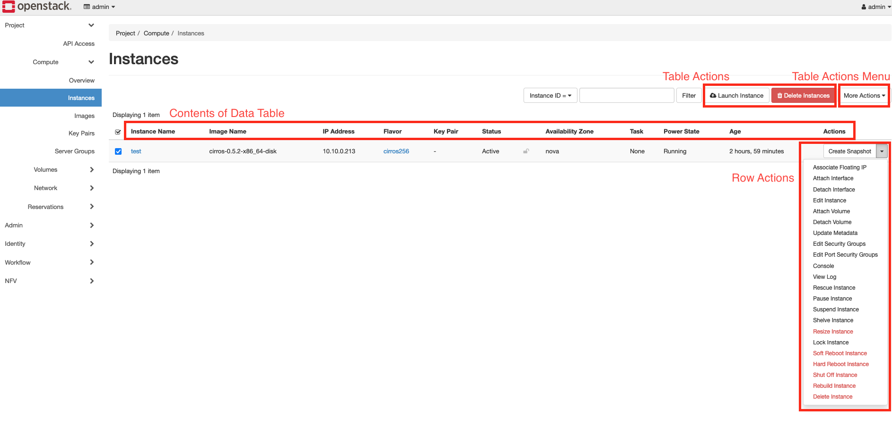
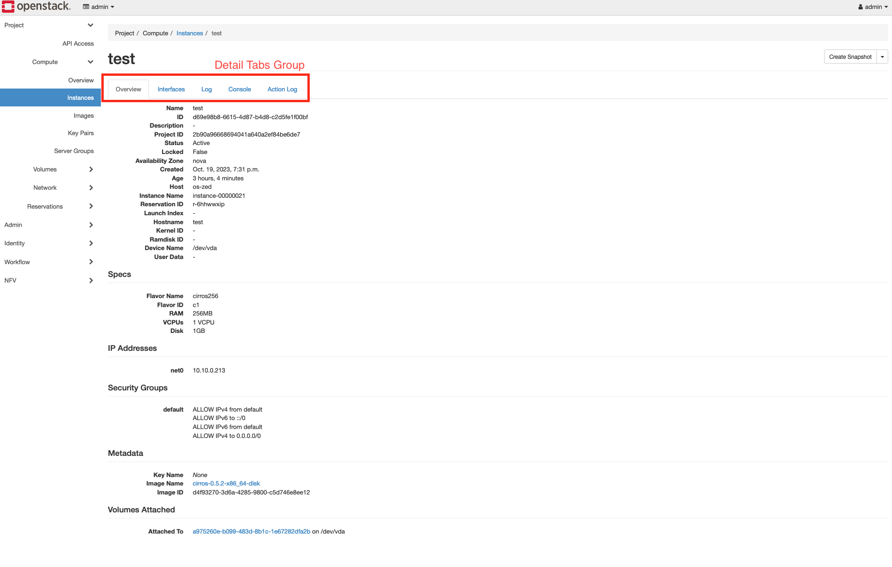
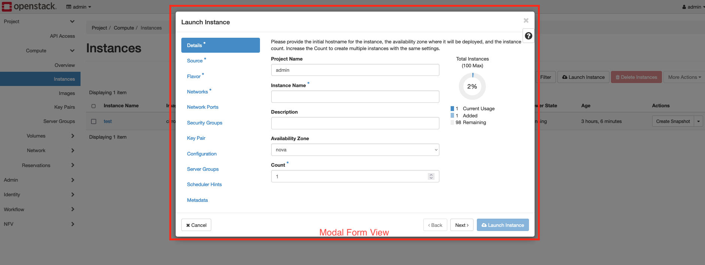
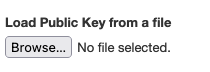
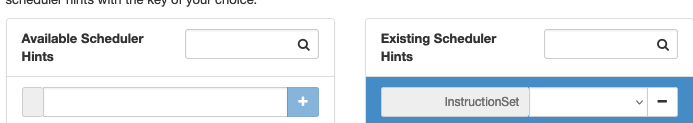
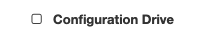
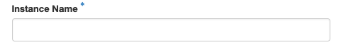
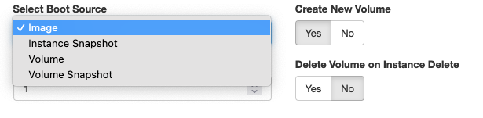
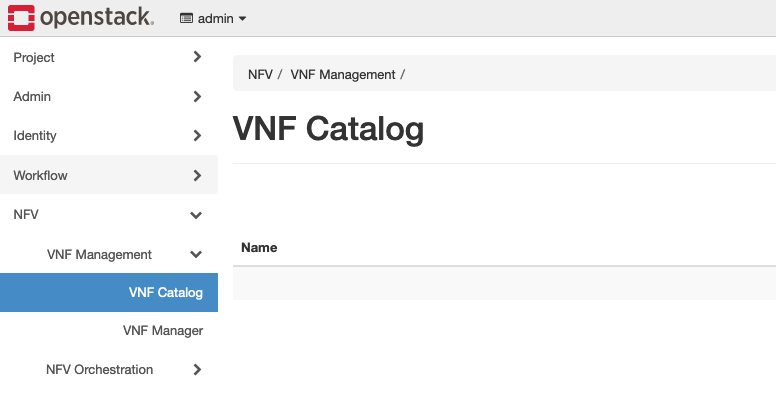
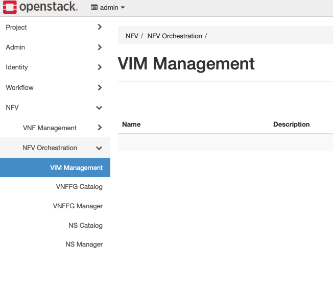

..
 This work is licensed under a Creative Commons Attribution 3.0 Unported
 License.

 http://creativecommons.org/licenses/by/3.0/legalcode

============================================
NFV Orchestration API v2.0 in Tacker Horizon
============================================

This specification proposes to support NFV Orchestration API v2.0 [#v2_api]_ in
Tacker horizon. The current tacker-horizon provides only features to call the
legacy APIs which are included in NFV Orchestration API v1.0. As the Tacker
community has announced the deprecation of the legacy API, we should update
them to the views to use the v2.0 API.

https://blueprints.launchpad.net/tacker/+spec/v2-api-horizon

Problem description
===================

Tacker has mainly two NFV Orchestration APIs: v1.0 and v2.0. Among them,
tacker-horizon only supports the Legacy Tacker API which is one of the v1.0
APIs consisting of three APIs, i.e., Legacy Tacker API, Virtualized Network
Function Packages (VNF packages) and Virtualized Network Function Lifecycle
Management Interface (VNF LCM). Although Tacker is defined to be called by API
clients like NFVO/EM and thus does not necessarily have to provide GUI, some
people who try to use Tacker for evaluation purposes get tacker-horizon first
[#paper_using_tacker]_. The current tacker-horizon gives them a
misunderstanding like Tacker performs as both NFVO/VNFM or does not comply with
ETSI NFV standard. To avoid such a situation, we need to update the
tacker-horizon.

Proposed change
===============

This spec proposes to update the tacker-horizon with the latest NFV
Orchestration API v2.0 listed below.

* Virtualized Network Function Lifecycle Management Interface (VNF LCM) v2
* Virtualized Network Function Fault Management Interface (VNF FM) v1
* Virtualized Network Function Performance Management Interface (VNF PM) v2

The following two APIs which are also included in the v2.0 API are out of scope
as they are only assumed to be called by monitoring tools like Prometheus.

* Prometheus Plugin Interface
* Fault Notification Interface

In addition, to manage VNF packages for testing purposes, this spec also
proposes to support Orchestration API v1.0, listed below.

* Virtualized Network Function Packages (VNF packages)

.. note::
  VNF package management is essentially an NFVO function, however in the
  experimental environment it is easier for VNFM to manage VNF packages by
  itself as NFVO might be unavailable.

The development steps are as follows.

#. Renaming the current dashboard panel groups (i.e., VNF Management and NFV
   Orchestration) to names clearly showing it as the legacy

#. (Optional) Adding deprecation warning to current panel groups

#. Adding a new methods to call v2.0 APIs to the tacker-client in the
   tacker-horizon

#. Adding and implementing a new panel group for v2.0 APIs

Terminology
-----------

Name of Elements
^^^^^^^^^^^^^^^^

The rest of the document uses the names of the elements described in the
following figures.

Input Field Type
^^^^^^^^^^^^^^^^

The following symbols are used to specify input field types.

**<File>:** Upload form

**Example:**

**<KeyValue>:** Key-Value from

**Example:**

**<Checkbox>:** Checkbox

**Example:**

**FIELD!:** FIELD is required

**Example:**

**[A|B]:** Options consisting of values A and B

**Example:**

.. note::
  Both buttons and the pull down menu shown above are accepted as a way to
  realize the options.

Current Tacker-horizon
----------------------

These images show the panel groups of the current tacker-horizon.

The structure of the NFV dashboard shown in the above images is described
below.

* VNF Management
    * VNF Catalog
    * VNF Manager
* NFV Orchestration
    * VIM Management
    * VNFFG Catalog
    * VNFFG Manager
    * NS Catalog
    * NS Manager

They all belong to the Legacy API, and thus will be deleted in the next few
cycles.

Proposed Tacker-horizon
-----------------------

The structure of the proposed tacker-horizon is described below. Basically,
Those panels are expected to implement the same features as corresponding CLI
commands [#tacker_cli]_.

* **VNF Packages**
* VNF LCM v2
    * VNF LCM
    * VNF OP OCC
    * LCCN Subscription
* VNF FM v1
    * Alarm
    * Subscription
* VNF PM v2
    * PM Job
    * PM Threshold

In the following part, the details of each panel are described.

VNF Packages
^^^^^^^^^^^^

Contents of Data Table
""""""""""""""""""""""

* ID
* VNF Product Name
* Onboarding State
* Usage State
* Operational State

Table Actions
"""""""""""""

* Upload VNF Package
* Delete VNF Packages

The Upload VNF Package action do Create VNF Package Info and Upload VNF
Package.

Row Actions
"""""""""""

* Fetch VNF Package
* Update VNF Package Info
* Delete VNF Package
* Create VNF Identifier

Table Actions Menu
""""""""""""""""""

None

Detail Tabs Group
"""""""""""""""""

* VNF Package Detail Tab
    * Additional Artifacts
    * Checksum
    * ID
    * Links
    * Onboarding State
    * Operational State
    * Software Images
    * Usage State
    * User Defined Data
    * VNF Product Name
    * VNF Provider
    * VNF Software Version
    * VNFD ID
    * VNFD Version

Modal Form View
"""""""""""""""

* Upload VNF Package
    * User Data <KeyValue>
    * URL
    * User Name
    * Password
    * VNF Package <File>
* Update VNF Package Info
    * Operational State
    * User Date <KeyValue>

VNF LCM v2/VNF LCM
^^^^^^^^^^^^^^^^^^

Contents of Data Table
""""""""""""""""""""""

* ID
* VNF Instance Name
* Instantiation State
* VNF Provider
* VNF Software Version
* VNF Product Name
* VNFD ID

Table Actions
"""""""""""""

* Create VNF Identifier
* Delete VNF Identifiers

Row Actions
"""""""""""

* Instantiate VNF
* Terminate VNF
* Delete VNF Identifier
* Heal VNF
* Update VNF
* Scale VNF
* Change External VNF Connectivity
* Change Current VNF Package

Table Actions Menu
""""""""""""""""""

None

Detail Tabs Group
"""""""""""""""""

* List LCM Operation Occurrences
    * ID
    * OperationState
    * VNFInstanceID
    * Operation
    * [Row Actions]
        * Rollback VNF Lifecycle Management Operation
        * Retry
        * Fail
* VNF Instance Detail Tab
    * ID
    * Instantiated Vnf Info
    * Instantiation State
    * Links
    * VIM Connection Info
    * VNF Instance Description
    * VNF Instance Name
    * VNF Product Name
    * VNF Provider
    * VNF Software Version
    * VNFD ID
    * VNFD Version

The detail tab for List LCM Operation Occurrences is redirected to the VNF
LCMOPOCC v2 panel. The List LCM Operation Occurrences filtered by the VNF
instance ID.

Modal Form View
"""""""""""""""

* Create VNF Identifier
    * VNFD ID!
    * Param File <File>
    * Name
    * Description
* Instantiate VNF
    * VNF Instance!
    * Param File! <File>
* Terminate VNF
    * Termination Type [GRACEFUL|FORCEFUL]
    * Graceful Termination Timeout
    * Delete VNF Instance <Checkbox>
* Heal VNF
    * Cause
    * VNFC Instance
* Update VNF
    * Param File! <File>
* Scale VNF
    * Type! [SCALE_IN|SCALE_OUT]
    * Aspect ID!
    * Number of Steps
    * Param File <File>
* Change External VNF Connectivity
    * Param File! <File>
* Change Current VNF Package
    * Param File! <File>

VNF LCM v2/VNF LCM OP OCC
^^^^^^^^^^^^^^^^^^^^^^^^^

Contents of Data Table
""""""""""""""""""""""

* ID
* OperationState
* VNFInstanceID
* Operation

Table Actions
"""""""""""""

* Rollback VNF Lifecycle Management Operation
* Retry
* Fail

Apply an action to multiple VNF OP OCCs.

Row Actions
"""""""""""

* Rollback VNF Lifecycle Management Operation
* Retry
* Fail

Table Actions Menu
""""""""""""""""""

None

Detail Tabs Group
"""""""""""""""""

* VNF OP OCC Detail Tab
    * CancelMode
    * ChangedExtConnectivity
    * ChangedInfo
    * Error
    * GrantID
    * ID
    * IsAutomaticInvocation
    * IsCancelPending
    * Links
    * Operation
    * OperationParams
    * OperationState
    * ResourceChanges
    * StartTime
    * StateEnteredTime
    * VnfInstanceID

Modal Form View
"""""""""""""""

None

VNF LCM v2/LCCN Subscription
^^^^^^^^^^^^^^^^^^^^^^^^^^^^

Contents of Data Table
""""""""""""""""""""""

* ID
* Callback URI

Table Actions
"""""""""""""

* Create Lccn Subscription
* Delete Lccn Subscriptions

Row Actions
"""""""""""

* Delete Lccn Subscription

Table Actions Menu
""""""""""""""""""

None

Detail Tabs Group
"""""""""""""""""

* LCCN Subscription Detail Tab
    * Callback URI
    * Filter
    * ID
    * Links

Modal Form View
"""""""""""""""

* Create Lccn Subscription
    * Param File! <File>

VNF FM v1/Subscription
^^^^^^^^^^^^^^^^^^^^^^

Contents of Data Table
""""""""""""""""""""""

* ID
* Callback Uri

Table Actions
"""""""""""""

* Create subscription
* Delete subscriptions

Row Actions
"""""""""""

* Delete subscription

Table Actions Menu
""""""""""""""""""

None

Detail Tabs Group
"""""""""""""""""

* VNF FM Subscription Detail Tab
    * Callback Uri Filter
    * ID
    * Links

Modal Form View
"""""""""""""""

* Create subscription
    * Param File! <File>

VNF FM v1/Alarm
^^^^^^^^^^^^^^^

Contents of Data Table
""""""""""""""""""""""

* ID
* Managed Object ID
* Ack State
* Event Type
* Perceived Severity
* Probable Cause

Table Actions
"""""""""""""

None

Row Actions
"""""""""""

* Update alarm

Table Actions Menu
""""""""""""""""""

None

Detail Tabs Group
"""""""""""""""""

* VNF FM Alarm Detail Tab
    * Ack State
    * Alarm Acknowledged Time
    * Alarm Changed Time
    * Alarm Cleared Time
    * Alarm Raised Time
    * Correlated Alarm IDs
    * Event Time
    * Event Type
    * Fault Details
    * Fault Type
    * ID
    * Is Root Cause
    * Links
    * Managed Object ID
    * Perceived Severity
    * Probable Cause
    * Root Cause Faulty Resource
    * VNFC Instance IDs

Modal Form View
"""""""""""""""

* Update alarm
    * VNF FM Alarm ID!
    * ACK State! [ACKNOWLEDGED|UNACKNOWLEDGED]

VNF PM v2/PM Job
^^^^^^^^^^^^^^^^

Contents of Data Table
""""""""""""""""""""""

* ID
* Object Type
* Links

Table Actions
"""""""""""""

* Create PM Job
* Delete PM Jobs

Row Actions
"""""""""""

* Update PM Job
* Delete PM Job

Table Actions Menu
""""""""""""""""""

None

Detail Tabs Group
"""""""""""""""""

* VNF PM Job Detail Tab
    * Callback URI
    * Criteria
    * ID
    * Links
    * Object Instance IDs
    * Object Type
    * Reports
    * Sub Object Instance IDs
* PM Job Reports
    * Entries

The PM Job Reports lists the details of reports from Reports field of the PM
Job.

Modal Form View
"""""""""""""""

* Create PM Job
    * Param File! <File>
* Update PM Job
    * Param File! <File>

VNF PM v2/PM Threshold
^^^^^^^^^^^^^^^^^^^^^^

Contents of Data Table
""""""""""""""""""""""

* ID
* Object Type
* Links

Table Actions
"""""""""""""

* Create PM Threshold
* Delete PM Thresholds

Row Actions
"""""""""""

* Update PM Threshold
* Delete PM Threshold

Table Actions Menu
""""""""""""""""""

None

Detail Tabs Group
"""""""""""""""""

* VNF PM Threshold Detail Tab
    * Callback URI
    * Criteria
    * ID
    * Links
    * Object Instance IDs
    * Object Type
    * Sub Object Instance IDs

Modal Form View
"""""""""""""""

* Create PM Threshold
    * Param File! <File>
* Update PM Threshold
    * Param File! <File>

Discussion
----------

* You need to decide whether to maintain VIM management

* Forms to generate the Param Files can be implemented in future releases, but
  not in this cycle

Alternatives
------------

Just announcing the tacker-horizon doesn't support the latest 2.0 APIs.

Data model impact
-----------------

None.

REST API impact
---------------

None.

Security impact
---------------

None.

Notifications impact
--------------------

None.

Other end user impact
---------------------

Tacker users who use the current tacker-horizon will be affected.

Performance Impact
------------------

None.

Other deployer impact
---------------------

Tacker users who use the current tacker-horizon will be affected.

Developer impact
----------------

We need to maintain tacker-horizon along with the server-side APIs.

Implementation
==============

Assignee(s)
-----------

Primary assignee:
  * Hiromu Asahina (hiromu) <hiromu.asahina@ntt.com> <hiromu.a5a@gmail.com>

Other contributors:
  * TBD

Work Items
----------

#. Renaming the current dashboard panel groups (i.e., VNF Management and NFV
   Orchestration) to names clearly showing it as the legacy

#. (Optional) Adding deprecation warning to current panel groups

#. Adding a new methods to call v2.0 APIs to the tacker-client in the
   tacker-horizon

#. Adding and implementing a new panel group for v2.0 APIs

Dependencies
============

None

Testing
=======

Testing tacker-horizon has already been proposed in another BP and is out of scope of this document.

Documentation Impact
====================

None.

References
==========

.. [#v2_api] https://docs.openstack.org/api-ref/nfv-orchestration/v2/vnflcm.html
.. [#paper_using_tacker] Lakshmanan S, Zhang M, Majumdar S, Jarraya Y, Pourzandi M, Wang L. Caught-in-Translation (CiT): Detecting Cross-level Inconsistency Attacks in Network Functions Virtualization (NFV). IEEE Transactions on Dependable and Secure Computing. 2023 Sep 29.
.. [#bp_horizon_testing] https://blueprints.launchpad.net/tacker/+spec/tacker-horizon-unittests
.. [#tacker_cli] https://docs.openstack.org/tacker/latest/cli/index.html
