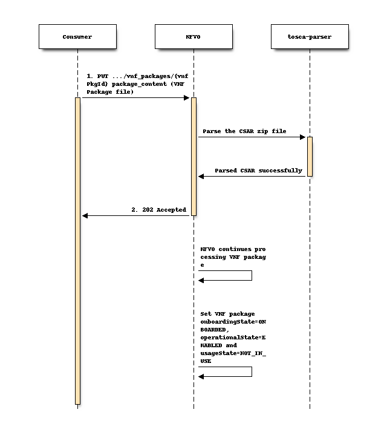

==========================================
Support VNF package (TOSCA CSAR) in Tacker
==========================================
https://blueprints.launchpad.net/tacker/+spec/tosca-csar-mgmt-driver

This specification describes onboarding VNF Packages in Tacker.

Problem description
===================

Currently, Tacker is able to onboard VNF descriptors using files in YAML
format. VNF Package is not supported (but it is possible to use files
with ‘csar’, Cloud Service Archive, extension in horizon-tacker).

The Cloud Service Archive (CSAR) is a package described in
TOSCA-Simple-Profile-YAML-v1.2 [#tosca]_ and VNF Package extends CSAR for
NFV in ETSI GS NFV-SOL 004 [#etsi_sol004]_. TOSCA Simple Profile
definitions along with all accompanying artifacts (e.g. scripts,
binaries, configuration files) can be packaged together in a CSAR file.

The CSAR file is an archive file using the ZIP file format whose
structure complies with the TOSCA Simple Profile YAML v1.1
Specification. The CSAR file may have one of the two following
structures:

#. CSAR containing a TOSCA-Metadata directory, which includes the TOSCA.meta
   metadata file providing an entry information for processing a CSAR file
   as defined in TOSCA v1.0 Specification.
#. CSAR containing a single yaml (.yml or .yaml) file at the root of the
   archive. The yaml file is a TOSCA definition template that contains a
   metadata section with template_name and template_version metadata.
   This file is the CSAR Entry-Definitions file.

VNF Package also shall contain the VNFD and many extra files needed for
successful deployment or used in a TOSCA template and configurations:

* Metadata file that provides entry information for a TOSCA orchestrator
* VNFD files as the main TOSCA definitions of the VNF
* The manifest file is the key for a decision regarding a VNF package
  integrity and validity in terms of its contained artifacts.
* The change history file describing any change of the VNF Package
* Licensing information for the released VNF
* Virtual machine images
* Configuration artifacts
* Monitoring configurations
* Testing files
* The certification file
* Non-MANO artifact sets

VNF Packages are essential for most VNF and NS that contain a lot of
artifacts, security sensitive data, and etc. The lack of support for VNF
Packages makes Tacker incompatible with most modern VNF descriptors.

The goal here is to implement the functionality in Tacker and provide
interfaces for onboarding and deploying VNF Package files.

Proposed change
===============

The changes needed to Tacker in order to accommodate this new feature
will include changes to following components:

* Tacker API service: Add new APIs for managing VNF csar packages.
* TOSCA-Parser: Tosca-parser supports reading CSAR package. Make suitable
  changes to the parser for creating topology template object as per tosca
  simple definition version 1.2..
* Add new commands to support management of VNF csar packages using
  python-openstackclient.
* Tacker-horizon: Add a new interface to support management of VNF csar
  packages.
* Tacker-conductor service: Uploading and processing of vnf packages will be
  done by tacker-conductor service. When a request to upload a VNF package
  is received by the tacker API service on the controller node, the
  responsibility of uploading and extraction of the CSAR file will be assigned
  to the tacker-conductor service using new RPC API calls. The CSAR file will
  be uploaded in the glance store (in case of multiple controller node
  deployment we need to make csar file available on all nodes) and later it
  will be downloaded from glance store and extracted in the path configurable
  using a new config option ``vnf_package_csar_path`` so that any subsequent
  calls to fetch VNF packages doesn't require to download CSAR file from
  glance_store again and again.

.. note:: In tacker.conf, a new section ``glance_store`` will be added to
          configure the backend to be used for storing the vnf packages csar
          zip file. In case of ``default_store`` is set to filesystem or file,
          we recommend to configure ``filesystem_store_datadir`` option on
          shared storage in case you plan to deploy tacker API and
          tacker-conductor services on multiple controller nodes.

Changes include:

* Implement 2-stage onboarding of VNF Package file according to ETSI GS
  NFV-SOL 005 specification [#etsi_sol005]_:

  * Create a new individual VNF package resource.
  * Upload a VNF package by providing the content of the VNF package.

* Support for new endpoints according to ETSI GS NFV-SOL 005
  [#etsi_sol005]_ specification for getting and removing VNF packages.

* Add the ability to use VNF Packages in Tacker for on-boarding and
  deploying:

  * Make changes to Tacker-horizon: add a field to specify user defined
    data if necessary (e.g. management driver) and change the southbound
    API to new endpoints.
  * Add new commands in python-openstackclient to use new Tacker-server
    REST APIs.
  * Make necessary changes to Tacker-server.

.. code-block:: console

    +------------+         +--------------+         +---------------+
    |            |         |              |         |               |
    |    VNF     |         |              |         |     Tacker    |
    |  Package   +--------->    Horizon   +--------->     Client    |--+
    |            |         |              |         |               |  |
    +------------+         +--------------+         +-------+-------+  |
                                                            |          |
    +--------------------------------+                      |          |
    |              Tacker            |                      |          |
    |   +------------+               |                      |          |
    |   |            <---------------|----------------------+          |
    |   |    REST    |               |1. POST /vnfpkgm/v1/vnf_packages |
    |   | Controller |               |                                 |
    |   |            <---------------|---------------------------------+
    |   +--+---------+               |2. PUT /vnfpkgm/v1/vnf_packages/{vnfPkgId}/package_content
    |      |                         |
    |      |                         |
    |      |  +--------------------+ |
    |      |  |    NFVO Plugin     | |       +----------------------+
    |      |  | +----------------+ | |       |       Libraries      |
    |      +----> create_package | | |       |   +--------------+   |
    |      |  | +----------------+ | |       |   |    TOSCA     |   |
    |      |  |                    +------------->    PARSER    |   |
    |      |  | +----------------+ | |       |   +--------------+   |
    |      +----> upload_content | | |       +----------------------+
    |         | +----------------+ | |
    |         +--------------------+ |
    +--------------------------------+

VNF Package state model
-----------------------

VNF Package has three state, i.e. onboardingState, operationalState and
usageState.

The onboardingState can take below values:

* CREATED: The VNF Package information object is created.
* UPLOADING: The VNF Package is being uploaded.
* PROCESSING: The VNF Package is being processed, e.g. validation.
* ONBOARDED: The VNF Package is successfully on-boarded.

The operationalState can take below values:

* ENABLED: The VNF Package is enabled.
* DISABLED: The VNF Package is disabled.

The usageState can take below values:

* IN_USE: The VNF Package is in use.
* NOT_IN_USE: The VNF Package is not in use.

See ETSI GS NFV-SOL 005 [#etsi_sol005]_ Figure B.2.2-1 for state
transions of these three states.

Flow of uploading of VNF package content
----------------------------------------

Precondition: The individual VNF package resource has been created with
the value of "onboardingState" attribute equals to "CREATED".

Uploading the content of a VNF package, as illustrated in above sequence
diagram, consists of the following steps:

#. Consumer sends a PUT request to the "VNF package content" resource
   including in the payload body a copy of the VNF package content.
#. The CSAR file will be validated using tosca-parser. If it finds any errors,
   then it will raise 400 error.
#. The NFVO returns a "202 Accepted" response with an empty payload body if
   validation succeeds.
#. The NFVO continues processing the VNF package populating various db tables
   with the required information.

Postcondition: Upon successful completion, the content of the VNF
package is on-boarded. And the state of the VNF package is changed as
follows: the value of the "onboardingState" attribute equals to
"ONBOARDED", the value of the "operationalState" attribute equals to
"ENABLED" and the value of the "usageState" attribute equals to
"NOT_IN_USE".

Error handling: In case of failure, appropriate error information is
provided in the response.

.. note:: Images and flavors will be created when user will instantiate
          VNF using uploaded VNF Package.

When user will upload the CSAR package_contents, it will be extracted in
the folder which will be configurable with a new config option
``vnf_package_csar_path``. Inside this folder, it will create a new
folder with name equal to ``vnfPkgId`` of the uploaded package. The
details of package contents will be stored in the db schema except
actual files as described in `Data model Impact`_. The CSAR file
contents will be stored using glance_store library which supports a wide
array of storages like Swift, FileSystem, HTTP, Ceph etc. Once the CSAR
file is extracted in the configurable path, it will remain there till
vnf_package is deleted. In case, the vnf_package contents are not
present in the configurable path, it will get the csar zip file from
glance_store and extract it for further processsing in the configurable
path..

.. code-block:: console

    +----------------------------+
    |    Server file storage     |
    |----------------------------|
    |                            |
    | /var/lib/tacker/<vnfPkgId> |
    |   -- TOSCA-Metadata        |
    |   -- definitions           |
    |   -- implementations       |
    |   -- ...                   |
    +----------------------------+

Data model Impact
-----------------

Add below new tables in 'tacker' database. The corresponding schemas are
detailed below:-

vnf_packages::
  `id` varchar(36) Pri

  `onboarding_state` varchar(255) NOT NULL

  `operational_state` varchar(255) NOT NULL

  `usage_state` varchar(255) NOT NULL

  `created_at` datetime NOT NULL

  `updated_at` datetime NULL

  `deleted_at` datetime NULL

  `deleted` tinyint(1) NULL

  `tenant_id` varchar(64) NOT NULL

  `algorithm` varchar(64) NULL

  `hash` text varchar(128) NULL

  `location_glance_store` text NULL

  This table will have `id` as primary key.

vnf_packages_user_data::
  `id` int(11) Pri, auto_increment

  `package_uuid` varchar(36) NOT NULL

  `key` varchar(255) NOT NULL

  `value` varchar(255) NOT NULL

  `created_at` datetime NOT NULL

  `updated_at` datetime NULL

  `deleted_at` datetime NULL

  `deleted` tinyint(1) NULL

  This table will have `id` as primary key. `package_uuid` will be foreign
  key of `vnf_packages`.`id`.

vnf_package_vnfd::
  `id` int(11) Pri, auto_increment

  `package_uuid` varchar(36) NOT NULL

  `vnfd_id` varchar(36) Unique, NOT NULL

  `vnf_provider` varchar(255), NOT NULL

  `vnf_product_name` varchar(255), NOT NULL

  `vnf_software_version` varchar(255), NOT NULL

  `vnfd_version` varchar(255), NOT NULL

  `created_at` datetime NOT NULL

  `updated_at` datetime NULL

  `deleted_at` datetime NULL

  `deleted` tinyint(1) NULL

  This table will have `id` as primary key. `package_uuid` will be foreign
  key of `vnf_packages`.`id`.

  note::
    The existing `vnfd` db tables will not used here. When the VNF
    Package will be uploaded, it will read the VNFD files and store
    basic information in this table like ``vnf_product_name``,
    ``vnf_software_version`` etc which can be returned when user will
    query information about an individual VNF package without the need
    to read that particular information from the VNF Package file

vnf_deployment_flavours::
  `id` varchar(36) Pri, NOT NULL

  `package_uuid` varchar(36) NOT NULL

  `flavour_id` varchar(255) NOT NULL

  `flavour_description` text NOT NULL

  `instantiation_levels` text NULL

  `created_at` datetime NOT NULL

  `updated_at` datetime NULL

  `deleted_at` datetime NULL

  `deleted` tinyint(1) NULL

  This table will have `id` as primary key. `package_uuid` will be foreign
  key of `vnf_packages`.`id`.

vnf_software_images::
  `id` varchar(36) Pri, NOT NULL

  `software_image_id` varchar(255) NOT NULL # VDU Name

  `flavour_uuid` varchar(36) NOT NULL

  `name` varchar(255) NOT NULL

  `provider` varchar(255) NOT NULL

  `version` varchar(255) NOT NULL

  `algorithm` varchar(64) NOT NULL

  `hash` text varchar(128) NOT NULL

  `container_format` varchar(20) NOT NULL

  `disk_format` varchar(20) NOT NULL

  `min_disk` int(11) NOT NULL

  `min_ram` int(11) NOT NULL

  `size` bigint(20) NOT NULL

  `image_path` text NOT NULL

  `created_at` datetime NOT NULL

  `updated_at` datetime NULL

  `deleted_at` datetime NULL

  `deleted` tinyint(1) NULL

  This table will have `id` as primary key. `flavour_uuid` will be foreign
  key of `vnf_deployment_flavours`.`id`.

vnf_software_image_metadata::
  `id` int(11) Pri, auto_increment

  `image_uuid` varchar(36) NOT NULL

  `key` varchar(255) NOT NULL

  `value` varchar(255) NOT NULL

  `created_at` datetime NOT NULL

  `updated_at` datetime NULL

  `deleted_at` datetime NULL

  `deleted` tinyint(1) NULL

  This table will have `id` as primary key. `image_uuid` will be foreign
  key of `vnf_software_images.`id`.

Upgrade tacker Database to HEAD  version
------------------------------------------------

.. code-block:: console

   tacker-db-manage --config-file /etc/tacker/tacker.conf upgrade HEAD

..

REST API impact
===============

Below new RestFul APIs will be added:-

+-------------------------+-----------------------------------------------------+-------------+----------------------------------------+--------------------------+
| Resource name           | Resource URI                                        | HTTP Method | Meaning                                | Response Codes           |
+=========================+=====================================================+=============+========================================+==========================+
| VNF packages            | /vnfpkgm/v1/vnf_packages                            | GET         | Query VNF packages information         | Success: 200             |
|                         |                                                     |             |                                        | Error: 401, 403          |
|                         |                                                     +-------------+----------------------------------------+--------------------------+
|                         |                                                     | POST        | Create a new individual VNF package    | Success: 201             |
|                         |                                                     |             | resource                               | Error: 400, 401, 403     |
+-------------------------+-----------------------------------------------------+-------------+----------------------------------------+--------------------------+
| Individual VNF package  | /vnfpkgm/v1/vnf_packages/{vnfPkgId}                 | GET         | Read information about an individual   | Success: 200             |
|                         |                                                     |             | VNF package                            | Error: 401, 403, 404     |
|                         |                                                     +-------------+----------------------------------------+--------------------------+
|                         |                                                     | DELETE      | Delete an individual VNF package       | Success: 204             |
|                         |                                                     |             |                                        | Error: 401, 302,404      |
+-------------------------+-----------------------------------------------------+-------------+----------------------------------------+--------------------------+
| VNF package content     | /vnfpkgm/v1/vnf_packages/{vnfPkgId}/package_content | PUT         | Upload a VNF package by providing      | Success: 202             |
|                         |                                                     |             | the content of the VNF package         | Error: 401, 403, 404, 409|
+-------------------------+-----------------------------------------------------+-------------+----------------------------------------+--------------------------+
| Upload VNF package from | /vnfpkgm/v1/vnf_packages/{vnfPkgId}/package_content | POST        | Upload a VNF package by providing the  | Success: 202             |
| URI task                | /upload_from_uri                                    |             | address information of the VNF package | Error: 401, 403, 404, 409|
+-------------------------+-----------------------------------------------------+-------------+----------------------------------------+--------------------------+

Other end user impact
=====================

Below new OpenStackClient commands will be added for managing VNF packages.

.. code-block:: console

    openstack vnf package create
    openstack vnf package list
    openstack vnf package show
    openstack vnf package upload
    openstack vnf package delete

..

Other deployer impact
=====================

Changes in api-paste.ini
------------------------

.. code-block:: ini

    [composite:tacker]
    /vnfpkgm/v1: vnfpkgmapi_v1

    [composite:vnfpkgmapi_v1]
    use = call:tacker.auth:pipeline_factory
    noauth = request_id catch_errors extensions vnfpkgmapp_v1
    keystone = request_id catch_errors authtoken keystonecontext extensions vnfpkgmapp_v1

    [app:vnfpkgmapp_v1]
    paste.app_factory = tacker.api.vnfpkgm.v1.router:VnfpkgmAPIRouter.factory

..

Changes in tacker.conf
-----------------------

.. code-block:: console

    [DEFAULT]
    vnf_package_delete_interval = 1800

    [vnf_package]
    vnf_package_csar_path = /var/lib/tacker/vnfpackages/

    [glance_store]
    default_backend = file
    filesystem_store_datadir = /var/lib/tacker/csar_files

..

Changes in policy.json
----------------------

Below default policies will be added for the newly added restFul APIs.
If you want to customize these policies, you must edit policy.json file.

.. code-block:: console

    # Creates a vnf package.
    # POST  /vnf_packages
    # "os_nfv_orchestration_api:vnf_packages:create": "rule:admin_or_owner"

    # Show a vnf package.
    # GET  /vnf_packages/{vnf_package_id}
    # "os_nfv_orchestration_api:vnf_packages:show": "rule:admin_or_owner"

    # List all vnf packages.
    # GET  /vnf_packages/
    # "os_nfv_orchestration_api:vnf_packages:index": "rule:admin_or_owner"

    # Delete a vnf package.
    # DELETE  /vnf_packages/{vnf_package_id}
    # "os_nfv_orchestration_api:vnf_packages:delete": "rule:admin_or_owner"

    # upload a vnf package content.
    # PUT  /vnf_packages/{vnf_package_id}/package_content
    # "os_nfv_orchestration_api:vnf_packages:upload_package_content": "rule:admin_or_owner"

    # upload a vnf package content from uri.
    # POST  /vnf_packages/{vnf_package_id}/package_content/upload_from_uri
    # "os_nfv_orchestration_api:vnf_packages:upload_from_uri": "rule:admin_or_owner"

..

Implementation
==============

Assignee(s)
-----------

Primary assignee:
  Hiroyuki Jo <hiroyuki.jo.mt@hco.ntt.co.jp>

Other contributors:
  Tushar Patil <tushar.vitthal.patil@gmail.com>
  Niraj Singh <niraj.singh@nttdata.com>
  Neha Alhat <neha.alhat@nttdata.com>>

Work Items
----------

* Add new onboarding REST API Endpoints to Tacker-server
* Support for storing unpacked VNF Packages stored in local file system
* TOSCA-Parser: Add ability to use CSAR packages as a parameter of
  ToscaTemplate init method
* Add new plugin to support management of VNF Packages
* Changes for tacker-horizon and python-openstackclient for using new APIs
* Add unit and functional tests cases for onboarding of VNF Packages
* Provide user documentation and developer documentation which explains
  the new onboarding process

Dependencies
============

None

Testing
=======

Unit and functional test cases will be added for onboarding of VNF
Packages.

Documentation Impact
====================

Complete user guide will be added to explain how to deal with VNF
packages.

References
==========

.. [#tosca] http://docs.oasis-open.org/tosca/TOSCA-Simple-Profile-YAML/v1.2/TOSCA-Simple-Profile-YAML-v1.2.html
.. [#etsi_sol004] https://www.etsi.org/deliver/etsi_gs/NFV-SOL/001_099/004/02.06.01_60/gs_nfv-sol004v020601p.pdf
.. [#etsi_sol005] https://www.etsi.org/deliver/etsi_gs/NFV-SOL/001_099/005/02.06.01_60/gs_nfv-sol005v020601p.pdf
