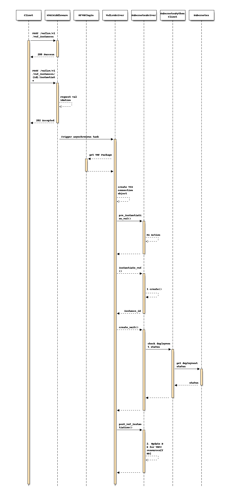
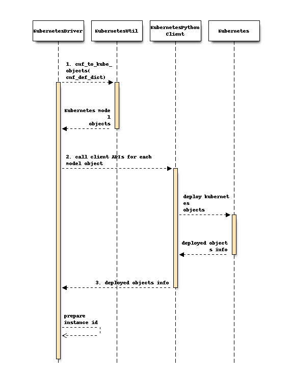
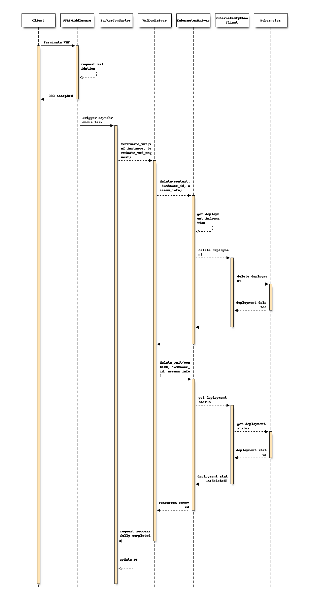

..
 This work is licensed under a Creative Commons Attribution 3.0 Unported
 License.

 http://creativecommons.org/licenses/by/3.0/legalcode

===================================================
Container Network Function (CNF) with VNFM and CISM
===================================================
https://blueprints.launchpad.net/tacker/+spec/cnf-support-with-etsi-nfv-specs

This specification describes enhancement of VNF Lifecycle Management for
Container Network Function in Tacker.

Problem description
===================

Container based virtualization is OS level virtualization, whereas
Virtual Machine (VM) is hypervisor-based virtualization. Advantages
of container-based virtualization is that it is lighter for memory
and CPU consumption. They are easier for deployment, migration and
service chaining. Kubernetes is most widely used container
orchestration platform with built in scalability and high availability
feature.

Tacker has Kubernetes infra driver which can instantiate CNF using TOSCA
definitions provided in VNFD. It supports limited number of Kubernetes objects.
Also it doesn't comply with VNF LCM APIs. This spec intends to add support for
additional Kubernetes objects and VNF LCM APIs. Current ETSI SOL standards do
not specify how to include CNF definitions in VNFD. Hence this spec proposes an
additional way to read Kubernetes object files as CNF definitions from
artifacts provided in the CSAR package.

.. note:: Although VNFD based CNF definitions will be supported in future,
          they are out of scope of this specification.

The NFVO is expected to perform validation of artifacts provided in the CSAR
package using APIs mentioned in spec `add-artifact-support-for-vnf-package`_.
Such changes in NFVO will be a future work. In this spec the validation will be
performed in VNFM.

Proposed Change
===============

This spec assumes the case of CNF deployment on pre-installed Kubernetes
cluster. Kubernetes infra driver will need following changes:

#. To load Kubernetes object files from artifact specified in
   additionalParams.
#. To support additional Kubernetes objects specified in
   `Kubernetes resource kind support`_.
#. To support VNF LCM APIs by implementing additional methods from
   ``VnfAbstractDriver``.

   * pre_instantiation_vnf
   * instantiate_vnf
   * post_vnf_instantiation

Following block diagram shows components involved in CNF instantiation on
pre-installed Kubernetes cluster:

.. code-block::

                                    +----------------------+
    +--------------------------+    |                NFVO  |
    |    Instantiated CNF      |    |                      |
    |                          |    +----------------------+
    |  +------+      +------+  |    +----------------------+
    |  | App  |      | App  |  |    |                VNFM  |
    |  +------+      +------+  |    |  +-------------+     |
    | +---------+  +---------+ |    |  |Infra driver |     |
    | |Container|  |Container| |    |  +----+--------+     |
    | +---------+  +---------+ |    |       |              |
    +--------------------------+    +-------+--------------+
                                    +-------+--------------+
    +--------------------------+    |       v         VIM  |
    |+---------+   +---------+ |    |  +----------+        |
    ||  CIS    |   |  CIS    |<+----+--+  CISM    |        |
    |+---------+   +---------+ |    |  +----------+        |
    |                          |    +----------------------+
    |     Pre-installed        |
    |   Kubernetes cluster     |
    +--------------------------+

In this case Container Infrastructure Service Management (CISM) is embedded
in VIM. Infra driver will instantiate a CNF on pre-installed Kubernetes
cluster with help of CISM. Container Infrastructure Service (CIS) can run
on a bare metal or VM.

The diagram below shows CNF instantiation on pre-installed Kubernetes cluster:

.. code-block::

                                                   +------------+
                                                   |    VNFD    |
                                                   +----+-------+     +---------------+
                                                        |             | Instantiation |
                               +-----------+       +----v-------+     | Request with  |
                               |CNF        +-----> |            |     | additional    |
                               |Definition |       |    CSAR    |     | Params        |
                               +-----------+       +--------+---+     +-+-------------+
                                                            |           |
                                                            |           |
                                                +-----------+-----------+-----------+
                                                |           v           v           |
                                                |  +----------------------+         |
                                                |  |   Tacker-server      |         |
                                                |  +-----+----------------+         |
                                                |        |                          |
                                                |        v                          |
                                                | +------------------------------+  |
                    Instantiate CNF             | |  +--------------+            |  |
         +-------------+------------------------+-+--+ Kubernetes   |            |  |
         |             |                        | |  | Infra Driver |            |  |
         v             v                        | |  +--------------+            |  |
  +------------+  +-----------+                 | |                              |  |
  | Container  |  | Container |                 | |                              |  |
  +------------+  +-----------+                 | |                              |  |
  +---------------------------+                 | |                              |  |
  |     Pre-installed         |                 | |      Tacker conductor        |  |
  |    Kubernetes cluster     |                 | +------------------------------+  |
  +---------------------------+                 +-----------------------------------+

The diagram shows that Kubernetes driver will use Kubernetes object files as
CNF definition in YAML format to instantiate CNF on pre-installed cluster.
VNFD will not contain any resource information such as VDU, Connection points,
Virtual links because all required components of CNF will be specified in
Kubernetes object files. VNFD will be used only to identify the flavour of CNF.

Sample VNFD file:

.. code-block:: yaml

    tosca_definitions_version: tosca_simple_yaml_1_2

    description: Deployment flavour for Kubernetes Cluster with
        "pre_installed" flavour ID

    imports:
      - etsi_nfv_sol001_common_types.yaml
      - etsi_nfv_sol001_vnfd_types.yaml

    topology_template:
      inputs:
        descriptor_id:
          type: string
        descriptor_version:
          type: string
        provider:
          type: string
        product_name:
          type: string
        software_version:
          type: string
        vnfm_info:
          type: list
          entry_schema:
            type: string
        flavour_id:
          type: string
        flavour_description:
          type: string

      substitution_mappings:
        node_type: Company.Tacker.KubernetesCluster
        properties:
          flavour_id: pre_installed

      node_templates:
        VNF:
          type: Company.Tacker.Kubernetes
          properties:
            flavour_description: The pre_installed flavour

Sample Kubernetes object file:

.. note:: Kubernetes object files as CNF definition file can contain
          definitions of Kubernetes objects mentioned in
          `Kubernetes resource kind support`_ section. Sample
          contains definition of ``Deployment``.

.. code-block:: yaml

      apiVersion: apps/v1
      kind: Deployment
      metadata:
        name: curry-test001
        namespace: curryns
      spec:
        replicas: 2
        selector:
          matchLabels:
            app: webserver
        template:
          metadata:
            labels:
              app: webserver
              scaling_name: SP1
          spec:
            containers:
            - env:
              - name: param0
                valueFrom:
                  configMapKeyRef:
                    key: param0
                    name: curry-test001
              - name: param1
                valueFrom:
                  configMapKeyRef:
                    key: param1
                    name: curry-test001
              image: celebdor/kuryr-demo
              imagePullPolicy: IfNotPresent
              name: web-server
              ports:
              - containerPort: 8080
              resources:
                limits:
                  cpu: 500m
                  memory: 512M
                requests:
                  cpu: 500m
                  memory: 512M
              volumeMounts:
              - name: curry-claim-volume
                mountPath: /data
            volumes:
            - name: curry-claim-volume
              persistentVolumeClaim:
                claimName: curry-pv-claim
            terminationGracePeriodSeconds: 0

Register VIM
------------
VIM of type ``kubernetes`` need to be registered before CNF instantiation. The
VIM registration process will remain same. Following sample `vim-config.yaml`
provides necessary information to register VIM of type Kubernetes.

.. code-block:: console

    auth_url: "https://172.20.20.10:6443"
    username: "admin"
    password: "admin"
    project_name: "default"
    ssl_ca_cert: None
    type: "kubernetes"

This VIM can be used in the instantiation request for CNF. If VIM is not
specified in the request, the user must ensure that the default VIM is of type
``kubernetes``.

CNF instantiation
-----------------
Following is a sample of instantiation request:

.. code-block:: json

    {
      "flavourId": "pre_installed",
      "additionalParams": {
        "lcm-kubernetes-def-files": [
          "Files/kubernetes/sample1.yaml",
          "Files/kubernetes/sample2.yaml"
        ]
      },
      "vimConnectionInfo": [
        {
          "id": "8a3adb69-0784-43c7-833e-aab0b6ab4470",
          "vimId": "7dc3c839-bf15-45ac-8dff-fc5b95c2940e",
          "vimType": "kubernetes"
        }
      ]
    }

Kubernetes driver will need changes to introduce an additional way to load CNF
definitions from artifacts provided in the CSAR package. The artifacts will be
one or more YAML files. The list of such Kubernetes object YAML artifact files
will be provided in ``lcm-kubernetes-def-files`` parameter in additionalParams
of the instantiation request. The ``create()`` method of Kubernetes driver will
look for this parameter and load the Kubernetes objects. The table
``vnf_artifacts`` introduced by spec `add-artifact-support-for-vnf-package`_
will be used for validation of artifacts. The order of files specified in the
list need to be maintained as the objects specified in those files may have
dependency.

Following sequence diagram describes the components involved and the flow of
CNF instantiation:

#. ``create()`` method will get instantiation request and VNF package path as
   parameters. It will look for ``lcm-kubernetes-def-files`` in
   additionalParams to decide where to get Kubernetes object files. This spec
   focuses on the case when this parameter is present.

   The next sequence diagram shows details about ``create()`` method.
#. TODO: As per discussion it has been decided that information about
   resources such as containers, pods etc. will not be stored in
   ``vnfc_resource_info`` because it is difficult to directly map such objects
   to existing vnfc_resource_info structure. The implication of this decision
   is that information about such resources will not be shown when user queries
   about the VNF instance.
   It still in discussion to decide where to store the information about
   resources created for CNF.

Following sequence diagram shows operation of ``create()`` method in
Kubernetes infra driver:

#. Definitions extracted from Kubernetes object YAML files will be translated
   into Kubernetes model objects [#kubernetes-model-objects]_. KubernetesUtils
   module will be added for the translation.
#. Kubernetes model objects will be passed to Kubernetes-client APIs
   [#kubernetes-apis]_ to deploy objects. Kubernetes-client's APIs will be
   called depending on ``kind`` of an object. The order of objects in which
   they are deployed will be important considering their dependency. Refer
   `Kubernetes API group support`_
#. Deployed object's information will be used for preparing deployment names.
   Deployment names will be returned as instance_id to maintain
   compatibility with VNF LCM API.

Following diagram shows how CNF will be deployed:

.. code-block::

              +-----------+ +------------------+
              |           | |Kubernetes object |
              |   VNFD    | |YAML file         |
              |           | |                  |
              +--------+--+ +---+--------------+
                       |        |
                       |        |
                       |<-------+
                       |
    +---------+     +--v--------+     +-----------+     +------------+     +----------+     +----------+
    |Command/ |     | VNFM      |No   | Parse k8s |     | Kubernetes |     |Kubernetes|     |Kubernetes|
    |REST Api +---->|           +---->| object    +---->| Object     +---->|Python    +---->|          |
    |         |     |Is CNF def |     | YAML files|  ^  |            |     |Client    |     |          |
    +---------+     |VNFD Based?|     +-----------+  |  +------------+     +----------+     +----------+
                    +--+--------+                    |
                       |      +-----------+          |
                       |Yes   | Parse     |          |
                       +----->| TOSCA CNF +----------+
                              | definition|
                              | from VNFD |
                              +-----------+
                              This case is out
                              of scope of this
                              spec

* The instantiation process will be called using either command or REST API
  call.
* The VNFM will process the VNFD and Kubernetes object files depending on
  additionalParams in the instantiation request.
* The VNFD will contain only the flavour definition.
* The Kubernetes model objects [#kubernetes-model-objects]_ will be created
  from the definitions provided in Kubernetes object YAML files.
* The `kubernetes-client`_ will instantiate objects on the Kubernetes cluster.

CNF termination
---------------
Following sequence diagram shows flow of termination of CNF.

Current implementation of Kubernetes driver handles limited objects such as
Service, Deployment, HorizontalPodAutoscaler etc. Since this spec introduces
more objects mentioned in `Kubernetes resource kind support`_, the ``delete()``
APIs implementations need to delete such objects.

Kubernetes API group support
----------------------------

Current Kubernetes infra driver supports following API groups:

#. AutoscalingV1Api
#. CoreApi
#. CoreV1Api
#. ExtensionsV1beta1Api

This spec proposes to add support for following API groups:

#. AppsV1Api
#. ApiregistrationV1Api
#. AuthenticationV1Api
#. AuthorizationV1Api
#. BatchV1Api
#. CoordinationV1Api
#. NetworkingV1Api
#. RbacAuthorizationV1Api
#. SchedulingV1Api
#. StorageV1Api

Kubernetes resource kind support
--------------------------------

In this spec we will support Kubernetes v1.16.0 and Kubernetes python
client v11.0. Following Kubernetes APIs will be supported.

* API Group ``core`` (CoreV1Api)

  +------------------------------------------+------------+
  |     API                                  |   Version  |
  +==========================================+============+
  | Container                                | v1         |
  +------------------------------------------+------------+
  | Pod                                      | v1         |
  +------------------------------------------+------------+
  | Service                                  | v1         |
  +------------------------------------------+------------+
  | ConfigMap                                | v1         |
  +------------------------------------------+------------+
  | Secret                                   | v1         |
  +------------------------------------------+------------+
  | PersistentVolumeClaim                    | v1         |
  +------------------------------------------+------------+
  | Volume                                   | v1         |
  +------------------------------------------+------------+
  | LimitRange                               | v1         |
  +------------------------------------------+------------+
  | PodTemplate                              | v1         |
  +------------------------------------------+------------+
  | Bindings                                 | v1         |
  +------------------------------------------+------------+
  | ComponentStatus                          | v1         |
  +------------------------------------------+------------+
  | Namespace                                | v1         |
  +------------------------------------------+------------+
  | Node                                     | v1         |
  +------------------------------------------+------------+
  | PersistentVolume                         | v1         |
  +------------------------------------------+------------+
  | ResourceQuota                            | v1         |
  +------------------------------------------+------------+
  | ServiceAccount                           | v1         |
  +------------------------------------------+------------+

* API Group ``apiregistration.k8s.io`` (ApiregistrationV1Api)

  +------------------------------------------+------------+
  |      API                                 |   Version  |
  +==========================================+============+
  | APIService                               | v1         |
  +------------------------------------------+------------+

* API Group ``apps`` (AppsV1Api)

  +------------------------------------------+------------+
  |      API                                 |   Version  |
  +==========================================+============+
  | DaemonSet                                | v1         |
  +------------------------------------------+------------+
  | Deployment                               | v1         |
  +------------------------------------------+------------+
  | ReplicaSet                               | v1         |
  +------------------------------------------+------------+
  | StatefulSet                              | v1         |
  +------------------------------------------+------------+
  | ControllerRevision                       | v1         |
  +------------------------------------------+------------+

* API Group ``authentication.k8s.io`` (AuthenticationV1Api)

  +------------------------------------------+------------+
  |      API                                 |   Version  |
  +==========================================+============+
  | TokenReview                              | v1         |
  +------------------------------------------+------------+

* API Group ``authorization.k8s.io`` (AuthorizationV1Api)

  +------------------------------------------+------------+
  |      API                                 |   Version  |
  +==========================================+============+
  | LocalSubjectAccessReview                 | v1         |
  +------------------------------------------+------------+
  | SelfSubjectAccessReview                  | v1         |
  +------------------------------------------+------------+
  | SelfSubjectRulesReview                   | v1         |
  +------------------------------------------+------------+
  | SubjectAccessReview                      | v1         |
  +------------------------------------------+------------+

* API Group ``autoscaling`` (AutoscalingV1Api)

  +------------------------------------------+------------+
  |      API                                 |   Version  |
  +==========================================+============+
  | HorizontalPodAutoscaler                  | v1         |
  +------------------------------------------+------------+

* API Group ``batch`` (BatchV1Api)

  +------------------------------------------+------------+
  |      API                                 |   Version  |
  +==========================================+============+
  | Job                                      | v1         |
  +------------------------------------------+------------+

* API Group ``coordination.k8s.io`` (CoordinationV1Api)

  +------------------------------------------+------------+
  |      API                                 |   Version  |
  +==========================================+============+
  | Lease                                    | v1         |
  +------------------------------------------+------------+

* API Group ``networking.k8s.io`` (NetworkingV1Api)

  +------------------------------------------+------------+
  |      API                                 |   Version  |
  +==========================================+============+
  | NetworkPolicy                            | v1         |
  +------------------------------------------+------------+

* API Group ``rbac.authorization.k8s.io`` (RbacAuthorizationV1Api)

  +------------------------------------------+------------+
  |      API                                 |   Version  |
  +==========================================+============+
  | ClusterRole                              | v1         |
  +------------------------------------------+------------+
  | ClusterRoleBinding                       | v1         |
  +------------------------------------------+------------+
  | Role                                     | v1         |
  +------------------------------------------+------------+
  | RoleBinding                              | v1         |
  +------------------------------------------+------------+

* API Group ``scheduling.k8s.io`` (SchedulingV1Api)

  +------------------------------------------+------------+
  |      API                                 |   Version  |
  +==========================================+============+
  | PriorityClass                            | v1         |
  +------------------------------------------+------------+

* API Group ``storage.k8s.io`` (StorageV1Api)

  +------------------------------------------+------------+
  |      API                                 |   Version  |
  +==========================================+============+
  | StorageClass                             | v1         |
  +------------------------------------------+------------+
  | VolumeAttachment                         | v1         |
  +------------------------------------------+------------+

Data model impact
-----------------

Table name: vnf_instantiated_info

+----------------------------+----------------+---------------+
| Column Name                | Old data type  | New data type |
+============================+================+===============+
| instance_id                | VARCHAR(255)   |    TEXT       |
+----------------------------+----------------+---------------+

The instance id returned by Kubernetes driver will be a string containing
deployment names. It can grow beyond 255 characters. Hence, we propose to
change the data type of ``instance_id`` field of ``vnf_instantiated_info``
table from VARCHAR(255) to TEXT.

Table name: vnf_resources

+----------------------------+----------------+---------------+
| Column Name                | Old data type  | New data type |
+============================+================+===============+
| resource_name              | VARCHAR(255)   |    TEXT       |
+----------------------------+----------------+---------------+

REST API impact
---------------

None

Security impact
---------------

None

Notifications impact
--------------------

None

Other end user impact
---------------------

None

Performance impact
------------------

None

Other deployer impact
---------------------

None

Developer impact
----------------

None

Implementation
==============

Assignee(s)
-----------

Primary assignee:
  Yoshito Ito <yoshito.itou.dr@hco.ntt.co.jp>

Other contributors:
  Nitin Uikey <nitin.uikey@nttdata.com>

  Tushar Patil <tushar.vitthal.patil@gmail.com>

  Prashant Bhole <prashant.bhole@nttdata.com>

Work Items
----------

* Kubernetes infra driver will be modified to implement:

  * VNF LCM compatibility
  * CNF instantiation from definitions provided in artifacts
  * Support for additional Kubernetes objects
* Add new unit and functional tests.

Dependencies
============

None

Testing
=======

Unit and functional tests will be added to cover cases required in the spec.

TODO: Since there is assumption that Kubernetes cluster will be pre-installed,
gate job needs to fetch the information about existing cluster and create
kubernetes VIM.

Documentation Impact
====================

Complete user guide will be added to explain CNF instantiation and
termination from the perspective of VNF LCM APIs.

References
==========

.. _kubernetes-client : https://github.com/kubernetes-client/python/releases/tag/v11.0.0
.. _add-artifact-support-for-vnf-package : add-artifacts.html
.. [#kubernetes-model-objects] : https://github.com/kubernetes-client/python/blob/master/kubernetes/README.md#documentation-for-models
.. [#kubernetes-apis] : https://github.com/kubernetes-client/python/blob/master/kubernetes/README.md#documentation-for-api-endpoints
