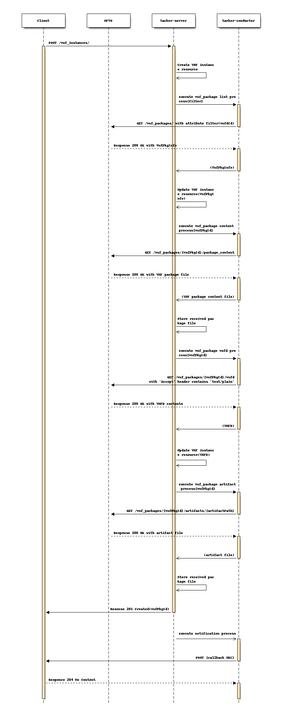
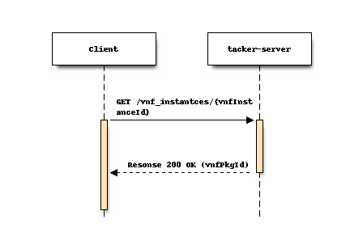
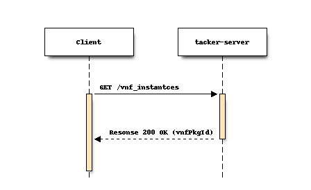
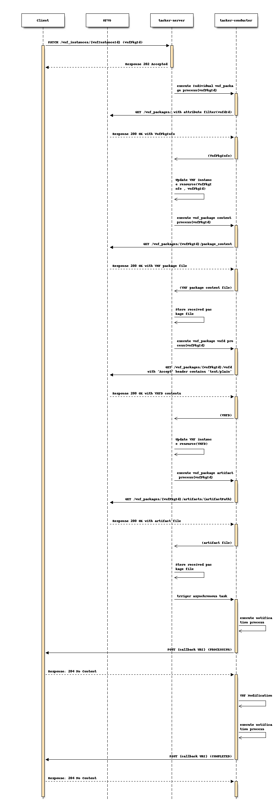

..
 This work is licensed under a Creative Commons Attribution 3.0 Unported
 License.
 http://creativecommons.org/licenses/by/3.0/legalcode

==========================================
Enhance VNF lifecycle management in Tacker
==========================================

https://blueprints.launchpad.net/tacker/+spec/support-etsi-nfv-specs

This specification describes enhancement of VNF lifecycle management in
Tacker.

Problem description
===================

In Ussuri release, we have added limited support of VNF lifecycle management as
defined in ETSI NFV SOL 002 [#etsi_sol002]_ and SOL 003 [#etsi_sol003]_.
Tacker should support more attributes to compliant ETSI NFV SOL specification
and expand a wide range of use cases.

Proposed change
===============

For backward compatibility, VNFM supports following features:

* to set vnfPkgId to related APIs.
  This parameter was present upon SOL003 version 2.4.1 [#etsi_sol003_v241]_ ,
  but it is removed upon SOL003 version 2.6.1.

- Create VNF Identifier(Response)
- Query VNF(Response)
- List VNF Instances(Response)
- Modify VNF Instances(Request)

* to support attribute filtering
  In order to get vnfPkgId, VNFM support Attribute based filtering

1) vnfPkgId support
-------------------

1-1) Flow of Create VNF Request
~~~~~~~~~~~~~~~~~~~~~~~~~~~~~~~

VNFM sends a GET request filtered by "vnfdId" to NFVO in order to query
information of the VNF packages to get "vnfPkgId" because the APIs to get VNF
packages using "vnfdId" is not supported.
Since the VNF package needs to be obtained from NFVO, the obtained "vnfPkgId"
is saved in the DB and used as an argument of getting VNF package request from
VNFM.
After that, VNFM starts the information collection sequence enabled by the
configuration and collects the content/VNFD/artifact.
These GET requests, "VNF package content" , "VNFD in an individual VNF package"
and "Individual VNF package artifact",  can be configured to execute or
not for each API. After successfully obtaining the target VNF package,
VNFM returns a 201 Created response containing "vnfPkgId" attribute
in the payload body.

1-2) Flow of Query VNF Request
~~~~~~~~~~~~~~~~~~~~~~~~~~~~~~

VNFM returns a "200 OK" response that includes "vnfPkgId" in the payload body.

1-3) Flow of List VNF Request
~~~~~~~~~~~~~~~~~~~~~~~~~~~~~

VNFM returns a "200 OK" response that includes "vnfPkgId" in the payload body.

1-4) Flow of Modify VNF Request
~~~~~~~~~~~~~~~~~~~~~~~~~~~~~~~

Client sends a modify VNF Information request which includes "vnfPkgId"
attribute.
After that, start the information collection sequence enabled by the
configuration and collect the content/VNFD/artifact.
These GET requests, "VNF package content" , "VNFD in an individual VNF package"
and "Individual VNF package artifact",  can be configured to execute or
not for each API. VNFM will continue to modify VNF information after
collecting all VNF package information correctly.

2) Support of Attribute based filtering
---------------------------------------

For an enhancement of LCM support with attribute based filering feature,
the filter specification defined in SOL013 [#etsi_sol013]_ section 5.2.2 will be supported in
Victoria release.

This feature can operate below:

* vnf_instances(GET)

Operators for attribute-based filtering

.. list-table::
   :header-rows: 1

   * - Operator with parameters
     - Meaning
   * - eq,<attrName>,<value>
     - Attribute equal to <value>
   * - neq,<attrName>,<value>
     - Attribute not equal to <value>
   * - in,<attrName>,<value>[,<value>]*
     - Attribute equal to one of the values in the list ("in set"
       relationship)
   * - nin,<attrName>,<value>[,<value>]*
     - Attribute not equal to any of the values in the list
       ("not in set" relationship)
   * - gt,<attrName>,<value>
     - Attribute greater than <value>
   * - gte,<attrName>,<value>
     - Attribute greater than or equal to <value>
   * - lt,<attrName>,<value>
     - Attribute less than <value>
   * - lte,<attrName>,<value>
     - Attribute less than or equal to <value>
   * - cont,<attrName>,<value>[,<value>]*
     - String attribute contains (at least) one of the values in the list
   * - ncont,<attrName>,<value>[,<value>]*
     - String attribute does not contain any of the values in the list

Applicability of the operators to data types

+-----------+----------+----------+----------+-------------+----------+
|  Operator |  String  |  Number  | DateTime | Enumeration |  Boolean |
+===========+==========+==========+==========+=============+==========+
| eq        |  x       |  x       |          |     x       |   x      |
+-----------+----------+----------+----------+-------------+----------+
| neq       |  x       |  x       |          |     x       |   x      |
+-----------+----------+----------+----------+-------------+----------+
| in        |  x       |  x       |          |     x       |          |
+-----------+----------+----------+----------+-------------+----------+
| nin       |  x       |  x       |          |     x       |          |
+-----------+----------+----------+----------+-------------+----------+
| gt        |  x       |  x       |  x       |             |          |
+-----------+----------+----------+----------+-------------+----------+
| gte       |  x       |  x       |  x       |             |          |
+-----------+----------+----------+----------+-------------+----------+
| lt        |  x       |  x       |  x       |             |          |
+-----------+----------+----------+----------+-------------+----------+
| lte       |  x       |  x       |  x       |             |          |
+-----------+----------+----------+----------+-------------+----------+
| cont      |  x       |          |          |             |          |
+-----------+----------+----------+----------+-------------+----------+
| ncont     |  x       |          |          |             |          |
+-----------+----------+----------+----------+-------------+----------+

The Above tables defines which operators are applicable for which data types.
All combinations marked with a "x" shall be supported.

Alternatives
------------

None

Data model impact
-----------------

Modify below tables in ‘tacker’ database. The corresponding schemas are
detailed below:-

vnf_instances::
    vnf_pkg_id vnf_pkg_id varchar(36)
    vnf_metadata vnf_metadata json

REST API impact (needs to be updated)
-------------------------------------

The following attributes of restFul API will be added. These attributes are
based on ETSI NFV SOL002 [#etsi_sol002]_ and SOL003 [#etsi_sol003]_.

* | **Name**: Create VNF Identifier
  | **Description**: Creates a new VNF instance resource
  | **Method type**: POST
  | **URL for the resource**: /vnflcm/v1/vnf_instances
  | **Request**:

  +------------------+-------------+------------------------------+
  | Data type        | Cardinality | Description                  |
  +==================+======+======+==============================+
  | CreateVnfRequest | 1           | The VNF creation parameters. |
  +------------------+-------------+------------------------------+

  .. list-table::
     :header-rows: 1

     * - Attribute name
       - Data type
       - Cardinality
       - Support in Victoria
     * - vnfdId
       - Identifier
       - 1
       - Already supported in Ussuri
     * - vnfInstanceName
       - String
       - 0..1
       - Already supported in Ussuri
     * - vnfInstanceDescription
       - String
       - 0..1
       - Already supported in Ussuri
     * - metadata
       - KeyValuePairs
       - 0..1
       - Yes

  | **Response**:

  .. list-table::
     :widths: 10 10 18 50
     :header-rows: 1

     * - Data type
       - Cardinality
       - Response Codes
       - Description
     * - VnfInstance
       - 1
       - | Success 201
         | Error 400 401 403
       - VNF instance identifier was created successfully.

* | **Name**: Query VNF
  | **Description**: Request to existing VNF instance resource by its id
  | **Method type**: GET
  | **URL for the resource**: /vnflcm/v1/vnf_instances/{vnfInstanceId}
  | **Resource URI variables for this resource**:

  +---------------+---------------------------------+
  | Name          | Description                     |
  +===============+=================================+
  | vnfInstanceId | Identifier of the VNF instance. |
  +---------------+---------------------------------+

  | **Response**:

  .. list-table::
     :widths: 10 10 18 50
     :header-rows: 1

     * - Data type
       - Cardinality
       - Response Codes
       - Description
     * - VnfInstance
       - 1
       - | Success: 200
         | Error: 401 403 404
       - Information about an individual VNF instance was queried successfully.

* | **Name**: List VNF Instances
  | **Description**: Request to list all existing VNF instances
  | **Method type**: GET
  | **URL for the resource**: /vnflcm/v1/vnf_instances
  | **Response**:

  .. list-table::
     :widths: 10 10 18 50
     :header-rows: 1

     * - Data type
       - Cardinality
       - Response Codes
       - Description
     * - VnfInstance
       - 0..N
       - | Success: 200
         | Error: 401 403
       - Information about zero or more VNF instances was queried successfully.

  .. list-table::
     :header-rows: 1

     * - Attribute name
       - Data type
       - Cardinality
       - Support in Victoria
     * - id
       - Identifier
       - 1
       - Already supported in Ussuri
     * - vnfInstanceName
       - String
       - 0..1
       - Already supported in Ussuri
     * - vnfInstanceDescription
       - String
       - 0..1
       - Already supported in Ussuri
     * - vnfdId
       - Identifier
       - 1
       - Already supported in Ussuri
     * - vnfProvider
       - String
       - 1
       - Already supported in Ussuri
     * - vnfProductName
       - String
       - 1
       - Already supported in Ussuri
     * - vnfSoftwareVersion
       - Version
       - 1
       - Already supported in Ussuri
     * - vnfdVersion
       - Version
       - 1
       - Already supported in Ussuri
     * - vnfPkgId
       - Identifier
       - 1
       - Yes
     * - vnfConfigurableProperties
       - KeyValuePairs
       - 0..1
       - No
     * - vimConnectionInfo
       - VimConnectionInfo
       - 0..N -> 0..1
       - Yes
     * - instantiationState
       - Enum
       - 1
       - Already supported in Ussuri
     * - instantiatedVnfInfo
       - Structure
       - 0..1
       - Already supported in Ussuri
     * - >flavourId
       - IdentifierInVnfd
       - 1
       - Already supported in Ussuri
     * - >vnfState
       - VnfOperationalStateType
       - 1
       - Already supported in Ussuri
     * - >scaleStatus
       - ScaleInfo
       - 0..N
       - Yes
     * - >extCpInfo
       - VnfExtCpInfo
       - 1..N
       - Already supported in Ussuri
     * - >extVirtualLinkInfo
       - ExtVirtualLinkInfo
       - 0..N
       - Already supported in Ussuri
     * - >extManagedVirtualLinkInfo
       - ExtManagedVirtualLinkInfo
       - 0..N
       - Already supported in Ussuri
     * - >monitoringParameters
       - MonitoringParameter
       - 0..N
       - No
     * - >localizationLanguage
       - String
       - 0..1
       - No
     * - >vnfcResourceInfo
       - VnfcResourceInfo
       - 0..N
       - Already supported in Ussuri
     * - >vnfVirtualLinkResourceInfo
       - VnfVirtualLinkResourceInfo
       - 0..N
       - Already supported in Ussuri
     * - >virtualStorageResourceInfo
       - VirtualStorageResourceInfo
       - 0..N
       - Already supported in Ussuri
     * - >vnfcInfo
       - VnfcInfo
       - 0..N
       - Yes
     * - metadata
       - KeyValuePairs
       - 0..1
       - No
     * - extensions
       - KeyValuePairs
       - 0..1
       - No
     * - _links
       - Structure
       - 1
       - Already supported in Ussuri
     * - >self
       - Link
       - 1
       - Already supported in Ussuri
     * - >indicators
       - Link
       - 0..1
       - No
     * - >instantiate
       - Link
       - 0..1
       - Already supported in Ussuri
     * - >terminate
       - Link
       - 0..1
       - Already supported in Ussuri
     * - >scale
       - Link
       - 0..1
       - Yes
     * - >scaleToLevel
       - Link
       - 0..1
       - No
     * - >changeFlavour
       - Link
       - 0..1
       - No
     * - >heal
       - Link
       - 0..1
       - Already supported in Ussuri
     * - >operate
       - Link
       - 0..1
       - No
     * - >changeExtConn
       - Link
       - 0..1
       - No

  .. Already supported in Ussuri:: vnfPkgId

* | **Name**: Instantiate VNF task
  | **Description**: This task resource represents the "Instantiate VNF"
    operation. The client can use this resource to instantiate a VNF instance.
  | **Method type**: POST
  | **URL for the resource**: /vnflcm/v1/vnf_instances/{vnfInstanceId}/instantiate
  | **Resource URI variables for this resource**:

  +---------------+--------------------------------------------------------+
  | Name          | Definition                                             |
  +===============+========================================================+
  | vnfInstanceId | The identifier of the VNF instance to be instantiated. |
  +---------------+--------------------------------------------------------+

  | **Request**:

  .. list-table::
     :header-rows: 1

     * - Data type
       - Cardinality
       - Description
     * - InstantiateVnfRequest
       - 1
       - Parameters passed to instantiate task.

  .. list-table::
     :widths: 10 10 10 10 40
     :header-rows: 1

     * - Attribute name
       - Data type
       - Cardinality
       - Support in Victoria
       - Description
     * - flavourId
       - IdentifierInVnfd
       - 1
       - Already supported in Ussuri
       - Identifier of the VNF deployment flavour to be instantiated.
     * - instantiationLevelId
       - IdentifierInVnfd
       - 0..1
       - Already supported in Ussuri
       - Identifier of the instantiation level of the deployment flavour to be
         instantiated. If not present, the default instantiation level as
         declared in the VNFD is instantiated.
     * - extVirtualLinks
       - ExtVirtualLinkData
       - 0..N
       - Already supported in Ussuri
       - Information about external VLs to connect the VNF to.
     * - vimConnectionInfo
       - VimConnectionInfo
       - 0..N -> 0..1
       - Already supported in Ussuri
       - Information about VIM connections to be used for managing the
         resources for the VNF instance. In U release, only 0..1
         VIMConnectionInfo will be accepted.
     * - additionalParams
       - KeyValuePairs
       - 0..1
       - Already supported in Ussuri
       - Additional params for instantiation process, specific to the VNF
         being instantiated.
     * - extManagedVirtualLinks
       - ExtManagedVirtualLinkData
       - 0..N
       - Already supported in Ussuri
       -
     * - localizationLanguage
       - String
       - 0..1
       - No
       -
     * - extensions
       - KeyValuePairs
       - 0..1
       - No
       -

  | **Response**:

  .. list-table::
     :widths: 12 10 28 50
     :header-rows: 1

     * - Data type
       - Cardinality
       - Response Codes
       - Description
     * - n/a
       -
       - | Success: 202
         | Error: 400, 401, 403, 404, 409
       - The request was accepted for processing, but the processing has
         not been completed.

* | **Name**: Terminate VNF task
  | **Description**: This task resource represents the "Terminate VNF"
    operation. The client can use this resource to terminate a VNF instance.
  | **Method type**: POST
  | **URL for the resource**:
      /vnflcm/v1/vnf_instances/{vnfInstanceId}/terminate
  | **Resource URI variables for this resource**:

  +---------------+------------------------------------------------------+
  | Name          | Description                                          |
  +===============+======================================================+
  | vnfInstanceId | The identifier of the VNF instance to be terminated. |
  +---------------+------------------------------------------------------+

  | **Request**:

  .. list-table::
     :header-rows: 1

     * - Data type
       - Cardinality
       - Description
     * - TerminateVnfRequest
       - 1
       - Parameters passed to Terminate VNF task.

  .. list-table::
     :widths: 10 10 10 10 10 40
     :header-rows: 1

     * - Attribute name
       - Data type
       - Possible values
       - Cardinality
       - Support
       - Description
     * - terminationType
       - Enum (inlined)
       - FORCEFUL
         GRACEFUL
       - 1
       - Already supported in Ussuri
       - | Indicates whether forceful or graceful termination is requested.
         | - FORCEFUL: The VNFM will shut down the VNF and release the
             resources immediately.
         | - GRACEFUL: The VNFM will first arrange to take the VNF out of
             service. Once the operation of taking the VNF out of service
             finishes, it will wait for the period as specified in the
             gracefulTerminationTimeout and then VNFM will shutdown the VNF
             and release the resources.
     * - additionalParams
       - KeyValuePairs
       -
       - 0..1
       - Yes
       - Additional parameters to the termination process, specific to the VNF
         being terminated.
     * - gracefulTerminationTimeout
       - Integer
       -
       - 0..1
       - Already supported in Ussuri
       - This attribute is only applicable in case of graceful termination.
         It defines the time to wait for the VNF to be taken out of service
         before shutting down the VNF and releasing the resources. The unit
         is seconds.

  | **Response**:

  .. list-table::
     :widths: 10 10 30 50
     :header-rows: 1

     * - Data type
       - Cardinality
       - Response Codes
       - Description
     * - n/a
       -
       - | Success: 202
         | Error: 400, 401, 403, 404, 409
       - The request was accepted for processing, but the processing has
         not been completed.

Security impact
---------------

None

Notifications impact
--------------------

None

Other end user impact
---------------------

None

Performance Impact
------------------

None

Other deployer impact
---------------------

The previously created VNFs will not be allowed to be managed using the newly
introduced APIs.

Developer impact
----------------

None

Implementation
==============

Assignee(s)
-----------

Primary assignee:
  Keiko Kuriu <keiko.kuriu.wa@hco.ntt.co.jp>

Work Items
----------

* Add new REST API attributes to Tacker-server.
* Add new unit and functional tests.
* Change API Tacker documentation.

Dependencies
============

"Modify VNF" refered in "Proposed change" is ETSI SOL based API proposed
in the spec [#modify_spec]_.

Testing
========

Unit and functional test cases will be added for VNF lifecycle management
of VNF instances.

Documentation Impact
====================

Complete user guide will be added to explain how to invoke VNF lifecycle
management of VNF instances with examples.

References
==========

.. [#etsi_sol002]
   https://www.etsi.org/deliver/etsi_gs/NFV-SOL/001_099/002/02.06.01_60/gs_nfv-sol002v020601p.pdf
   (Chapter 5: VNF Lifecycle Management interface)
.. [#etsi_sol003]
   https://www.etsi.org/deliver/etsi_gs/NFV-SOL/001_099/003/02.06.01_60/gs_nfv-sol003v020601p.pdf
   (Chapter 5: VNF Lifecycle Management interface)
.. [#etsi_sol003_v241]
   https://www.etsi.org/deliver/etsi_gs/NFV-SOL/001_099/003/02.04.01_60/gs_nfv-sol003v020401p.pdf
   (Chapter 5: VNF Lifecycle Management interface)
.. [#etsi_sol013]
   https://www.etsi.org/deliver/etsi_gs/NFV-SOL/001_099/013/02.06.01_60/gs_nfv-sol013v020601p.pdf
   (Chapter 5: Result set control)
.. [#modify_spec] https://review.opendev.org/#/c/731697/
