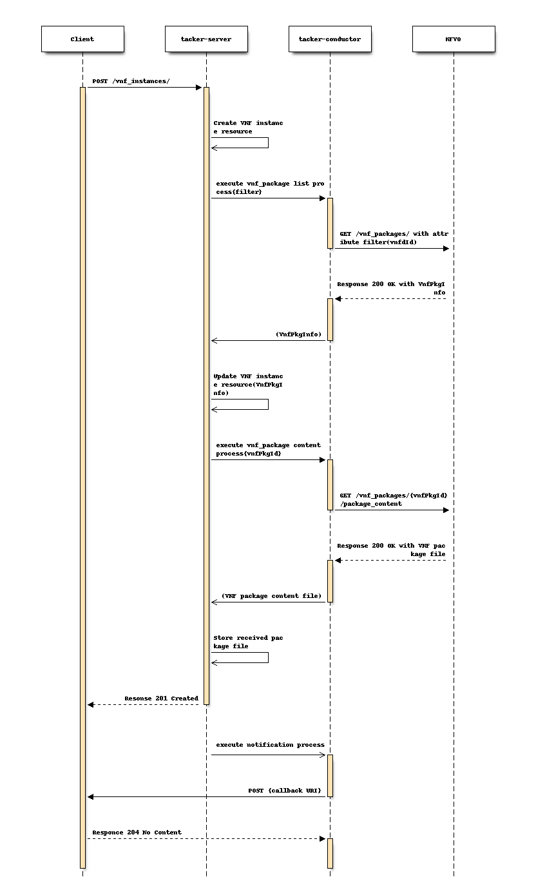

..
 This work is licensed under a Creative Commons Attribution 3.0 Unported
 License.
 http://creativecommons.org/licenses/by/3.0/legalcode

=====================================================================
Support LCM notifications for VNF based on ETSI NFV-SOL specification
=====================================================================

https://blueprints.launchpad.net/tacker/+spec/support-etsi-nfv-specs

ETSI specifications within the NFV Architecture Framework [#etsi_nfv]_
describe the main aspects of NFV development and usage based on of the
industry needs, feedback from SDN/NFV vendors and telecom operators.
These specifications include the REST API and data model architecture
which is used by NFV users and developers in related products.

Problem description
===================

In the current Tacker implementation based on ETSI NFV-SOL,
Tacker uses its own API which describes VNF lifecycle change
notifications which is Ability to inform the receiver that
LCM operations has been changed.

However, those operations are not aligned with the current ETSI NFV
data-model. As a result, there might be lack of compatibility with
`3rd party VNFs` [#etsi_plugtest2]_, as they are developed according to ETSI
NFV specifications.  Support of key ETSI NFV specifications will
significantly reduce efforts for Tacker integration into Telecom production
networks and also will simplify further development and support of future
standards.

Proposed change
===============

Introduces new interfaces to VNFM in order to  notify VNF lifecycle
management operations status for VNF instances.
The operation provided through the interfaces are:

* Subscription (GET/POST/DELETE)
* Notification endpoint (POST)
* Individual Subscription (GET)
* individual VNF occurrence (GET)

1）Flow of managing subscriptions
---------------------------------

* Register subscription

* Delete subscription

* Show subscription

* List subscription

* VNFM holds the Callback URL sent by consumer via "Subscription API"
  in advance.
* Notify the issuer of the ID associated with the received Subscription
  request.
* For the registered Subscription status, read by specifying ID, reading of
  all ID data and deletion of specified ID are allowed.

2）Flow of sending notifications
--------------------------------

* Depending on the progress status of the sequence, VNFM send notification
  (Notify) to notify the status change and update the internal
  operation_status.

Precondition: Requesting Node has subscribed previously to notifications
related to VNF lifecycle management.

* When the LCM request is accepted, the operation status is sent to the
  consumer which registers subscription via "Subscription API". This will
  be sent for the number of registrations.
* The following operation states can be notified:
  STARTING/PROCESSING/COMPLETED/ROLLINGBACK/ROLLEDBACK/FAILED_TEMP
* STARTING state is sent from Tacker Server, and other Operation_state
  notifications are sent from Tacker-Conductor.
* Modify VNF does not send STARTING state.
* NFVO which recieved notification infomation sends 204 No Content to Tacker.

3) Flow of LCM Operation with notification
------------------------------------------

* Instantiate VNF
* Scale VNF
* Heal VNF
* Terminate VNF

.. image:: ./support-notification-api-based-on-etsi-nfv-sol/05.png

* Modify VNF

.. image:: ./support-notification-api-based-on-etsi-nfv-sol/06.png

* Rollback

.. image:: ./support-notification-api-based-on-etsi-nfv-sol/07.png

4) Flow of VNF instance resource with notification
--------------------------------------------------

* CereateVNFRequest

* DeleteVNFRequest

5）Flow of Getting Operation Status
-----------------------------------

Operation status can be obtained from VNFM.

* The transmission source node specifies the vnfLcmOpOccId issued at the time
  of subscription and reads the information about the resource in the
  Subscription state.
* If the VNFM information read is successful, Response 200 OK is responded.

Alternatives
------------

None

Data model impact
-----------------

Add below new tables in ‘tacker’ database. The corresponding schemas are
detailed below:-

A list of added tables:
    - vnf_lcm_filters

details of added table:

vnf_lcm_filters:

    .. code-block:: python

        id id varchar(36) Not Null
        subscription_uuid subscription_uuid varchar(36) Not Null
        filter filter json Not Null
        notification_types notification_types MEDIUMBLOB
        notification_types_len notification_types_len int
        operation_types operation_types MEDIUMBLOB
        operation_types_len operation_types_len int

`subscription_uuid` will be foreign key of `vnf_lcm_subscriptions`.`id`.
This table has current status of LCM.
Table for accumulating information for each event.

vnf_lcm_op_occs:

    .. code-block:: python

        id id varchar(36) Not Null
        operation_state operation_state varchar(16) Not Null
        state_entered_time state_entered_time datetime Not Null
        start_time start_time datetime Not Null
        vnf_instance_id vnf_instance_id varchar(36) Not Null
        operation operation varchar(16) Not Null
        is_cancel_pending is_cancel_pending tinyint(1) Not Null
        is_automatic_invocation is_automatic_invocation tinyint(1) Not Null
        operation_params operation_params json
        error error json
        resource_changes resource_changes json
        error_point error_point int
        changed_info changed_info json
        created_at created_at datetime Not Null
        updated_at updated_at datetime
        deleted_at deleted_at datetime
        deleted deleted tinyint(1) Not Null

`vnf_instance_id` will be foreign key of `vnf_instances`.`id`.
This table has current status of  operation occurrence

vnf_lcm_subscriptions:

    .. code-block:: python

        id id varchar(36) Not Null
        callback_uri callback_uri varchar(255) Not Null
        subscription_authentication subscription_authentication json
        deleted deleted tinyint(1)

This table has registration information of Subscription

REST API impact
---------------

The following restFul API will be added. This restFul API will be based on
ETSI NFV SOL002 [#NFV-SOL002]_ and SOL003 [#NFV-SOL003]_.

* | **Name**: Subscriptions
  | **Description**: Subscribe to notifications related to VNF lifecycle
                     management
  | **Method type**: POST
  | **URL for the resource**: /vnflcm/v1/subscriptions
  | **Request**:

  +--------------------------+-------------+----------------------------------+
  | Data type                | Cardinality | Description                      |
  +==========================+======+======+==================================+
  | LccnSubscriptionRequest  | 1           | Parameters for the Subscription. |
  +--------------------------+-------------+----------------------------------+

  .. list-table::
     :header-rows: 1

     * - Attribute name
       - Data type
       - Cardinality
       - Supported in (V)
     * - filter
       - LifecycleChangeNotificationFilter
       - 0..1
       - Yes
     * - callbackUri
       - Uri
       - 1
       - Yes
     * - authentication
       - SubscriptionAuthentication
       - 0..1
       - Yes

  | **Response**:

  .. list-table::
     :widths: 10 10 18 50
     :header-rows: 1

     * - Data type
       - Cardinality
       - Response Codes
       - Description
     * - LccnSubscription
       - n/a
       - | Success 201
         | Redirection 303
         | Error 4xx
       - The subscription has been created successfully.

* | **Name**: List Subscriptions
  | **Description**: Request to list all existing subscriptions
  | **Method type**: GET
  | **URL for the resource**: /vnflcm/v1/subscriptions
  | **Request**:

  .. list-table::
     :header-rows: 1

     * -  Data type
       - Cardinality
       - Description
       - Supported in (V)
     * -  filter
       - 0..1
       - Filter to list subscriptions
       - No

  | **Response**:

  .. list-table::
     :widths: 10 10 18 50
     :header-rows: 1

     * - Data type
       - Cardinality
       - Response Codes
       - Description
     * - LccnSubscription
       - n/a
       - | Success 200
         | Error 400 4xx
       - The list of subscriptions has been queried successfully.

* | **Name**: Query Subscriptions
  | **Description**: Request to show individual subscription resource by its id
  | **Method type**: GET
  | **URL for the resource**: /vnflcm/v1/subscriptions/{subscriptionId}
  | **Request**:

  +----------------+----------------------------------+
  | Name           | Description                      |
  +================+==================================+
  | subscriptionId | Identifier of the subscriptions. |
  +----------------+----------------------------------+

  | **Response**:

  .. list-table::
     :widths: 10 10 18 50
     :header-rows: 1

     * - Data type
       - Cardinality
       - Response Codes
       - Description
     * - LccnSubscription
       - n/a
       - | Success 200
         | Error 400 4xx
       - The operation has completed successfully.

* | **Name**: Delete Subscriptions
  | **Description**: Request to delete individual subscription resource by
                     its id
  | **Method type**: DELETE
  | **URL for the resource**: /vnflcm/v1/subscriptions/{subscriptionId}
  | **Request**:

  +----------------+----------------------------------+
  | Name           | Description                      |
  +================+==================================+
  | subscriptionId | Identifier of the subscriptions. |
  +----------------+----------------------------------+

  | **Response**:

  .. list-table::
     :widths: 10 10 18 50
     :header-rows: 1

     * - Data type
       - Cardinality
       - Response Codes
       - Description
     * - n/a
       - n/a
       - | Success 204
         | Error 400 4xx
       - The individual subscription resource has been deleted successfully.

* | **Name**: Notification endpoint
  | **Description**: Send notifications related to VNF lifecycle changes
  | **Method type**: POST
  | **URL for the resource**: The resource URI is provided by the client when
                              creating the subscription.
  | **Request**:

  .. list-table::
     :widths: 20 10 50
     :header-rows: 1

     * - Data type
       - Cardinality
       - Description
     * - VnfLcmOperationOccurrenceNotification
       - 1
       - A notification about lifecycle changes triggered by a VNF LCM
         operation occurrence.
     * - VnfIdentifierCreationNotification
       - 1
       - A notification about lthe creation of a VNF identifier and the
         related individual VNF instance resource.
     * - VnfIdentifierDeletionNotification
       - 1
       - A notification about the deletion of a VNF identifier and the
         related individual VNF instance resource.

  .. list-table::
     :header-rows: 1

     * - Attribute name
       - Data type
       - Cardinality
       - Supported in (V)
     * - id
       - Identifier
       - 1
       - Yes
     * - notificationType
       - String
       - 1
       - Yes
     * - subscriptionId
       - Identifier
       - 1
       - Yes
     * - timeStamp
       - DateTime
       - 1
       - Yes
     * - notificationStatus
       - Enum (inlined)
       - 1
       - Yes
     * - operationState
       - LcmOperationStateType
       - 1
       - Yes
     * - vnfInstanceId
       - Identifier
       - 1
       - Yes
     * - operation
       - LcmOperationType
       - 1
       - Yes
     * - isAutomaticInvocation
       - Boolean
       - 1
       - Yes
     * - vnfLcmOpOccId
       - Identifier
       - 1
       - Yes
     * - affectedVnfcs
       - AffectedVnfc
       - 0..N
       - Yes
     * - affectedVirtualLinks
       - AffectedVirtualLink
       - 0..N
       - Yes
     * - affectedVirtualStorages
       - AffectedVirtualStorage
       - 0..N
       - Yes
     * - changedInfo
       - VnfInfoModifications
       - 0..1
       - Yes
     * - changedExtConnectivity
       - ExtVirtualLinkInfo
       - 0..N
       - No
     * - error
       - ProblemDetails
       - 0..1
       - Yes
     * - _links
       - LccnLinks
       - 1
       - Yes

  | **Response**:

  .. list-table::
     :widths: 12 10 18 50
     :header-rows: 1

     * - Data type
       - Cardinality
       - Response Codes
       - Description
     * - n/a
       - n/a
       - | Success 204
         | Error 4xx
       - The notification has been delivered successfully.

.. note:: `virtualLinkDescId`, one of the attribute contained in
          affectedVirtualLinks, is removed upon SOL003 version
          2.6.1. However, in order to enable Tacker to expand
          a wide range of NFV compliant product, `virtualLinkDescId`
          will be supported in Victoria release.

* | **Name**: Query VNF occurrence
  | **Description**: Request to show individual VNF lifecycle management
                     operation occurrence by its id
  | **Method type**: GET
  | **URL for the resource**: /vnflcm/v1/vnf_lcm_op_occs/{vnfLcmOpOccId}
  | **Response**:

  .. list-table::
     :widths: 12 10 18 50
     :header-rows: 1

     * - Data type
       - Cardinality
       - Response Codes
       - Description
     * - VnfLcmOpOcc
       - 1
       - | Success 200
         | Error 4xx
       - The operation has completed successfully.

  .. list-table::
     :header-rows: 1

     * - Attribute name
       - Data type
       - Cardinality
       - Supported in (V)
     * - id
       - Identifier
       - 1
       - Yes
     * - operationState
       - LcmOperationStateType
       - 1
       - Yes
     * - stateEnteredTime
       - DateTime
       - 1
       - Yes
     * - startTime
       - DateTime
       - 1
       - Yes
     * - vnfInstanceId
       - Identifier
       - 1
       - Yes
     * - grantId
       - Identifier
       - 1
       - No
     * - operation
       - LcmOperationType
       - 1
       - Yes
     * - isAutomaticInvocation
       - Boolean
       - 1
       - Yes
     * - operationParams
       - Object
       - 1
       - Yes
     * - isCancelPending
       - Boolean
       - 0..N
       - No
     * - cancelMode
       - CancelModeType
       - 0..N
       - No
     * - error
       - ProblemDetails
       - 0..N
       - Yes
     * - resourceChanges
       - Structure(inlined)
       - 0..1
       - Yes
     * - changedInfo
       - VnfInfoModifications
       - 0..N
       - No
     * - changedExtConnectivity
       - ExtVirtualLinkInfo
       - 0..1
       - No
     * - _links
       - LccnLinks
       - 1
       - Yes

Security impact
---------------

None

Notifications impact
--------------------
Tacker will creates a new subscription to notifications related to VNF
lifecycle changes and send notification to consumer.

Other end user impact
---------------------

None

Performance Impact
------------------

None

Other deployer impact
---------------------

The previously created VNFs will not be allowed to be managed using the newly
introduced APIs.

Developer impact
----------------

None

Implementation
==============

Assignee(s)
-----------

Primary assignee:
  Keiko Kuriu <keiko.kuriu.wa@hco.ntt.co.jp>

Work Items
----------

* Add new REST API endpoints to Tacker-server for LCM notifications interface
  of VNF instances.
* Add features which Tacker consumes Rest API for Notifications
* Add new unit and functional tests.
* Change API Tacker documentation.

Dependencies
============

None

Testing
========

Unit and functional test cases will be added for VNF lifecycle management
of VNF instances.

Documentation Impact
====================

Complete user guide will be added to explain how to invoke VNF lifecycle
management of VNF instances with examples.

References
==========

.. [#etsi_nfv] https://www.etsi.org/technologies-clusters/technologies/NFV
.. [#NFV-SOL002]
  https://www.etsi.org/deliver/etsi_gs/NFV-SOL/001_099/002/02.06.01_60/gs_nfv-sol002v020601p.pdf
  (Chapter 5: VNF Lifecycle Management interface)
.. [#NFV-SOL003]
  https://www.etsi.org/deliver/etsi_gs/NFV-SOL/001_099/003/02.06.01_60/gs_nfv-sol003v020601p.pdf
  (Chapter 5: VNF Lifecycle Management interface)
.. [#etsi_plugtest2]
  https://portal.etsi.org/Portals/0/TBpages/CTI/Docs/2nd_ETSI_NFV_Plugtests_Report_v1.0.0.pdf
