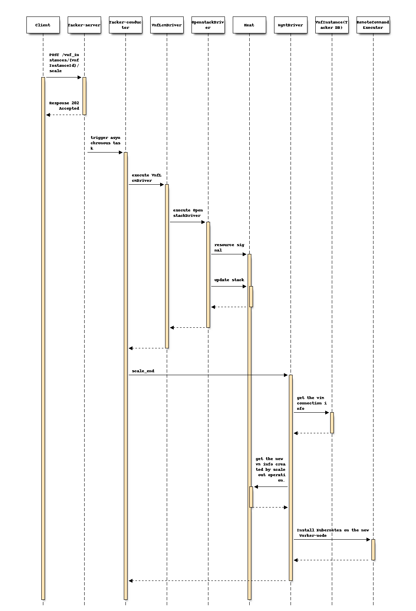
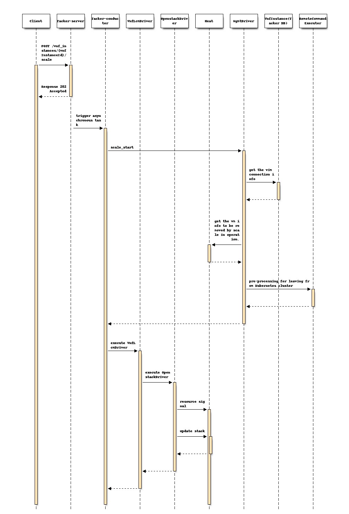

=======================================================
Support scaling Kubernetes Worker-nodes with Mgmtdriver
=======================================================

https://blueprints.launchpad.net/tacker/+spec/mgmt-driver-for-k8s-scale

Problem description
===================
The ``Victoria`` release supports the ETSI-compliant VNF scale interface. For
use cases where Kubernetes clusters run on top of VNFs, it is important to
support cluster management. This spec proposes the scaling of
Worker-nodes for the VNF including Kubernetes cluster. It helps to install and
configure the cluster to add or remove a Worker-node with Mgmtdriver. This
operation assumes that the VNF is deployed the spec
`mgmt-driver-for-k8s-cluster`_.

Proposed change
===============

The following changes are needed:

#. Implement a new MgmtDriver to support ``scale_start`` and ``scale_end``
   defined in ETSI NFV-SOL001 [#SOL001]_.

   #. scale-out

      The scale-out process will include:

      #. Deploy new VMs for Worker-nodes with OpenStackInfraDriver
      #. Add the deployed VMs to the exiting Kubernetes cluster in
         ``scale_end``.

         + MgmtDriver

           + Identify the deployed VMs in the scale-out operation.
           + Get the existing Kubernetes cluster information from DB
             and execute the script for scale-out below with the arguments.

         + Script

           + Install and configure Kubernetes components in Worker-nodes.
           + Send a join request to the existing Master-node from Worker-nodes.

   #. scale-in

      The scale-in process will include:

      #. In order to ensure the continuity and safety of applications
         running on the existing Kubernetes cluster, the following process
         is executed in ``scale_start``, following the concept of graceful
         shutdown.

         + MgmtDriver

           + Identify VMs to be removed in the scale-in operation.
           + Get the existing Kubernetes cluster information from DB
             and execute the script for scale-in below with the arguments.

         + Script

           + Evacuate Pods running on the VMs to another Worker-node.
           + Remove the Worker-nodes from the Kubernetes cluster

      #. Remove the VMs for this scale-in operation with OpenStackInfraDriver.

#. Provide a sample script executed by MgmtDriver to install and/or configure
   Kubernetes cluster.

.. note:: Kubernetes v1.16.0 and Kubernetes python client v11.0 are supported
          for Kubernetes VIM.

VNFD for Scaling operation
--------------------------

VNFD needs to have ``scale_start``, ``scale_end`` and ``policies`` definition
as the following sample:

.. code-block:: yaml

  node_templates:
    VNF:
      ...
      interfaces:
        Vnflcm:
          ...
          scale_start:
            implementation: mgmt-drivers-kubernetes
          scale_end:
            implementation: mgmt-drivers-kubernetes
      artifacts:
        mgmt-drivers-kubernetes:
          description: Management driver for kubernetes cluster
          type: tosca.artifacts.Implementation.Python
          file: /.../mgmt_drivers/kubernetes_mgmt.py

    MasterVDU:
      type: tosca.nodes.nfv.Vdu.Compute
      ...

    WorkerVDU:
      type: tosca.nodes.nfv.Vdu.Compute
      ...

  policies:
    - scaling_aspects:
        type: tosca.policies.nfv.ScalingAspects
        properties:
          aspects:
            worker_instance:
              name: worker_instance_aspect
              description: worker_instance scaling aspect
              max_scale_level: 2
              step_deltas:
                - delta_1

    - WorkerVDU_initial_delta:
        type: tosca.policies.nfv.VduInitialDelta
        properties:
          initial_delta:
            number_of_instances: 1
        targets: [ WorkerVDU ]

    - WorkerVDU_scaling_aspect_deltas:
        type: tosca.policies.nfv.VduScalingAspectDeltas
        properties:
          aspect: worker_instance
          deltas:
            delta_1:
              number_of_instances: 1
        targets: [ WorkerVDU ]

Scale-out
---------

The diagram below shows VNF scale-out operation:

::

                                                              +---------------+
                                                              | Scaling       |
                                                              | Request with  |
                                                              | Additional    |
                                                              | Params        |
                                                              +-+-------------+
                                                                |
                                               +----------------+--------------+
                                               |                v         VNFM |
                                               |  +-------------------+        |
                                               |  |   Tacker-server   |        |
                                               |  +-------+-----------+        |
                                               |          |                    |
                                               |          v                    |
                                               |  +----------------------+     |
                       2.Setup new Worker-node |  |    +-------------+   |     |
                       +-----------------------+--+----| MgmtDriver  |   |     |
                       |                       |  |    +-------------+   |     |
  +--------------------+-----------+           |  |                      |     |
  |                    |           |           |  |                      |     |
  |+-----------+  +----|------+    |           |  |                      |     |
  ||           |  |    v      |    | 1.Add     |  |    +-------------+   |     |
  ||  +------+ |  | +------+  |    |    new VM |  |    |OpenStack    |   |     |
  ||  |Master|<+--+-|Worker|  |<---+-----------+--+----|InfraDriver  |   |     |
  ||  +------+ |  | +------+  |    |           |  |    +-------------+   |     |
  ||    VM     |  |   VM      |    |           |  |                      |     |
  |+-----------+  +-----------+    |           |  |                      |     |
  |               +-----------+    |           |  |                      |     |
  |               | +------+  |    |           |  |                      |     |
  |               | |Worker|  |    |           |  |                      |     |
  |               | +------+  |    |           |  |                      |     |
  |               |   VM      |    |           |  |                      |     |
  |               +-----------+    |           |  |                      |     |
  +--------------------------------+           |  |      Tacker-conductor|     |
  +--------------------------------+           |  +----------------------+     |
  |       Hardware Resources       |           |                               |
  +--------------------------------+           +-------------------------------+

The diagram shows related component of this spec proposal and an overview of
the following processing:

#. OpenStackInfraDriver add new VMs, i.e. scale-out with Heat, as described
   in the specification `support-scale-api-based-on-etsi-nfv-sol`_

#. MgmtDriver setup new Worker-node on new VMs in ``scale_end``.
   This setup procedure can be implemented with the shell script or the python
   script including installation and configuration tasks.

.. note:: To identify the VMs to be installed, that is, the VMs increased by
          this scale-out operation, it is assumed that information such as the
          number of Worker-node VMs before scale-out and the creation time of
          each VM will need to be referenced.

Request data for Scale-out
^^^^^^^^^^^^^^^^^^^^^^^^^^

User gives following scale parameter to "POST /vnf_instances/{id}/scale" as
``ScaleVnfRequest`` data type in ETSI NFV-SOL003 v2.6.1 [#SOL003]_:

  +------------------+---------------------------------------------------------+
  | Attribute name   | Parameter description                                   |
  +==================+=========================================================+
  | type             | User specify scaling operation type:\n                  |
  |                  | "SCALE_IN" or "SCALE_OUT"                               |
  +------------------+---------------------------------------------------------+
  | aspectId         | User specify target aspectId, aspectId is defined in    |
  |                  | above VNFD and user can know by                         |
  |                  | ``InstantiatedVnfInfo.ScaleStatus`` that contained in   |
  |                  | the response of "GET /vnf_instances/{id}"               |
  +------------------+---------------------------------------------------------+
  | numberOfSteps    | Number of scaling steps                                 |
  +------------------+---------------------------------------------------------+
  | additionalParams | Not needed                                              |
  +------------------+---------------------------------------------------------+

Following is a sample of scaling request body:

.. code-block::

  {
    "type": "SCALE_OUT",
    "aspectId": "worker_instance",
    "numberOfSteps": "1"
  }

Following sequence diagram describes the components involved and the flow of VNF
``scale-out`` operation:

The procedure consists of the following steps as illustrated in above sequence

#. Client sends a POST request to the scale VNF Instance resource.
#. Basically the same sequence as described in the spec
   `support-scale-api-based-on-etsi-nfv-sol`_, except for the MgmtDriver.

   .. note:: Heat templates contain resource information for VM instantiation.
             OpenstackDriver sends request to Heat to update the number of
             Worker nodes which is specified in the variable "desired_capacity"
             in this scale operation.

#. MgmtDriver gets vimConnection information in order to get existing
   Kubernetes cluster information such as auth_url.
#. MgmtDriver gets new VM information from HEAT created by scale-out operation.
#. MgmtDriver setups a Worker-node on the VM by invoking a shell script
   using RemoteCommandExecutor.

Scale-in
--------

The diagram below shows VNF scale-in operation:

::

                                                              +---------------+
                                                              | Scaling       |
                                                              | Request with  |
                                                              | Additional    |
                                                              | Params        |
                                                              +-+-------------+
                                                                |
                                               +----------------+--------------+
                                               |                v         VNFM |
                                               |  +-------------------+        |
                                               |  |   Tacker-server   |        |
                                               |  +-------+-----------+        |
                                               |          |                    |
                                               |          v                    |
                       1. Pre-processing       |  +----------------------+     |
                            to remove VM       |  |    +-------------+   |     |
         +-------------------------------------+--+----| MgmtDriver  |   |     |
         |                                     |  |    +-------------+   |     |
  +------+-------------------------+           |  |                      |     |
  |      |                         |           |  |                      |     |
  |+-----|-----+  +-----------+    |           |  |                      |     |
  ||     v     |  |           |    | 2.Remove  |  |    +-------------+   |     |
  ||  +------+ |  | +------+  |    |     VM    |  |    |OpenStack    |   |     |
  ||  |Master|-+--+>|Worker|  |<---+-----------+--+----|InfraDriver  |   |     |
  ||  +------+ |  | +------+  |    |           |  |    +-------------+   |     |
  ||    VM     |  |   VM      |    |           |  |                      |     |
  |+-----------+  +-----------+    |           |  |                      |     |
  |               +-----------+    |           |  |                      |     |
  |               | +------+  |    |           |  |                      |     |
  |               | |Worker|  |    |           |  |                      |     |
  |               | +------+  |    |           |  |                      |     |
  |               |   VM      |    |           |  |                      |     |
  |               +-----------+    |           |  |                      |     |
  +--------------------------------+           |  |      Tacker-conductor|     |
  +--------------------------------+           |  +----------------------+     |
  |       Hardware Resources       |           |                               |
  +--------------------------------+           +-------------------------------+

The diagram shows related component of this spec proposal and an overview of
the following processing:

#. MgmtDriver pre-process to remove VM in ``scale_start`` in order to ensure the
   continuity and safety of applications running on the existing Kubernetes
   cluster. Specifically, it executes the evacuation of the pod running on the
   VM to another Worker-node and leaving the Worker-node from existing
   Kubernetes cluster by accessing to Master-node.

#. OpenStackInfraDriver removes VMs i.e. scale-In with Heat, as described in
   the specification `support-scale-api-based-on-etsi-nfv-sol`_.

.. note:: To identify the VMs to be removed in pre-processing phase, that is
          the VMs to be decreased by this scale-in operation, it is assumed
          that information such as the number of Worker-node VMs before
          scale-in and the creation time of each VM will need to be referenced.

Request data for Scale-in
^^^^^^^^^^^^^^^^^^^^^^^^^

The ``type`` parameter in the request body is set to SCALE_IN.
Following is a sample of scaling request body:

.. code-block::

  {
    "type": "SCALE_IN",
    "aspectId": "worker_instance",
    "numberOfSteps": "1"
  }

Following sequence diagram describes the components involved and the flow of VNF
``scale-in`` operation:

The procedure consists of the following steps as illustrated in above sequence.

#. Client sends a POST request to the scale VNF Instance resource.
#. Basically the same sequence as described in the spec
   `support-scale-api-based-on-etsi-nfv-sol`_, except for the MgmtDriver.

   .. note:: Heat templates contain resource information for VM instantiation.
             OpenstackDriver sends request to Heat to update the number of
             Worker nodes which are specified in the variable "desired_capacity"
             in this scale operation.

#. MgmtDriver gets Vim connection information in order to get existing
   Kubernetes
   cluster information such as auth_url.
#. MgmtDriver gets the information of the VM to be removed from Heat
   by scale-in operation.
#. MgmtDriver pre-processes of the Worker-node for leaving from Kubernetes
   cluster.

Alternatives
------------
None.

Data model impact
-----------------
None.

REST API impact
---------------
None.

Security impact
---------------
None.

Notifications impact
--------------------
None.

Other end user impact
---------------------
None.

Performance Impact
------------------
None.

Other deployer impact
---------------------
None.

Developer impact
----------------
None.

Implementation
==============
Assignee(s)
-----------
Primary assignee:
  Yoshito Ito <yoshito.itou.dr@hco.ntt.co.jp>

Other contributors:
  Shotaro Banno <banno.shotaro@fujitsu.com>

  Ayumu Ueha <ueha.ayumu@fujitsu.com>

  Liang Lu <lu.liang@fujitsu.com>

Work Items
----------
* MgmtDriver will be modified to implement:

  + Support ``scale_start`` for scale-in and ``scale_end`` for scale-out.
  + Provide a sample script to be executed by MgmtDriver to install and/or
    configure Kubernetes cluster.

* Add new unit and functional tests.

Dependencies
============

``scale_end`` referred in "Proposed change" is based on ``instantiate_end``
in the spec of `mgmt-driver-for-k8s-cluster`_.

Testing
=======
Unit and functional tests will be added to cover cases required in the spec.

Documentation Impact
====================
Complete user guide will be added to explain scaling Kubernetes Worker-node
from the perspective of VNF LCM APIs.

References
==========
.. [#SOL001] https://www.etsi.org/deliver/etsi_gs/NFV-SOL/001_099/001/
.. [#SOL003] https://www.etsi.org/deliver/etsi_gs/NFV-SOL/001_099/003/
.. _mgmt-driver-for-k8s-cluster :
  ./mgmt-driver-for-k8s-cluster.html
.. _support-scale-api-based-on-etsi-nfv-sol :
  ../victoria/support-scale-api-based-on-etsi-nfv-sol.html
