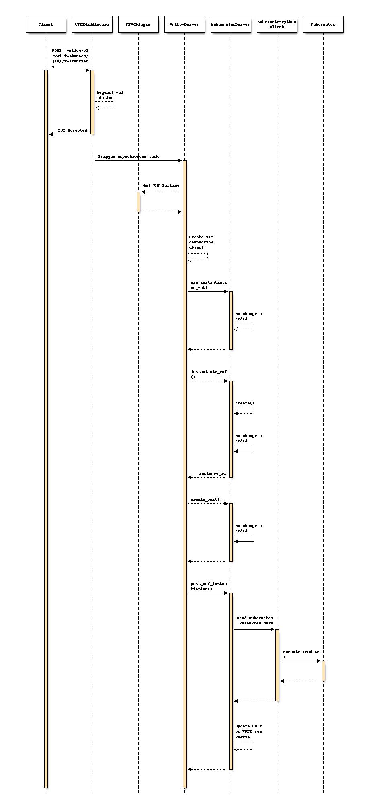
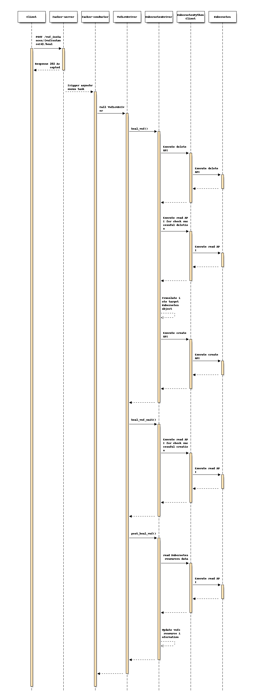

==============================
Support Heal operation for CNF
==============================
https://blueprints.launchpad.net/tacker/+spec/support-cnf-heal

This specification describes the "Heal VNF" operation of VNF Lifecycle
Management for Container Network Function (CNF) in Tacker.

Problem description
===================
In ``Victoria`` release, the Instantiate and Terminate VNF operations with VNF
Lifecycle Management defined in `ETSI NFV-SOL003 v2.6.1`_ for CNF are
supported in the spec `container-network-function`_. The CNF heal operation
with ETSI specifications also needs to be implemented. However, the current
ETSI NFV-SOL documents have not defined the detailed specifications for OS
container based VNF. This spec provides the definition of the heal operation
for CNF in Tacker and also the design to be implemented.

According to ETSI NFV-SOL documents, two different types of heal operations
are defined:

* Heal VNF instance with SOL003
* Heal VNFC with SOL002

Proposed change
===============
This spec proposes the definition of the heal operation and its design to be
implemented.

Definition of CNF healing
-------------------------
For "Heal VNF instance with SOL003", the heal operation is defined to be the
termination and instantiation of the VNF.

For "Heal VNFC with SOL002", Pod is mapped to VNFC. Pod can be a singleton or
can be created using a `controller resource`_ in Kubernetes such as Deployment,
DaemonSet, StatefulSet, or ReplicaSet. The heal operation is defined to delete
the Pod. When the Pod is a singleton, a new Pod need to be created while the
respawn of Pod is not required for the case of controller resources because a
new Pod is automatically created by Kubernetes.

.. note:: The following are defined in Kubernetes as controller resources:

          * Deployment
          * DaemonSet
          * StatefulSet
          * ReplicaSet
          * Job
          * CronJob

          Tacker will support the heal operation for singleton Pod or Pod that
          created using Deployment, DaemonSet, StatefulSet, and ReplicaSet. Pod
          that created using Job and CronJob is out of scope because no heal
          operation is required.

When Users execute "Heal VNF instance with SOL003", all Kubernetes resources
described in VNF Package are re-created, but, for the case of StatefulSet,
assigned PersistentVolume by the PersistentVolumeClaim which is automatically
created by Kubernetes is not deleted. Also, in "Heal VNFC with SOL002", only
the Pod specified with the provided VNFC ID is re-created and other related
resources are not deleted.

Design of heal operation
---------------------------
Before the heal operation, CNF containing the resources need to be
instantiated. Kubernetes Infra Driver needs following changes:

#. To validate the target Kubernetes resource to support the heal operation
#. To heal VNFC by re-create singleton Pod.
#. To heal VNFC by delete Pod that created using following Kubernetes controller
   resources:

   * Deployment
   * DaemonSet
   * StatefulSet
   * ReplicaSet

#. To store and update the VNFC resource information for the heal operation

.. note::  The heal operation for VNF instance with SOL003 has been already
           implemented to be the termination and instantiation of VNF.

The diagram below shows the CNF heal operation for instantiated CNF:

.. code-block::

                                                   +--------------------+
                                                   | Heal Request with  |
                                                   | additional Params  |
                                                   +--------+-----------+
                                                            | 1. Request heal
                                                            |    CNF
                                                   +--------+----------------+
                                                   |        v                |
                                                   |  +-------------------+  |
                                                   |  |   Tacker-server   |  |
                                                   |  +-----+-------------+  |
                                                   |        |                |
                                                   |        v                |
                                                   | +--------------------+  |
                                      2. Heal CNF  | |  +--------------+  |  |
                                          +--------+-+--| Kubernetes   |  |  |
  +------------------+ 3. Re-create       |        | |  | Infra Driver |  |  |
  |                  |    VNF or VNFC     v        | |  +--------------+  |  |
  | +-----+ +-----+  |             +------------+  | |                    |  |
  | | Pod | | Pod |<-+-------------| Kubernetes |  | |                    |  |
  | +-----+ +-----+  |             | cluster    |  | |                    |  |
  |                  |             | (Master)   |  | |                    |  |
  | Kubernetes       |             +------------+  | | Tacker conductor   |  |
  | cluster (Worker) |                             | +--------------------+  |
  +------------------+                             +-------------------------+

#. Tacker-server receives the heal request from user
#. Kubernetes Infra Driver calls Kubernetes client API for healing (delete Pod,
   or delete and create Kubernetes resources)
#. Kubernetes Master node re-creates pods running on worker nodes

Sample VNFD file:

VNFD needs to have ``VDU`` defined as resource name. The following is a sample
of Deployment.

.. code-block:: yaml

    tosca_definitions_version: tosca_simple_yaml_1_2

    description: Deployment flavour for Kubernetes Cluster with
        "pre_installed" flavour ID

    imports:
      - etsi_nfv_sol001_common_types.yaml
      - etsi_nfv_sol001_vnfd_types.yaml

    topology_template:
      inputs:
        descriptor_id:
          type: string
        descriptor_version:
          type: string
        provider:
          type: string
        product_name:
          type: string
        software_version:
          type: string
        vnfm_info:
          type: list
          entry_schema:
            type: string
        flavour_id:
          type: string
        flavour_description:
          type: string

      substitution_mappings:
        node_type: Company.Tacker.KubernetesCluster
        properties:
          flavour_id: pre_installed

    node_templates:
      VNF:
        type: Company.Tacker.Kubernetes
        properties:
          flavour_description: The pre_installed flavour

      curry-test001:
        type: tosca.nodes.nfv.Vdu.Compute
        properties:
          name: curry-test001
          description: Deployment of Kubernetes resource
          vdu_profile:
            min_number_of_instances: 1
            max_number_of_instances: 3

.. note:: For Heal operation, Users need to describe
          ``tosca.nodes.nfv.Vdu.Compute`` in their VNFD because Tacker stores
          VnfcResourceInfo in VnfInstance.InstantiatedVnfInfo with the data
          type.

Sample Kubernetes object file:

The sample is an example of Deployment.

.. code-block:: yaml

      apiVersion: apps/v1
      kind: Deployment
      metadata:
        name: curry-test001
        namespace: curryns
      spec:
        replicas: 2
        selector:
          matchLabels:
            app: webserver
        template:
          metadata:
            labels:
              app: webserver
              scaling_name: SP1
          spec:
            containers:
            - env:
              - name: param0
                valueFrom:
                  configMapKeyRef:
                    key: param0
                    name: curry-test001
              - name: param1
                valueFrom:
                  configMapKeyRef:
                    key: param1
                    name: curry-test001
              image: celebdor/kuryr-demo
              imagePullPolicy: IfNotPresent
              name: web-server
              ports:
              - containerPort: 8080
              resources:
                limits:
                  cpu: 500m
                  memory: 512M
                requests:
                  cpu: 500m
                  memory: 512M
              volumeMounts:
              - name: curry-claim-volume
                mountPath: /data
            volumes:
            - name: curry-claim-volume
              persistentVolumeClaim:
                claimName: curry-pv-claim
            terminationGracePeriodSeconds: 0

The following heal parameters for "POST /vnf_instances/{id}/heal" are needed
as ``HealVnfRequest`` data type defined in `ETSI NFV-SOL002 v2.6.1`_:

  +------------------+---------------------------------------------------------+
  | Attribute name   | Parameter description                                   |
  +==================+=========================================================+
  | vnfcInstanceId   | Indicates the target of Kubernetes resource, user can   |
  |                  | find "vnfcInstanceId" in                                |
  |                  | ``InstantiatedVnfInfo.vnfcResourceInfo`` provided by    |
  |                  | "GET /vnf_instances/{id}".                              |
  +------------------+---------------------------------------------------------+
  | cause            | Not needed.                                             |
  +------------------+---------------------------------------------------------+
  | additionalParams | Not needed.                                             |
  +------------------+---------------------------------------------------------+
  | healScript       | Not needed.                                             |
  +------------------+---------------------------------------------------------+

Kubernetes resource information needs to be stored as "vnfcResourceInfo" in
InstantiatedVnfInfo during the CNF instantiate operation.
The type "vnfcResourceInfo" is defined in `ETSI NFV-SOL003 v2.6.1`_.
The Kubernetes resource information will be stored in "vnfcResourceInfo" as
follows:

  +------------------------+-------------+-------------------------------------+
  | Attribute name         | Cardinality | Parameter description               |
  +========================+=============+=====================================+
  | id                     | 1           | UUID of vnfc                        |
  +------------------------+-------------+-------------------------------------+
  | vduId                  | 1           | VDU name defined in VNFD            |
  +------------------------+-------------+-------------------------------------+
  | computeResource        | 1           | Store information of Pod            |
  +------------------------+-------------+-------------------------------------+
  | > vimConnectionId      | 0..1        | Not needed                          |
  +------------------------+-------------+-------------------------------------+
  | > resourceProviderId   | 0..1        | Not needed                          |
  +------------------------+-------------+-------------------------------------+
  | > resourceId           | 1           | Pod name that is got information    |
  |                        |             | from Kubernetes cluster after the   |
  |                        |             | Pod is created                      |
  +------------------------+-------------+-------------------------------------+
  | > vimLevelResourceType | 0..1        | Store Kubernetes resource kind:     |
  |                        |             |                                     |
  |                        |             | * Singleton Pod: "Pod"              |
  |                        |             | * Pod created by controller         |
  |                        |             |   resource: Controller resource kind|
  |                        |             |   such as "Deployment" and so on    |
  +------------------------+-------------+-------------------------------------+
  | storageResourceIds     | 0..N        | Not needed                          |
  +------------------------+-------------+-------------------------------------+
  | reservationId          | 0..1        | Not needed                          |
  +------------------------+-------------+-------------------------------------+
  | vnfcCpInfo             | 0..N        | Not needed                          |
  +------------------------+-------------+-------------------------------------+
  | >id                    | 1           | Not needed                          |
  +------------------------+-------------+-------------------------------------+
  | >cpdId                 | 1           | Not needed                          |
  +------------------------+-------------+-------------------------------------+
  | >vnfExtCpId            | 0..1        | Not needed                          |
  +------------------------+-------------+-------------------------------------+
  | >cpProtocolInfo        | 0..N        | Not needed                          |
  +------------------------+-------------+-------------------------------------+
  | >vnfLinkPortId         | 0..1        | Not needed                          |
  +------------------------+-------------+-------------------------------------+
  | >metadata              | 0..1        | Not needed                          |
  +------------------------+-------------+-------------------------------------+
  | metadata               | 0..1        | metadata in Kubernetes object file  |
  +------------------------+-------------+-------------------------------------+

The "vnfcResourceInfo.metadata" data type is not well designed to store the
information of CNF. Therefore, the metadata fields need to store ``metadata``
and ``spec.template.metadata`` defined in Kubernetes object files to keep the
both of metadata for Controller resource and Pod.

.. code-block:: json

    {
      "metadata": {
        "Deployment": {
          "name": "curry-test001",
          "namespace": "curryns"
        }
        "Pod": {
          "labels": {
            "app": "webserver",
            "scaling_name": "SP1"
          }
        }
      }
    }

The above is an example of Deployment.

The "key" in "metadata" is set to Kubernetes resource kind such as "Deployment"
and so on. And "value" in "metadata" is set to "metadata" in each definition,
in this case is set to follow:

* The value of "Deployment" is set to ``Deployment.metadata`` (json format)
* The value of "Pod" is set to ``Deployment.spec.template.metadata`` (json
  format)

.. note:: Pod name that is stored in ``computeResource`` is different from
   the actual Pod name which acts in Kubernetes cluster because Pod name may
   change when Kubernetes auto-healing or auto-scaling works. DB needs to be
   synchronized during CNF scaling and healing.

Store VNFC resources information in Instantiate VNF
^^^^^^^^^^^^^^^^^^^^^^^^^^^^^^^^^^^^^^^^^^^^^^^^^^^
During the operation of Instantiate CNF, it needs to store above VNFC resource
information. The following sequence diagram describes the components involved
and the flow of CNF instantiation operation:

#. Tacker receives POST request for instantiate CNF, and Kubernetes resources
   are created and validated creation which processing is implemented in
   ``Victoria`` release.
#. In "post_vnf_instantiation()" method, KubernetesDriver sends read API request
   to KubernetesPythonClient to store information about resources such as pods,
   storage and so on to ``vnfcResourceInfo`` if needed.

.. note:: Need to update DB for VNFC resources also after scaling or healing
   CNF because of Pod name will be changed after those operations.

Heal VNF instance with SOL003
-----------------------------
If user does not specify any vnfcInstanceId, the heal operation runs the
terminate and instantiate operations for re-creating entire VNF instance.
No change is required from the current implementation described in the spec
`etsi-nfv-sol-rest-api-for-VNF-deployment`_.

.. note:: When instantiating CNF during the heal operation, change the number
   of replicas by reading "InstantiatedVnfInfo.scale_status" stored after the
   scaling operation.

Heal VNFC with SOL002
---------------------
If user specify vnfcInstanceId, VNFC which is the controller resource in
Kubernetes such as Deployment, DaemonSet, StatefulSet, or ReplicaSet is the
target of the heal operation and it enables to respawn the VNFC instance.

The following is a sample of healing request body:

.. code-block:: json

    {
      "vnfcInstanceId": "311485f3-45df-41fe-85d9-306154ff4c8d"
    }

The following sequence diagram describes the components involved and the flow
of the CNF heal operation:

#. Client sends a POST request to the Heal CNF Instance resource.
#. Basically the same sequence as the one described in the spec
   `support-notification-api-based-on-etsi-nfv-sol`_, except for the
   Tacker-conductor. In case of CNF heal operation, the MgmtDriver action
   is not need.
#. KubernetesDriver sends delete and read API request to Kubernetes with
   KubernetesPythonClient to delete the Kubernetes resources and check deletion
   is successful in heal_vnf() method.
#. If deletion is successful, the definition of heal target resources is
   extracted from Kubernetes object YAML files will be translated into Kubernetes
   model object, and KubernetesDriver sends create API request to Kubernetes
   with KubernetesPythonClient to re-create the Kubernetes resources.

   .. note:: No explicit deletion process is required for Pods created by
      controller resources in Kubernetes such as Deployment, DaemonSet,
      StatefulSet, or ReplicaSet, because Kubernetes automatically regenerates
      the Pods.

   .. note:: Change the number of replicas in Kubernetes model object by reading
      "InstantiatedVnfInfo.scale_status" stored after the scaling operation.

#. KubernetesDriver sends read API request to Kubernetes with
   KubernetesPythonClient to check creation result in heal_vnf_wait() method.
#. VnfLcmDriver updates VNFC resource information by reading Kubernetes
   resource to "VnfInstance.InstantiatedVnfInfo.vnfcResourceInfo" if creation
   is successful in post_heal_vnf() method.

Alternatives
------------
None

Data model impact
-----------------
None

REST API impact
---------------
None

Security impact
---------------
None

Notifications impact
--------------------
None

Other end user impact
---------------------
None

Performance Impact
------------------
None

Other deployer impact
---------------------
None

Developer impact
----------------
None

Implementation
==============

Assignee(s)
-----------

Primary assignee:
  Yoshito Ito <yoshito.itou.dr@hco.ntt.co.jp>

Other contributors:
  Ayumu Ueha <ueha.ayumu@fujitsu.com>

  LiangLu <lu.liang@fujitsu.com>

Work Items
----------
* Validate the target Kubernetes resource to support heal operation
* Kubernetes Infra Driver will be modified to implement:

  * Heal VNFC by re-create singleton Pod.
  * Heal VNFC by delete Pod that created using following Kubernetes resource
    kind:

    * Deployment
    * DaemonSet
    * StatefulSet
    * ReplicaSet

  * Store and update the VNFC resource information for the heal operation

* Add new unit and functional tests.

Dependencies
============
None

Testing
=======
Unit and functional tests will be added to cover cases required in the spec.

Documentation Impact
====================
Complete user guide will be added to explain CNF healing.

References
==========
None

.. _ETSI NFV-SOL003 v2.6.1 : https://www.etsi.org/deliver/etsi_gs/NFV-SOL/001_099/003/02.06.01_60/gs_NFV-SOL003v020601p.pdf
.. _ETSI NFV-SOL002 v2.6.1 : https://www.etsi.org/deliver/etsi_gs/NFV-SOL/001_099/002/02.06.01_60/gs_NFV-SOL002v020601p.pdf
.. _container-network-function : ../victoria/container-network-function.html
.. _support-notification-api-based-on-etsi-nfv-sol : ../victoria/support-notification-api-based-on-etsi-nfv-sol.html
.. _controller resource : https://kubernetes.io/docs/concepts/workloads/controllers/
.. _etsi-nfv-sol-rest-api-for-VNF-deployment : ../ussuri/etsi-nfv-sol-rest-api-for-VNF-deployment.html
