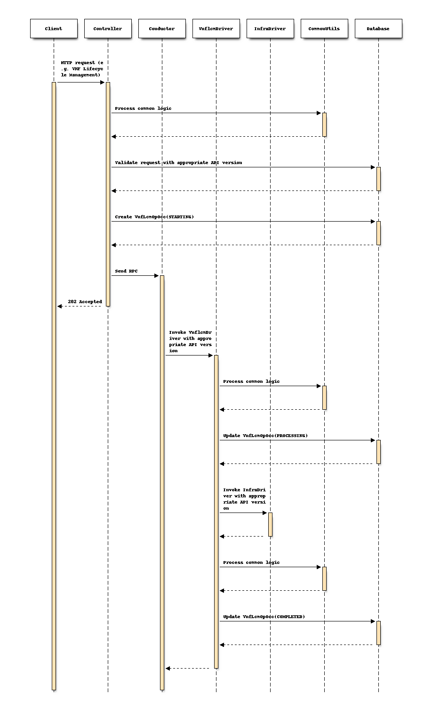

=====================================
Multi-Version Design for ETSI NFV-SOL
=====================================

https://blueprints.launchpad.net/tacker/+spec/multi-version-api

This spec proposes a new design of ETSI NFV-SOL based implementation in Tacker
to support multiple versions of ETSI NFV Release2, 3, and 4.
API versions are described in ETSI NFV-SOL documents. In Release 3,
VNF Lifecycle Management interface SOL003 v2.6.1 [#SOL003-V261]_ is defined as
"1.3.0", and it's upgraded to "2.0.0" in v3.3.1 [#SOL003-V331]_.

Problem description
===================

ETSI NFV Release3 and 4 documents are published while Tacker now supports only
Release2 based implementation with ETSI NFV-SOL v2.6.1 [#SOL003-V261]_.
In Release4, a lot of expansions for Cloud Native Function (CNF) are under
discussion. Toward supporting those new specifications, Tacker needs a new
design to support multiple versions on its APIs.

Proposed change
===============

For multi-version API support, Tacker needs to change:

#. HTTP header fields compliant with ETSI NFV SOL013 v3.4.1 [#SOL013-V341]_

   + Request header fields
   + Response header fields

#. ApiVersionInformation compliant with ETSI NFV SOL013 v3.4.1 [#SOL013-V341]_

   + VNF Lifecycle Management (/vnflcm)
   + VNF Package Management (/vnfpkgm)

#. Major/minor version support in Controller

   + Schema validation
   + VnfInstances (/vnflcm/{v1 or v2}/vnf_instances)
   + VnfLcmOpOccs (/vnflcm/{v1 or v2}/vnf_lcm_op_occs)
   + Subscriptions (/vnflcm/{v1 or v2}/subscriptions)

#. Major/minor version support in Conductor

   + Conductor server to call multi-version Drivers
   + VnflcmDriver
   + OpenStack InfraDriver
   + Kubernetes InfraDriver

#. Major/minor version support in Database

   + Objects
   + SQLAlchemy

Design of operation
---------------------

The following is the block diagram how multi-version api design
works:

.. code-block::

       +----------+
       | Request  |
       | Response |
       |          |
       +--+-------+
          |
  +-------+--------------------------------------+
  |       |                        Tacker-server |
  |    +--v------------------+                   |
  |    | Schema validation   |                   |
  |    |  * VNF Lifecycle    |                   |
  | +--+                     |                   |
  | |  +---------------------+                   |
  | |  +---------------------+   +-------------+ |
  | +->| VNF Lifecycle       |   | ApiVersion  | |
  |    |  vnflcm/{v1 or v2}  |   |  /vnflcm    | |
  |    |   /vnf_instances    |   |  /vnfpkgm   | |
  |    |   /vnf_lcm_op_occs  |   |             | |
  |    |   /subscriptions    |   +-------------+ |
  |    |                     |                   |
  |    +--+------------------+                   |
  |       |                                      |
  +-------+--------------------------------------+
          |
  +-------+--------------------------------------+
  |       |                     Tacker-conductor |
  |    +--v--------------+                       |
  |    | Conductor       |                       |
  | +--+                 |                       |
  | |  +-----------------+                       |
  | |  +-----------------+   +-----------------+ |     +-----------------+
  | +->| VnflcmDriverV1  +-->| InfraDriverV1   +-+--+->| OpenStack VIM   |
  | |  |                 |   |                 | |  |  |                 |
  | |  +-----------------+   +-----------------+ |  |  +-----------------+
  | +->| VnflcmDriverV2  +-->| InfraDriverV2   +-+--+->| Kubernetes VIM  |
  |    |                 |   |                 | |     |                 |
  |    +-----------------+   +-----------------+ |     +-----------------+
  |                                              |
  +----------------------------------------------+

Request/Response header fields
~~~~~~~~~~~~~~~~~~~~~~~~~~~~~~

The specifications for Request and Response header fields are defined
in section 4.2 of ETSI NFV-SOL013 v3.4.1 [#SOL013-V341]_.
Tacker already has its Request and Response class but not all required
fields are supported.

Request class requires the following header fields:

+-------------------+-------------------------------------------+
| Header field name | Descriptions                              |
+===================+===========================================+
| Accept            | Content-Types that are acceptable         |
|                   | for the response.                         |
|                   | This header field shall be present if     |
|                   | the response is expected to have a        |
|                   | non-empty message body.                   |
+-------------------+-------------------------------------------+
| Content-Type      | The MIME type of the body of the request. |
|                   | This header field shall be present if     |
|                   | the request has a non-empty               |
|                   | message body.                             |
+-------------------+-------------------------------------------+
| Authorization     | The authorization token for the request.  |
+-------------------+-------------------------------------------+
| Range             | Requested range of bytes from a file.     |
+-------------------+-------------------------------------------+
| Version           | Version of the API requested to use       |
|                   | when responding to this request.          |
+-------------------+-------------------------------------------+

Response needs to support to provide the following header fields:

+-------------------+-------------------------------------------+
| Header field name | Descriptions                              |
+===================+===========================================+
| Content-Type      | The MIME type of the body of the          |
|                   | response.                                 |
|                   | This header field shall be present if     |
|                   | the response has a non-empty              |
|                   | message body.                             |
+-------------------+-------------------------------------------+
| Location          | Used in redirection, or when a new        |
|                   | resource has been created.                |
|                   | This header field shall be present if     |
|                   | the response status code is 201 or 3xx.   |
|                   | In the RESTful NFV-MANO APIs              |
|                   | this header field is also used if the     |
|                   | response status code is 202 and a         |
|                   | new resource was created.                 |
+-------------------+-------------------------------------------+
| WWW-Authenticate  | Challenge if the corresponding            |
|                   | HTTP request has not provided             |
|                   | authorization, or error details if the    |
|                   | corresponding HTTP request has provided   |
|                   | an invalid authorization token.           |
+-------------------+-------------------------------------------+
| Accept-Ranges     | Used by the server to signal              |
|                   | whether or not it supports ranges for     |
|                   | certain resources.                        |
+-------------------+-------------------------------------------+
| Content-Range     | Signals the byte range that is            |
|                   | contained in the response, and the        |
|                   | total length of the file.                 |
+-------------------+-------------------------------------------+
| Retry-After       | Used to indicate how long the user        |
|                   | agent ought to wait before making a       |
|                   | follow-up request.                        |
|                   | It can be used with 503 responses.        |
|                   | The value of this field can be an         |
|                   | HTTP-date or a number of seconds          |
|                   | to delay after the response is received.  |
+-------------------+-------------------------------------------+
| Link              | Reference to other resources.             |
+-------------------+-------------------------------------------+
| Version           | Version of the API requested to use       |
|                   | when responding to this request.          |
+-------------------+-------------------------------------------+

Version management
~~~~~~~~~~~~~~~~~~

According to ETSI NFV-SOL013 v3.4.1 [#SOL013-V341]_, all interfaces need to
provide ApiVersionInformation for version information retrieval.

Tacker now supports two APIs, VNF Lifecycle Management in ETSI NFV-SOL003 and
VNF Package Management interface in ETSI NFV-SOL005. Both of them need to have
the following two URIs:

#. {apiRoot}/{apiName}/api_versions
#. {apiRoot}/{apiName}/{apiMajorVersion}/api_versions

The detail of API specification is described in the clause of REST API impact.

Controller for major/minor version
~~~~~~~~~~~~~~~~~~~~~~~~~~~~~~~~~~

The schema validation for VNF Lifecycle Management is updated to support
multiple major/minor versions.
Each operation has its validation dict for each major version. The dict is
updated for new minor versions.
For example of ``POST {apiRoot}/vnflcm/v1/vnf_instances`` with v2.0.0 and
v2.0.1 where some updates exist in newer version:

.. code-block:: python

  vnf_instances_create_v200 = {
    "type": "object",
    "properties": {
        "vnfdId": parameter_types.uuid,
        "vnfInstanceName": parameter_types.name_allow_zero_min_length,
        "vnfInstanceDescription": parameter_types.description,
        "metadata": parameter_types.keyvalue_pairs,
    },
    "required": ["vnfdId"],
    "additionalProperties": True,
  }

  vnf_instances_create_v201 = copy.deepcopy(vnf_instances_create_v200)
  vnf_instances_create_v201["properties"].update({
      "somethingNew": parameter_types.something
  })

The Controller for VNF Lifecycle Management is now implemented in
VnflcmController, however, it's separated to three Controllers;
VnfInstancesController, VnfLcmOpOccController, and SubscriptionsControllers.
This change helps us to easily understand huge logic blocks of VNF Lifecycle
Management.

Conductor for major/minor version
~~~~~~~~~~~~~~~~~~~~~~~~~~~~~~~~~

Conductor server needs to invoke different versions of VnflcmDrivers
according to the Version header in the request.
VnflcmDrivers should be different class implementation not to depend each
other for the management of deprecated API versions in future.

On the other hand, it's too redundant to implement all logics in VnflcmDriver
for each because most of them are the same in the different major versions.
Therefore the VnflcmDrivers expose their logics to the common function files,
for example, vnf_instances_utils.py.
This enables to re-use of the logics in VnflcmDriver and to reduce
duplicated code blocks.

InfraDrivers for OpenStack and Kubernetes are also re-designed to follow
the different version of APIs because they may need different logics.

Database for major/minor version
~~~~~~~~~~~~~~~~~~~~~~~~~~~~~~~~

The different major API versions require different Database tables because
the major version is incremented when one or more changed were made to the
resources structure of API that breaks backward compatibility.
Otherwise, complex dependencies make difficult to maintain data models.

It is also useful to expose their logics to the common function files as
the case in VnflcmDriver to re-use the same logics in different API versions.

Sequence of multi-version API
-----------------------------

#. Client sends HTTP request (e.g. `POST vnflcm/v2/vnf_instances/instantiate`)
#. Controller receives and validates requests
#. Controller creates VnfLcmOpOcc("STARTING") table
#. Controller sends RPC to Conductor and sends "202 Accepted" to Client
#. Conductor receives RPC and invokes VnflcmDriver

   #. Finds Version header field in the request
   #. Chooses appropriate version of VnflcmDriver with API version

#. VnflcmDriver updates VnfLcmOpOcc("PROCESSING") table
#. VnflcmDriver invokes InfraDriver

   #. Finds Version header field in the request
   #. Chooses appropriate version of InfraDriver with API version

#. VnflcmDriver updates VnfLcmOpOcc("COMPLETED") table

Alternatives
------------

The difference between Release 2 implementation and the one for Release 3
may be limited for some APIs.
It is also possible to inherit the class of Release 2 for the new Release 3
class, but this design makes version management much difficult.
Therefore, in this spec, the class for Release 3 is newly created and its
implementations can be shared between Release 2 and Release 3 with utils
functions.

Data model impact
-----------------

None.

REST API impact
---------------

* | **Name**: API versions
  | **Description**: Reads API version information
  | **Method type**: GET
  | **URL for the resource**: /vnflcm/api_versions, /vnflcm/{v1/v2}/api_versions
  | **Request**: n/a

  | **Response**:

  +-----------------------+-------------+------------------+-----------------------------------------------------+
  | Data type             | Cardinality | Response Codes   | Description                                         |
  +=======================+=============+==================+=====================================================+
  | ApiVersionInformation | 1           | Success 200      | API version information was read successfully.      |
  |                       |             | Error 4xx/5xx    |                                                     |
  +-----------------------+-------------+------------------+-----------------------------------------------------+

  +------------------+-----------+-------------+--------------------------------------------------------------+
  | Attribute name   | Data type | Cardinality | Description                                                  |
  +==================+===========+=============+==============================================================+
  | uriPrefix        | String    | 1           | Specifies the URI prefix for the API, in the following form  |
  |                  |           |             | {apiRoot}/{apiName}/{apiMajorVersion}/.                      |
  +------------------+-----------+-------------+--------------------------------------------------------------+
  | apiVersions      | Structure | 1..N        | Version(s) supported for the API signalled by                |
  |                  |           |             | the uriPrefix attribute.                                     |
  +------------------+-----------+-------------+--------------------------------------------------------------+
  | > version        | String    | 1           | Identifies a supported version.                              |
  +------------------+-----------+-------------+--------------------------------------------------------------+
  | > isDeprecated   | Boolean   | 0..1        | If such information is available, this attribute indicates   |
  |                  |           |             | whether use of the version signalled by the version          |
  |                  |           |             | attribute is deprecated (true) or not (false).               |
  +------------------+-----------+-------------+--------------------------------------------------------------+
  | > retirementDate | DateTime  | 0..1        | The date and time after which the API version will no longer |
  |                  |           |             | be supported. This attribute may be included if the value of |
  |                  |           |             | the isDeprecated attribute is set to true and shall be       |
  |                  |           |             | absent otherwise.                                            |
  +------------------+-----------+-------------+--------------------------------------------------------------+

Security impact
---------------

None.

Notifications impact
--------------------

None.

Other end user impact
---------------------

* CLI options may be changed to support version management
  due to the change in `python-tackerclient`.

Performance Impact
------------------

None.

Other deployer impact
---------------------

None.

Developer impact
----------------

* `python-tackerclient` needs to support version management.
* The basic design of Tacker is recreated and all new features need to follow
  the new design of Controller and Conductor.

Implementation
==============

Assignee(s)
-----------

Primary assignee:
  Yoshito Ito <yoshito.itou.dr@hco.ntt.co.jp>

Other contributors:
  Hirofumi Noguchi <hirofumi.noguchi.rs@hco.ntt.co.jp>

Work Items
----------

* Add new Request/Response class
* Add new controller for API version management
* Add new Controller design for major/minor versions support
* Add new Conductor to invoke VnflcmDrivers for different major versions
* Add new Database design to separate different major versions

Dependencies
============

None.

Testing
=======

Unit and functional test cases will be added for VNF Lifecycle Management of Release 3.

Documentation Impact
====================

Complete contributor guide will be added for multi-version support design.

References
==========

.. [#SOL003-V261] https://www.etsi.org/deliver/etsi_gs/NFV-SOL/001_099/003/02.06.01_60/gs_nfv-sol003v020601p.pdf
.. [#SOL003-V331] https://www.etsi.org/deliver/etsi_gs/NFV-SOL/001_099/003/03.03.01_60/gs_NFV-SOL003v030301p.pdf
.. [#SOL013-V341] https://www.etsi.org/deliver/etsi_gs/NFV-SOL/001_099/013/03.04.01_60/gs_NFV-SOL013v030401p.pdf
