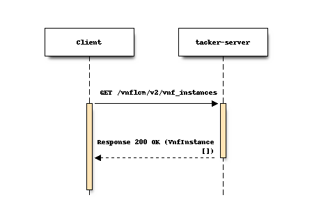
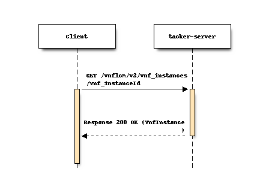
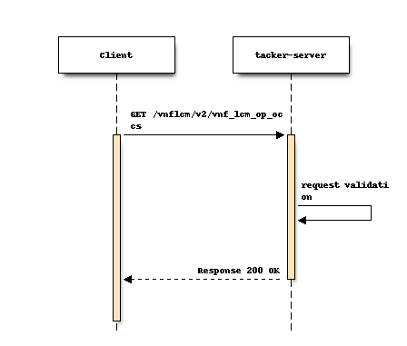
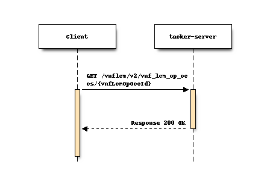
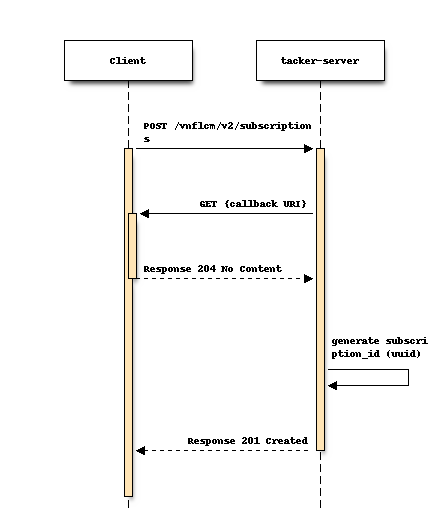
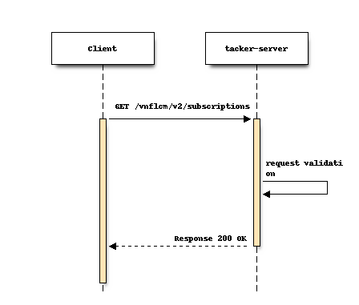
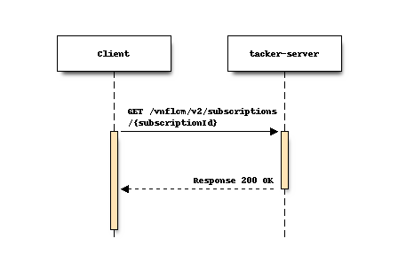
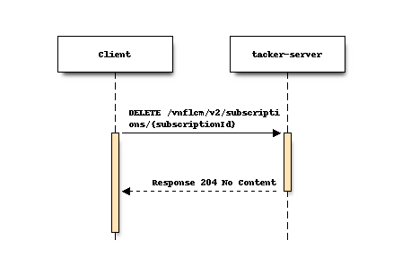

..
 This work is licensed under a Creative Commons Attribution 3.0 Unported
 License.
 http://creativecommons.org/licenses/by/3.0/legalcode

==========================================
Support NFV SOL_v3 getting LCM information
==========================================

Blueprints:

- https://blueprints.launchpad.net/tacker/+spec/support-nfv-solv3-query-vnf-instances
- https://blueprints.launchpad.net/tacker/+spec/support-nfv-solv3-query-operation-occurrences
- https://blueprints.launchpad.net/tacker/+spec/support-nfv-solv3-subscriptions

This specification supports a new version of VNF lifecycle management APIs
complying with ETSI NFV SOL v3.
It adds a new version of APIs involved in getting LCM information.

Problem description
===================

ETSI specifications within the NFV Architecture Framework [#etsi_nfv]_
describe the main aspects of NFV development and usage based on the
industry needs, feedback from SDN/NFV vendors and telecom operators.
These specifications include the REST API and data model architecture
which is used by NFV users and developers in related products.

Support of key ETSI NFV specifications will significantly reduce efforts
for Tacker integration into Telecom production networks and also will
simplify further development and support of future standards. In Wallaby
release, VNF lifecycle management operations defined in ETSI NFV SOL002
v2.6.1 [#NFV-SOL002_261]_ and SOL003 v2.6.1 [#NFV-SOL003_261]_ are supported.
However, NFV continues to develop new specifications, it should comply
with multiple versions of ETSI NFV SOL specification. Tacker will
support VNF lifecycle management operations defined in ETSI NFV SOL002
v3.3.1 [#NFV-SOL002_331]_ and SOL003 v3.3.1 [#NFV-SOL003_331]_.

Proposed change
===============

Since the VNF lifecycle management interface version specified in ETSI NFV SOL v3
is "2.0.0", the API major version included in the URI shall be set
to "v2". Supporting v2 APIs involves changing the data type of some attributes and adding
or removing attributes.
To avoid impact on the existing implementation, APIs corresponding to "v2"
should be implemented as a process independent of that of "v1".

This interface supports the following APIs
involved in getting information of lifecycle management operation.

* List VNF Instances (GET /vnf_instances)
* Show VNF Instances (GET /vnf_instances/{vnfInstanceId})

* List VNF occurrence (GET /vnf_lcm_op_occs)
* Show VNF occurrence (GET /vnf_lcm_op_occs/{vnfLcmOpOccId})

* Create Subscriptions (POST /subscriptions)
* List Subscriptions (GET /subscriptions)
* Show Subscriptions (GET /subscriptions/{subscriptionId})
* Delete Subscriptions (DELETE /subscriptions/{subscriptionId})

* Notification endpoint (POST)
* Test Notification endpoint (GET)

As shown in the below, there is no difference between
flow of v1 API and that of v2 API.

1) Flow of the Query VNF operation
----------------------------------------------

* List VNF Instances (GET /vnf_instances)

The procedure consists of the following steps as illustrated in the above sequence:

Precondition: The resource representing the VNF instance has been created.

#. If the Client intends to query all VNF instances, it sends a GET request
   to the "VNF instances" resource with the API major version included in the URI is "v2".
#. The VNFM returns a "200 OK" response including zero or more data structures of type
   "VnfInstance" in the payload body.

* Show VNF (GET /vnf_instances/{vnfInstanceId})

The procedure consists of the following steps as illustrated in the above sequence:

Precondition: The resource representing the VNF instance has been created.

#. If the Client intends to read information about a particular VNF instance,
   it sends a GET request to the "Individual VNF instance" resource,
   addressed by the appropriate VNF instance identifier in its resource URI
   with the API major version included in the URI is "v2".
#. The VNFM returns a "200 OK" response including one data structure of type
   "VnfInstance" in the payload body.

2) Flow of the Get Operation Status operation
----------------------------------------------

* List VNF occurrence (GET /vnf_lcm_op_occs)

The procedure consists of the following steps as illustrated in the above sequence:

#. The Client sends a GET request to the "VNF LCM operation occurrences" resource
   with the API major version included in the URI is "v2"
   and can use attribute-based filtering expression that follows clause 5.2 of
   ETSI GS NFV SOL013 [#NFV-SOL013_341]_.
#. The VNFM returns a "200 OK" response that includes zero or more data structures of type
   "VnfLcmOpOcc" in the payload body.

* Show VNF occurrence (GET /vnf_lcm_op_occs/{vnfLcmOpOccId})

The procedure consists of the following steps as illustrated in the above sequence:

#. The Client sends a GET request to the "Individual VNF LCM operation occurrence" resource
   with the API major version included in the URI is "v2",
   addressed by the appropriate VNF LCM operation occurrence identifier in its resource URI.
#. The VNFM returns a "200 OK" response to the Client, and includes one data structure of type
   "VnfLcmOpOcc" in the payload body.

3) Flow of managing subscriptions
----------------------------------------

* Create Subscriptions (POST /subscriptions)
* Test Notification endpoint (GET)

The procedure consists of the following steps as illustrated in the above sequence:

#. The Client sends a POST request to the "subscriptions" resource
   with the API major version included in the URI is "v2".
#. The VNFM sends Notification to test the notification endpoint obtained from Create
   Subscription request.
#. The Client returns a "204 No Content" response to indicate success.
#. The VNFM returns a "201 Created" response.

* List Subscriptions (GET /subscriptions)

The procedure consists of the following steps as illustrated in the above sequence:

#. The Client sends a GET request to the "subscriptions" resource
   with the API major version included in the URI is "v2".
#. The VNFM returns a "200 OK" response that contains zero or more representations of all existing
   subscriptions that were created by the Client.

* Show Subscriptions (GET /subscriptions/{subscriptionId})

The procedure consists of the following steps as illustrated in the above sequence:

#. The Client sends a GET request to the "subscriptions" resource
   with the API major version included in the URI is "v2",
   addressed by the appropriate VNF LCM operation occurrence identifier in its resource URI.
#. The VNFM returns a "200 OK" response that contains a representation of that individual
   subscription.

* Delete Subscriptions (DELETE /subscriptions/{subscriptionId})

The procedure consists of the following steps as illustrated in the above sequence:

#. The Client sends a DELETE request to the "subscriptions" resource
   with the API major version included in the URI is "v2",
   addressed by the appropriate VNF LCM operation occurrence identifier in its resource URI.
#. The VNFM returns a "204 No Content" response if the subscription is successfully terminated.

4) Flow of sending notifications
----------------------------------------------

* Notification endpoint (POST)
   * Precondition: Requesting Node has subscribed previously to notifications related to VNF lifecycle management.
   * When the LCM request is accepted, the operation status is sent to the consumer
     which registers subscription via "Subscription  API". This will be sent for the number of registrations.
   * The following operation states can be notified: STARTING/PROCESSING/COMPLETED/ROLLINGBACK/ROLLEDBACK/FAILED_TEMP
   * STARTING state is sent from Tacker Server, and other Operation_state notifications are sent from Tacker-Conductor.
   * Modify VNF does not send STARTING state.
   * Clients which received notification information sends "204 No Content" to Tacker.

Data model impact
-----------------

In this SPEC with ETSI NFV SOL002 v3.3.1 [#NFV-SOL002_331]_ and SOL003
v3.3.1 [#NFV-SOL003_331]_, all defined attributes should be supported in
API validation. Also, all data models in the response should be implemented
in the Database to enable flexible change of logic in VNF lifecycle management.

From the above point of view, there are two motivations to change Database tables.

The first one is from supporting new attributes in v2 API.
According to the SOL v3, new attributes were added from v2 API.
However, the data model does not need to be changed because all new attributes
are described in the current JSON data type.

The second one is from supporting all attributes defined in SOL documents.
In v1 API, limited attributes are supported in API validation and stored in the Database.
Database tables need to be changed to store additional supported attributes.

Below shows the Database tables for v2 API.
As reference information, the difference with v1 API is also shown.

.. note::

    Since Tacker manages a separate database for each major version,
    the design or the change of them does not affect each other.

* VnfInstance

  .. list-table::
    :header-rows: 1
    :widths: 2 ,2 ,2, 4

    * - v1 API (vnf_instances)
      - v2 API (VnfInstanceV2)
      - Changes from v1 API
      - Data type
    * - id
      - id
      - Data type changed
      - varchar(36) NOT NULL -> varchar(255) NOT NULL
    * - vnf_instance_name
      - vnfInstanceName
      - Renamed
      - <no_changed>
    * - vnf_instance_description
      - vnfInstanceDescription
      - Renamed and Data type changed
      - varchar(1024) DEFAULT NULL -> text DEFAULT NULL
    * - vnfd_id
      - vnfdId
      - Renamed and Data type changed
      - varchar(36) NOT NULL -> varchar(255) NOT NULL
    * - vnf_provider
      - vnfProvider
      - Renamed
      - <no_changed>
    * - vnf_product_name
      - vnfProductName
      - Renamed
      - <no_changed>
    * - vnf_software_version
      - vnfSoftwareVersion
      - Renamed
      - <no_changed>
    * - vnfd_version
      - vnfdVersion
      - Renamed
      - <no_changed>
    * -
      - vnfConfigurableProperties
      - Added
      - json DEFAULT NULL
    * - vim_connection_info
      - vimConnectionInfo
      - Renamed
      - <no_changed>
    * - instantiation_state
      - instantiationState
      - Data type changed
      - varchar(255) NOT NULL -> enum('NOT_INSTANTIATED','INSTANTIATED') NOT NULL
    * -
      - instantiatedVnfInfo
      - | Added
        | `instantiatedVnfInfo` field corresponding to `vnf_instantiated_info` in v1 API is merged in `VnfInstanceV2` table and json data is stored directly.
      - json DEFAULT NULL
    * - vnf_metadata
      - metadata
      - Renamed
      - <no_changed>
    * -
      - extensions
      - Added
      - json DEFAULT NULL
    * - task_state
      -
      - Deleted
      -
    * - tenant_id
      -
      - Deleted
      -
    * - vnf_pkg_id
      -
      - Deleted
      -
    * - created_at
      -
      - Deleted
      -
    * - updated_at
      -
      - Deleted
      -
    * - deleted_at
      -
      - Deleted
      -
    * - deleted
      -
      - Deleted
      -

* VnfLcmOpOcc

  .. list-table::
    :header-rows: 1
    :widths: 2 ,2 ,2, 4

    * - v1 API (vnf_lcm_op_occs)
      - v2 API (VnfLcmOpOccV2)
      - Changes from v1 API
      - Data type
    * - id
      - id
      - Data type changed
      - varchar(36) NOT NULL -> varchar(255) NOT NULL
    * - operation_state
      - operationState
      - Renamed and Data type changed
      - varchar(16) DEFAULT NULL -> enum('STARTING','PROCESSING','COMPLETED','FAILED_TEMP','FAILED','ROLLING_BACK','ROLLED_BACK') NOT NULL
    * - state_entered_time
      - stateEnteredTime
      - Renamed
      - <no_changed>
    * - start_time
      - startTime
      - Renamed
      - <no_changed>
    * - vnf_instance_id
      - vnfInstanceId
      - Renamed and Data type changed
      - varchar(36) NOT NULL -> varchar(255) NOT NULL
    * - grant_id
      - grantId
      - Data type changed
      - varchar(36) NOT NULL -> varchar(255) NOT NULL
    * - operation
      - operation
      - Data type changed
      - varchar(16) DEFAULT NULL -> enum('INSTANTIATE','SCALE','SCALE_TO_LEVEL','CHANGE_FLAVOUR','TERMINATE','HEAL','OPERATE','CHANGE_EXT_CONN','MODIFY_INFO','CREATE_SNAPSHOT','REVERT_TO_SNAPSHOT','CHANGE_VNFPKG') NOT NULL
    * - is_automatic_invocation
      - isAutomaticInvocation
      - Renamed
      - <no_changed>
    * - operation_params
      - operationParams
      - Renamed
      - <no_changed>
    * - is_cancel_pending
      - isCancelPending
      - Renamed
      - <no_changed>
    * -
      - cancelMode
      - Added
      - enum('GRACEFUL','FORCEFUL') DEFAULT NULL
    * - error
      - error
      - <no_changed>
      - <no_changed>
    * - resource_changes
      - resourceChanges
      - Renamed
      - <no_changed>
    * - changed_info
      - changedInfo
      - Renamed
      - <no_changed>
    * - changed_ext_connectivity
      - changedExtConnectivity
      - Renamed
      - <no_changed>
    * -
      - modificationsTriggeredByVnfPkgChange
      - | Added
        | New field defined SOL003 v3.3.1 [#NFV-SOL003_331]_ "F.2.1 FEAT02: VNF Software modification".
      - json DEFAULT NULL
    * -
      - vnfSnapshotInfoId
      - | Added
        | New field defined SOL003 v3.3.1 [#NFV-SOL003_331]_ "F.2.4 FEAT15: VNF snapshotting".
      - varchar(255) DEFAULT NULL
    * - error_point
      -
      - Deleted
      -
    * - created_at
      -
      - Deleted
      -
    * - updated_at
      -
      - Deleted
      -
    * - deleted_at
      -
      - Deleted
      -
    * - deleted
      -
      - Deleted
      -

* LccnSubscription

  .. list-table::
    :header-rows: 1
    :widths: 2 ,2 ,2, 4

    * - v1 API (vnf_lcm_subscriptions)
      - v2 API (LccnSubscriptionV2)
      - Changes from v1 API
      - Data type
    * - id
      - id
      - Data type changed
      - varchar(36) NOT NULL -> varchar(255) NOT NULL
    * -
      - filter
      - | Added
        | In v2 API data model, `filter` field merged `LccnSubscriptionV2` table.
        | The `filter` field means `vnf_lcm_filters` table in v1 API.
      - json DEFAULT NULL
    * - callback_uri
      - callbackUri
      - Renamed
      - <no_changed>
    * -
      - verbosity
      - | Added
        | New field defined SOL003 v3.3.1 [#NFV-SOL003_331]_ "F.2.5.3 Verbosity of VNF LCM operation occurrence notifications".
      - enum('FULL','SHORT') NOT NULL,
    * - subscription_authentication
      - authentication
      - Renamed
      - <no_changed>
    * - created_at
      -
      - Deleted
      -
    * - updated_at
      -
      - Deleted
      -
    * - deleted_at
      -
      - Deleted
      -
    * - deleted
      -
      - Deleted
      -

REST API impact
---------------

In this SPEC with ETSI NFV SOL002 v3.3.1 [#NFV-SOL002_331]_ and SOL003
v3.3.1 [#NFV-SOL003_331]_, all defined attributes should be supported in
API validation. Also, all data models in the response should be implemented
in the Database to enable flexible change of logic in VNF lifecycle management.

The "_link" attribute is the only exception because not all operations in
VNF lifecycle management interface are implemented. Some links to not
implemented operations should be filtered.

* | **Name**: List VNF instances
  | **Description**: Query VNF instance resource
  | **Method type**: GET
  | **URL for the resource**: /vnflcm/v2/vnf_instances
  | **URI query parameters supported by the GET method**:

  .. list-table::
     :header-rows: 1

     * - URI query parameter
       - Cardinality
       - Supported in API v2 (Xena)
       - Supported in API v1 (Wallaby)
     * - filter
       - 0..1
       - Yes
       - Yes
     * - all_fields
       - 0..1
       - Yes
       - No
     * - fields
       - 0..1
       - Yes
       - No
     * - exclude_fields
       - 0..1
       - Yes
       - No
     * - exclude_default
       - 0..1
       - Yes
       - No
     * - nextpage_opaque_marker
       - 0..1
       - Yes
       - No

  | **Response**:

  .. list-table::
    :header-rows: 1
    :widths: 2 ,2 ,2 ,2

    * -  Data type
      -  Cardinality
      -  Response Codes
      -  Description
    * -  VnfInstance
      - 0..N
      -  Success: 200
      -  Information about zero or more VNF instances has been queried successfully.
    * -  ProblemDetails
      -  1
      -  Error: 400
      -  Invalid attribute-based filtering expression.
    * -  ProblemDetails
      -  1
      -  Error: 400
      -  Invalid attribute selector.
    * -  ProblemDetails
      -  1
      -  Error: 400
      -  Response too big.
    * -  ProblemDetails
      -  See clause 6.4 of [#NFV-SOL013_341]_
      -  Error: 4xx, 5xx
      -  Any common error response code as defined in clause 6.4
         of ETSI GS NFV-SOL 013 [#NFV-SOL013_341]_ may be returned.

  .. list-table::
    :header-rows: 1
    :widths: 2 ,2 ,2 ,2 ,2 ,2

    * -  Attribute name
      -  Data type
      -  Cardinality
      - Supported in API v2 (Xena)
      - Supported in API v1 (Wallaby)
      -  Description
    * -  id
      -  Identifier
      - 1
      -  Yes
      -  Yes
      -
    * -  vnfInstanceName
      -  String
      -  0..1
      -  Yes
      -  Yes
      -
    * -  vnfInstanceDescription
      -  String
      -  0..1
      -  Yes
      -  Yes
      -
    * -  vnfdId
      -  Identifier
      - 1
      -  Yes
      -  Yes
      -
    * -  vnfProvider
      -  String
      - 1
      -  Yes
      -  Yes
      -
    * -  vnfProductName
      -  String
      - 1
      -  Yes
      -  Yes
      -
    * -  vnfSoftwareVersion
      -  Version
      - 1
      -  Yes
      -  Yes
      -
    * -  vnfdVersion
      -  Version
      - 1
      -  Yes
      -  Yes
      -
    * -  vnfConfigurableProperties
      -  KeyValuePairs
      -  0..1
      -  Yes
      -  No
      -
    * -  vimConnectionInfo
      -  map(VimConnectionInfo)
      -  0..N
      -  Yes
      -  Yes
      -  In API v2, the Data type is changed from VimConnectionInfo to map(VimConnectionInfo).
    * -  instantiationState
      -  Enum
      - 1
      -  Yes
      -  Yes
      -
    * -  instantiatedVnfInfo
      -  Structure (inlined)
      -  0..1
      -  Yes
      -  Yes
      -
    * -  >flavourId
      -  IdentifierInVnfd
      - 1
      -  Yes
      -  Yes
      -
    * -  >vnfState
      -  VnfOperationalStateType
      - 1
      -  Yes
      -  Yes
      -
    * -  >scaleStatus
      -  ScaleInfo
      -  0..N
      -  Yes
      -  Yes
      -
    * -  >maxScaleLevels
      -  ScaleInfo
      -  0..N
      -  Yes
      -  not defined
      -  New attribute in API v2.
    * -  >extCpInfo
      -  VnfExtCpInfo
      -  1..N
      -  Yes
      -  Yes
      -
    * -  >extVirtualLinkInfo
      -  ExtVirtualLinkInfo
      -  0..N
      -  Yes
      -  Yes
      -
    * -  >extManagedVirtualLinkInfo
      -  ExtManagedVirtualLinkInfo
      -  0..N
      -  Yes
      -  Yes
      -
    * -  >monitoringParameters
      -  MonitoringParameter
      -  0..N
      -  Yes
      -  No
      -
    * -  >localizationLanguage
      -  String
      -  0..1
      -  Yes
      -  No
      -
    * -  >vnfcResourceInfo
      -  VnfcResourceInfo
      -  0..N
      -  Yes
      -  Yes
      -
    * -  >vnfVirtualLinkResourceInfo
      -  VnfVirtualLinkResourceInfo
      -  0..N
      -  Yes
      -  Yes
      -
    * -  >virtualStorageResourceInfo
      -  VirtualStorageResourceInfo
      -  0..N
      -  Yes
      -  Yes
      -
    * -  >vnfcInfo
      -  VnfcInfo
      -  0..N
      -  Yes
      -  Yes
      -
    * -  metadata
      -  KeyValuePairs
      -  0..1
      -  Yes
      -  Yes
      -
    * -  extensions
      -  KeyValuePairs
      -  0..1
      -  Yes
      -  No
      -
    * -  \_links
      -  Structure (inlined)
      - 1
      -  Yes
      -  Yes
      -
    * -  >self
      -  Link
      - 1
      -  Yes
      -  Yes
      -
    * -  >indicators
      -  Link
      -  0..1
      -  No
      -  No
      -
    * -  >instantiate
      -  Link
      -  0..1
      -  Yes
      -  Yes
      -
    * -  >terminate
      -  Link
      -  0..1
      -  Yes
      -  Yes
      -
    * -  >scale
      -  Link
      -  0..1
      -  Yes
      -  Yes
      -
    * -  >scaleToLevel
      -  Link
      -  0..1
      -  No
      -  No
      -
    * -  >changeFlavour
      -  Link
      -  0..1
      -  No
      -  No
      -
    * -  >heal
      -  Link
      -  0..1
      -  Yes
      -  Yes
      -
    * -  >operate
      -  Link
      -  0..1
      -  No
      -  No
      -
    * -  >changeExtConn
      -  Link
      -  0..1
      -  Yes
      -  Yes
      -
    * -  >createSnapshot
      -  Link
      -  0..1
      -  No
      -  not defined
      -  New attribute in API v2.
    * -  >revertToSnapshot
      -  Link
      -  0..1
      -  No
      -  not defined
      -  New attribute in API v2.

* | **Name**: Show VNF instances
  | **Description**: Query individual VNF instance resource
  | **Method type**: GET
  | **URL for the resource**: /vnflcm/v2/vnf_instances/{vnfInstanceId}
  | **Resource URI variables for this resource**:

  .. list-table::
    :header-rows: 1
    :widths: 2 ,2

    * - Name
      - Description
    * - vnfInstanceId
      - Identifier of the vnfInstance.

  | **Response**:

  .. list-table::
    :header-rows: 1
    :widths: 2 ,2 ,2 ,2

    * -  Data type
      -  Cardinality
      -  Response Codes
      -  Description
    * -  VnfInstance
      - 1
      -  Success: 200
      -  Information about an individual VNF instance has been read successfully.
    * -  ProblemDetails
      -  See clause 6.4 of [#NFV-SOL013_341]_
      -  Error: 4xx, 5xx
      -  Any common error response code as defined in clause 6.4
         of ETSI GS NFV-SOL 013 [#NFV-SOL013_341]_ may be returned.

  This API returns the data type of "VndInstance" in the payload body.
  Supported attributes of "VnfInstance" are the same as those of List VNF instances.

* | **Name**: List VNF LCM operation occurrence
  | **Description**: Request VNF lifecycle management operation occurrence
  | **Method type**: GET
  | **URL for the resource**: /vnflcm/v2/vnf_lcm_op_occs
  | **URI query parameters supported by the GET method**:

  .. list-table::
     :header-rows: 1

     * - URI query parameter
       - Cardinality
       - Supported in API v2 (Xena)
       - Supported in API v1 (Wallaby)
     * - filter
       - 0..1
       - Yes
       - Yes
     * - all_fields
       - 0..1
       - Yes
       - Yes
     * - fields
       - 0..1
       - Yes
       - Yes
     * - exclude_fields
       - 0..1
       - Yes
       - Yes
     * - exclude_default
       - 0..1
       - Yes
       - Yes
     * - nextpage_opaque_marker
       - 0..1
       - Yes
       - No

  | **Response**:

  .. list-table::
    :widths: 12 10 18 50
    :header-rows: 1

    * - Data type
      - Cardinality
      - Response Codes
      - Description
    * - VnfLcmOpOcc
      - 0..N
      - Success: 200
      - Status information for zero or more VNF lifecycle
        management operation occurrences has been queried successfully.
    * -  ProblemDetails
      -  1
      -  Error: 400
      -  Invalid attribute-based filtering expression.
    * -  ProblemDetails
      -  1
      -  Error: 400
      -  Invalid attribute selector.
    * -  ProblemDetails
      -  1
      -  Error: 400
      -  Response too big.
    * -  ProblemDetails
      -  See clause 6.4 of [#NFV-SOL013_341]_
      -  Error: 4xx, 5xx
      -  Any common error response code as defined in clause 6.4
         of ETSI GS NFV-SOL 013 [#NFV-SOL013_341]_ may be returned.

  .. list-table::
    :header-rows: 1

    * - Attribute name
      - Data type
      - Cardinality
      - Supported in API v2 (Xena)
      - Supported in API v1 (Wallaby)
      -  Description
    * - id
      - Identifier
      - 1
      - Yes
      - Yes
      -
    * - operationState
      - LcmOperationStateType
      - 1
      - Yes
      - Yes
      -
    * - stateEnteredTime
      - DateTime
      - 1
      - Yes
      - Yes
      -
    * - startTime
      - DateTime
      - 1
      - Yes
      - Yes
      -
    * - vnfInstanceId
      - Identifier
      - 1
      - Yes
      - Yes
      -
    * - grantId
      - Identifier
      - 0..1
      - Yes
      - Yes
      -
    * - operation
      - LcmOperationType
      - 1
      - Yes
      - Yes
      -
    * - isAutomaticInvocation
      - Boolean
      - 1
      - Yes
      - Yes
      -
    * - operationParams
      - Object
      - 0..1
      - Yes
      - Yes
      -
    * - isCancelPending
      - Boolean
      - 1
      - Yes
      - Yes
      -
    * - cancelMode
      - CancelModeType
      - 0..1
      - Yes
      - No
      -
    * - error
      - ProblemDetails
      - 0..1
      - Yes
      - Yes
      -
    * - resourceChanges
      - Structure (inlined)
      - 0..1
      - Yes
      - Yes
      -
    * - >affectedVnfcs
      - AffectedVnfc
      - 0..N
      - Yes
      - Yes
      -
    * - >affectedVirtualLinks
      - AffectedVirtualLink
      - 0..N
      - Yes
      - Yes
      -
    * - >affectedExtLinkPorts
      - AffectedExtLinkPort
      - 0..N
      - Yes
      - not defined
      - New attribute in API v2.
    * - >affectedVirtualStorages
      - AffectedVirtualStorage
      - 0..N
      - Yes
      - Yes
      -
    * - changedInfo
      - VnfInfoModifications
      - 0..1
      - Yes
      - Yes
      -
    * - changedExtConnectivity
      - ExtVirtualLinkInfo
      - 0..N
      - Yes
      - Yes
      -
    * - modificationsTriggeredByVnfPkgChange
      - ModificationsTriggeredByVnfPkgChange
      - 0..1
      - Yes
      - not defined
      - New attribute in API v2.
    * - vnfSnapshotInfoId
      - Identifier
      - 0..1
      - Yes
      - not defined
      - New attribute in API v2.
    * - _links
      - Structure (inlined)
      - 1
      - Yes
      - Yes
      -
    * - >self
      - Link
      - 1
      - Yes
      - Yes
      -
    * - >vnfInstance
      - Link
      - 1
      - Yes
      - Yes
      -
    * - >grant
      - Link
      - 0..1
      - Yes
      - Yes
      -
    * - >cancel
      - Link
      - 0..1
      - No
      - No
      -
    * - >retry
      - Link
      - 0..1
      - Yes
      - Yes
      -
    * - >rollback
      - Link
      - 0..1
      - Yes
      - Yes
      -
    * - >fail
      - Link
      - 0..1
      - Yes
      - Yes
      -
    * - >vnfSnapshot
      - Link
      - 0..1
      - No
      - No
      -

* | **Name**: Show LCM operation occurrence
  | **Description**: Request VNF lifecycle management operation occurrence
  | **Method type**: GET
  | **URL for the resource**: /vnflcm/v2/vnf_lcm_op_occs/{vnfLcmOpOccId}
  | **Resource URI variables for this resource**:

  .. list-table::
    :header-rows: 1
    :widths: 2 ,2

    * - Name
      - Description
    * - vnfLcmOpOccId
      - Identifier of a VNF lifecycle management operation occurrence.

  | **Response**:

  .. list-table::
     :widths: 12 10 18 50
     :header-rows: 1

     * - Data type
       - Cardinality
       - Response Codes
       - Description
     * - VnfLcmOpOcc
       - 1
       - Success: 200
       - Status information about a VNF lifecycle management operation
         occurrence.
     * -  ProblemDetails
       -  See clause 6.4 of [#NFV-SOL013_341]_
       -  Error: 4xx, 5xx
       -  Any common error response code as defined in clause 6.4
          of ETSI GS NFV-SOL 013 [#NFV-SOL013_341]_ may be returned.

  This API returns the data type of "VnfLcmOpOcc" in the payload body.
  Supported attributes of "VnfLcmOpOcc" are the same
  as those of List Lcm operation occurrence.

* | **Name**: Create Subscriptions
  | **Description**: Subscribe to notifications related to VNF lifecycle management
  | **Method type**: POST
  | **URL for the resource**: /vnflcm/v2/subscriptions
  | **Request**:

  .. list-table::
    :header-rows: 1
    :widths: 2 ,2 ,2

    * - Data type
      - Cardinality
      - Description
    * - LccnSubscriptionRequest
      - 1
      - Parameters for the Subscription.

  .. list-table::
    :header-rows: 1

    * - Attribute name
      - Data type
      - Cardinality
      - Supported in API v2 (Xena)
      - Supported in API v1 (Wallaby)
      - Description
    * - filter
      - LifecycleChangeNotificationFilter
      - 0..1
      - Yes
      - Yes
      -
    * - callbackUri
      - Uri
      - 1
      - Yes
      - Yes
      -
    * - authentication
      - SubscriptionAuthentication
      - 0..1
      - Yes
      - Yes
      -
    * - verbosity
      - LcmOpOccNotificationVerbosityType
      - 0..1
      - Yes
      - not defined
      - New attribute in API v2.

  | **Response**:

  .. list-table::
    :widths: 10 10 18 50
    :header-rows: 1

    * - Data type
      - Cardinality
      - Response Codes
      - Description
    * - LccnSubscription
      - 1
      - Success: 201
      - The subscription has been created successfully.
    * - ProblemDetails
      -  1
      -  Error: 422
      -  The content type of the payload body is supported
         and the payload body of a request contains
         syntactically correct data but the data cannot be processed.
    * - ProblemDetails
      -  See clause 6.4 of [#NFV-SOL013_341]_
      -  Error: 4xx, 5xx
      -  Any common error response code as defined in clause 6.4
         of ETSI GS NFV-SOL 013 [#NFV-SOL013_341]_ may be returned.

  .. note:: Tacker allows creating an "Individual subscription" resource if another
             "Individual subscription" resource with the same filter and callback URI
             already exists (in which case it shall return the "201 Created" response code).

  .. list-table::
     :header-rows: 1

     * - Attribute name
       - Data type
       - Cardinality
       - Supported in API v2 (Xena)
       - Supported in API v1 (Wallaby)
       - Description
     * - id
       - Identifier
       - 1
       - Yes
       - Yes
       -
     * - filter
       - LifecycleChangeNotificationFilter
       - 0..1
       - Yes
       - Yes
       -
     * - callbackUri
       - Uri
       - 1
       - Yes
       - Yes
       -
     * - verbosity
       - LcmOpOccNotificationVerbosityType
       - 0..1
       - Yes
       - not defined
       - New attribute in API v2.
     * - _links
       - Structure (inlined)
       - 1
       - Yes
       - Yes
       -
     * - >self
       - Link
       - 1
       - Yes
       - Yes
       -

* | **Name**: List Subscriptions
  | **Description**: Request to list all existing subscriptions
  | **Method type**: GET
  | **URL for the resource**: /vnflcm/v2/subscriptions
  | **URI query parameters supported by the GET method**:

  .. list-table::
     :header-rows: 1

     * - URI query parameter
       - Cardinality
       - Supported in API v2 (Xena)
       - Supported in API v1 (Wallaby)
     * -  filter
       - 0..1
       - Yes
       - Yes
     * -  nextpage_opaque_marker
       - 0..1
       - Yes
       - Yes

  | **Response**:

  .. list-table::
     :widths: 10 10 18 50
     :header-rows: 1

     * - Data type
       - Cardinality
       - Response Codes
       - Description
     * - LccnSubscription
       - 0..N
       - Success: 200
       - The list of subscriptions has been queried successfully.
     * - ProblemDetails
       -  1
       -  Error: 400
       -  Invalid attribute-based filtering expression.
     * - ProblemDetails
       -  1
       -  Error: 400
       -  Response too big.
     * - ProblemDetails
       -  See clause 6.4 of [#NFV-SOL013_341]_
       -  Error: 4xx, 5xx
       -  Any common error response code as defined in clause 6.4
          of ETSI GS NFV-SOL 013 [#NFV-SOL013_341]_ may be returned.

  This API returns the data type of "LccnSubscription" in the payload body.
  Supported attributes of "LccnSubscription" are the same as
  those of Create Subscriptions.

* | **Name**: Query Subscriptions
  | **Description**: Request to show individual subscription resource by its id
  | **Method type**: GET
  | **URL for the resource**: /vnflcm/v2/subscriptions/{subscriptionId}
  | **Resource URI variables for this resource**:

  .. list-table::
    :header-rows: 1
    :widths: 2 ,2

    * - Name
      - Description
    * - subscriptionId
      - Identifier of the subscriptions.

  | **Response**:

  .. list-table::
     :widths: 10 10 18 50
     :header-rows: 1

     * - Data type
       - Cardinality
       - Response Codes
       - Description
     * - LccnSubscription
       - 1
       - Success: 200
       - The operation has completed successfully.
     * - ProblemDetails
       -  See clause 6.4 of [#NFV-SOL013_341]_
       -  Error: 4xx, 5xx
       -  Any common error response code as defined in clause 6.4
          of ETSI GS NFV-SOL 013 [#NFV-SOL013_341]_ may be returned.

  This API returns the data type of "LccnSubscription" in the payload body.
  Supported attributes of "LccnSubscription" are the same as those of Create Subscriptions.

* | **Name**: Delete Subscriptions
  | **Description**: Request to delete individual subscription resource by its id
  | **Method type**: DELETE
  | **URL for the resource**: /vnflcm/v2/subscriptions/{subscriptionId}
  | **Resource URI variables for this resource**:

  .. list-table::
    :header-rows: 1
    :widths: 2 ,2

    * - Name
      - Description
    * - subscriptionId
      - Identifier of the subscriptions.

  | **Response**:

  .. list-table::
     :widths: 10 10 18 50
     :header-rows: 1

     * - Data type
       - Cardinality
       - Response Codes
       - Description
     * - n/a
       -
       - Success: 204
       - The individual subscription resource has been deleted successfully.
     * - ProblemDetails
       -  See clause 6.4 of [#NFV-SOL013_341]_
       -  Error: 4xx, 5xx
       -  Any common error response code as defined in clause 6.4
          of ETSI GS NFV-SOL 013 [#NFV-SOL013_341]_ may be returned.

* | **Name**: Notification endpoint
  | **Description**: Send notifications related to VNF lifecycle changes

  .. note:: This API is called from Tacker to the Client.

  | **Method type**: POST
  | **URL for the resource**: The resource URI is provided by the Client when creating the subscription.
  | **Request**:

  .. list-table::
     :widths: 20 10 50
     :header-rows: 1

     * - Data type
       - Cardinality
       - Description
     * - VnfLcmOperationOccurrenceNotification
       - 1
       - A notification about lifecycle changes triggered by a VNF LCM
         operation occurrence.
     * - VnfIdentifierCreationNotification
       - 1
       - A notification about the creation of a VNF identifier and the
         related individual VNF instance resource.
     * - VnfIdentifierDeletionNotification
       - 1
       - A notification about the deletion of a VNF identifier and the
         related individual VNF instance resource.

  * VnfLcmOperationOccurrenceNotification

  .. list-table::
     :header-rows: 1

     * - Attribute name
       - Data type
       - Cardinality
       - Supported in API v2 (Xena)
       - Supported in API v1 (Wallaby)
       - Description
     * - id
       - Identifier
       - 1
       - Yes
       - Yes
       -
     * - notificationType
       - String
       - 1
       - Yes
       - Yes
       -
     * - subscriptionId
       - Identifier
       - 1
       - Yes
       - Yes
       -
     * - timeStamp
       - DateTime
       - 1
       - Yes
       - Yes
       -
     * - notificationStatus
       - Enum
       - 1
       - Yes
       - Yes
       -
     * - operationState
       - LcmOperationStateType
       - 1
       - Yes
       - Yes
       -
     * - vnfInstanceId
       - Identifier
       - 1
       - Yes
       - Yes
       -
     * - operation
       - LcmOperationType
       - 1
       - Yes
       - Yes
       -
     * - isAutomaticInvocation
       - Boolean
       - 1
       - Yes
       - Yes
       -
     * - verbosity
       - LcmOpOccNotificationVerbosityType
       - 0..1
       - Yes
       - not defined
       - New attribute in API v2.
     * - vnfLcmOpOccId
       - Identifier
       - 1
       - Yes
       - Yes
       -
     * - affectedVnfcs
       - AffectedVnfc
       - 0..N
       - Yes
       - Yes
       -
     * - affectedVirtualLinks
       - AffectedVirtualLink
       - 0..N
       - Yes
       - Yes
       -
     * - affectedExtLinkPorts
       - AffectedExtLinkPort
       - 0..N
       - Yes
       - not defined
       - New attribute in API v2.
     * - affectedVirtualStorages
       - AffectedVirtualStorage
       - 0..N
       - Yes
       - Yes
       -
     * - changedInfo
       - VnfInfoModifications
       - 0..1
       - Yes
       - Yes
       -
     * - changedExtConnectivity
       - ExtVirtualLinkInfo
       - 0..N
       - Yes
       - Yes
       -
     * - modificationsTriggeredByVnfPkgChange
       - ModificationsTriggeredByVnfPkgChange
       - 0..1
       - Yes
       - not defined
       - New attribute in API v2.
     * - error
       - ProblemDetails
       - 0..1
       - Yes
       - Yes
       -
     * - _links
       - LccnLinks
       - 1
       - Yes
       - Yes
       -

  * VnfIdentifierCreationNotification

  .. list-table::
     :header-rows: 1

     * - Attribute name
       - Data type
       - Cardinality
       - Supported in API v2 (Xena)
       - Supported in API v1 (Wallaby)
       - Description
     * - id
       - Identifier
       - 1
       - Yes
       - Yes
       -
     * - notificationType
       - String
       - 1
       - Yes
       - Yes
       -
     * - subscriptionId
       - Identifier
       - 1
       - Yes
       - Yes
       -
     * - timeStamp
       - DateTime
       - 1
       - Yes
       - Yes
       -
     * - vnfInstanceId
       - Identifier
       - 1
       - Yes
       - Yes
       -
     * - _links
       - LccnLinks
       - 1
       - Yes
       - Yes
       -

  * VnfIdentifierDeletionNotification

  .. list-table::
     :header-rows: 1

     * - Attribute name
       - Data type
       - Cardinality
       - Supported in API v2 (Xena)
       - Supported in API v1 (Wallaby)
       - Description
     * - id
       - Identifier
       - 1
       - Yes
       - Yes
       -
     * - notificationType
       - String
       - 1
       - Yes
       - Yes
       -
     * - subscriptionId
       - Identifier
       - 1
       - Yes
       - Yes
       -
     * - timeStamp
       - DateTime
       - 1
       - Yes
       - Yes
       -
     * - vnfInstanceId
       - Identifier
       - 1
       - Yes
       - Yes
       -
     * - _links
       - LccnLinks
       - 1
       - Yes
       - Yes
       -

  | **Response**:

  .. list-table::
     :widths: 12 10 18 50
     :header-rows: 1

     * - Data type
       - Cardinality
       - Response Codes
       - Description
     * - n/a
       -
       - Success: 204
       - The notification has been delivered successfully.
     * - ProblemDetails
       -  See clause 6.4 of [#NFV-SOL013_341]_
       -  Error: 4xx, 5xx
       -  Any common error response code as defined in clause 6.4
          of ETSI GS NFV-SOL 013 [#NFV-SOL013_341]_ may be returned.

* | **Name**: Test Notification endpoint
  | **Description**: The method allows the server to test the notification endpoint that is provided by the Client.

  .. note:: This API is called from Tacker to the Client.

  | **Method type**: GET
  | **URL for the resource**: The resource URI is provided by the Client when creating the subscription.
  | **Response**:

  .. list-table::
     :widths: 12 10 18 50
     :header-rows: 1

     * - Data type
       - Cardinality
       - Response Codes
       - Description
     * - n/a
       -
       - Success: 204
       - The notification endpoint has been tested successfully.
     * - ProblemDetails
       -  See clause 6.4 of [#NFV-SOL013_341]_
       -  Error: 4xx, 5xx
       -  Any common error response code as defined in clause 6.4
          of ETSI GS NFV-SOL 013 [#NFV-SOL013_341]_ may be returned.

  .. note:: If this API returns an error response, the Subscriptions API
            that triggers it will return a 400 error response.

Security impact
---------------

None

Notifications impact
--------------------

None

Other end user impact
---------------------

CLI options may be changed to switch between v1 API and v2 API.

Performance Impact
------------------

None

Other deployer impact
---------------------

None

Developer impact
----------------

* `python-tackerclient` needs to support a new attribute to set API version.

Implementation
==============

Assignee(s)
-----------

Hirofumi Noguchi <hirofumi.noguchi.rs@hco.ntt.co.jp>

Work Items
----------

* Add new version API endpoints to Tacker-server.
* Add new unit and functional tests.
* Update the Tacker's API documentation.

Dependencies
============

None

Testing
========

Unit and functional test cases will be added for VNF lifecycle management
of VNF instances.

Documentation Impact
====================

Complete user guide will be added to explain how to invoke VNF lifecycle
management of VNF instances with examples.

References
==========

.. [#etsi_nfv] https://www.etsi.org/technologies-clusters/technologies/NFV
.. [#NFV-SOL002_261]
  https://www.etsi.org/deliver/etsi_gs/NFV-SOL/001_099/002/02.06.01_60/gs_nfv-sol002v020601p.pdf
  (Chapter 5: VNF Lifecycle Management interface)
.. [#NFV-SOL003_261]
  https://www.etsi.org/deliver/etsi_gs/NFV-SOL/001_099/003/02.06.01_60/gs_nfv-sol003v020601p.pdf
  (Chapter 5: VNF Lifecycle Management interface)
.. [#NFV-SOL002_331]
  https://www.etsi.org/deliver/etsi_gs/NFV-SOL/001_099/002/03.03.01_60/gs_nfv-sol002v030301p.pdf
  (Chapter 5: VNF Lifecycle Management interface)
.. [#NFV-SOL003_331]
  https://www.etsi.org/deliver/etsi_gs/NFV-SOL/001_099/003/03.03.01_60/gs_nfv-sol003v030301p.pdf
  (Chapter 5: VNF Lifecycle Management interface)
.. [#NFV-SOL013_341]
  https://www.etsi.org/deliver/etsi_gs/NFV-SOL/001_099/013/03.04.01_60/gs_nfv-sol013v030401p.pdf
