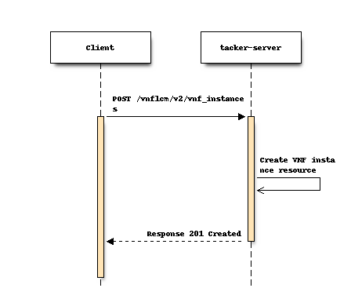

..
 This work is licensed under a Creative Commons Attribution 3.0 Unported
 License.
 http://creativecommons.org/licenses/by/3.0/legalcode

============================================
Support NFV SOL_v3 starting and terminating
============================================

https://blueprints.launchpad.net/tacker/+spec/support-nfv-solv3-start-and-terminate-vnf

This specification supports a new version of VNF lifecycle management APIs
complying with ETSI NFV SOL v3.
It adds a new version of APIs involved in starting VNF and terminating VNF.

Problem description
===================

ETSI specifications within the NFV Architecture Framework [#etsi_nfv]_
describe the main aspects of NFV development and usage based on the
industry needs, feedback from SDN/NFV vendors and telecom operators.
These specifications include the REST API and data model architecture
which is used by NFV users and developers in related products.

Support of key ETSI NFV specifications will significantly reduce efforts
for Tacker integration into Telecom production networks and also will
simplify further development and support of future standards. In Wallaby
release, VNF lifecycle management operations defined in ETSI NFV SOL002
v2.6.1 [#NFV-SOL002_261]_ and SOL003 v2.6.1 [#NFV-SOL003_261]_ are supported.
However, NFV continues to develop new specifications, it should comply
with multiple versions of ETSI NFV SOL specification. Tacker will
support VNF lifecycle management operations defined in ETSI NFV SOL002
v3.3.1 [#NFV-SOL002_331]_ and SOL003 v3.3.1 [#NFV-SOL003_331]_.

Proposed change
===============

Since the VNF lifecycle management interface version specified in ETSI NFV SOL v3
is "2.0.0", the API major version included in URI shall be set
to "v2". Supporting v2 APIs involves changing the data type of some attributes and adding
or removing attributes.
To avoid impact on the existing implementation, APIs corresponding to "v2"
should be implemented as a process independent of that of "v1".

The following are sample APIs supported by this interface.

* Create VNF Identifier
* Instantiate VNF
* Terminate VNF
* Delete VNF Identifier

1) Flow of creation of a VNF instance resource
----------------------------------------------

#. Client sends a Create VNF request with the API major version included
   in URI is "v2".
#. The VNFM creates a VNF instance resource and the associated VNF instance
   identifier.
#. The VNFM returns a "201 Created" response.

If necessary, VNFM performs the package acquisition process as described
in the SPEC `support-sol003-vnfm-operations`_, and the notification
process as described in the SPEC `support-notification-api-based-on-etsi-nfv-sol`_.

2) Flow of Instantiation of a VNF instance
------------------------------------------

#. Client sends an Instantiate VNF request with the API major version included
   in URI is "v2".
#. The VNFM returns a "202 Accepted" response.
#. VNFM and NFVO exchange granting information.
#. The VNFM calls MgmtDriver and VnfLcmDriver.

If necessary, VNFM performs the notification process as described in the SPEC
`support-notification-api-based-on-etsi-nfv-sol`_.

3) Flow of Termination of a VNF instance
----------------------------------------

#. Client sends a Terminate VNF request with the API major version included
   in URI is "v2".
#. The VNFM returns a "202 Accepted" response.
#. VNFM and NFVO exchange granting information.
#. The VNFM calls MgmtDriver and VnfLcmDriver.

If necessary, VNFM performs the notification process as described in the SPEC
`support-notification-api-based-on-etsi-nfv-sol`_.

4) Flow of deletion of a VNF instance resource
----------------------------------------------

#. Client sends a Delete VNF request with the API major version included
   in URI is "v2".
#. The VNFM deletes the "VNF instance resource" and the associated VNF instance
   identifier.
#. The VNFM returns a "204 No Content" response with an empty payload body.

If necessary, VNFM performs the notification process as described in the SPEC
`support-notification-api-based-on-etsi-nfv-sol`_.

Data model impact
-----------------

In this SPEC with ETSI NFV SOL002 v3.3.1 [4] and SOL003
v3.3.1 [5], all defined attributes should be supported in
API validation. Also, all data models in the response should be implemented
in the Database to enable flexible change of logic in VNF lifecycle management.

From the above point of view, there are two motivations to change Database tables.

The first one is from supporting new attributes in v2 API.
According to the SOL v3, new attributes were added from v2 API.
However, the data model does not need to be changed because all new attributes
are described in the current JSON data type.

The second one is from supporting all attributes defined in SOL documents.
In v1 API, limited attributes are supported in API validation and stored in the Database.
Database tables need to be changed to store additional supported attributes.

Below shows the Database tables for v2 API.
As reference information, the difference with v1 API is also shown.

.. note:: Since Tacker manages a separate database for each major version,
          the design or the change of them does not affect each other.

* VnfInstance

  .. list-table::
    :header-rows: 1
    :widths: 2 ,2 ,2, 4

    * - v1 API (vnf_instances)
      - v2 API (VnfInstanceV2)
      - Changes from v1 API
      - Data type
    * - id
      - id
      - Data type changed
      - varchar(36) NOT NULL -> varchar(255) NOT NULL
    * - vnf_instance_name
      - vnfInstanceName
      - Renamed
      - <no_changed>
    * - vnf_instance_description
      - vnfInstanceDescription
      - Renamed and Data type changed
      - varchar(1024) DEFAULT NULL -> text DEFAULT NULL
    * - vnfd_id
      - vnfdId
      - Renamed and Data type changed
      - varchar(36) NOT NULL -> varchar(255) NOT NULL
    * - vnf_provider
      - vnfProvider
      - Renamed
      - <no_changed>
    * - vnf_product_name
      - vnfProductName
      - Renamed
      - <no_changed>
    * - vnf_software_version
      - vnfSoftwareVersion
      - Renamed
      - <no_changed>
    * - vnfd_version
      - vnfdVersion
      - Renamed
      - <no_changed>
    * -
      - vnfConfigurableProperties
      - Added
      - json DEFAULT NULL
    * - vim_connection_info
      - vimConnectionInfo
      - Renamed
      - <no_changed>
    * - instantiation_state
      - instantiationState
      - Data type changed
      - varchar(255) NOT NULL -> enum('NOT_INSTANTIATED','INSTANTIATED') NOT NULL
    * -
      - instantiatedVnfInfo
      - | Added
        | `instantiatedVnfInfo` field corresponding to `vnf_instantiated_info` in v1 API is merged in `VnfInstanceV2` table and json data is stored directly.
      - json DEFAULT NULL
    * - vnf_metadata
      - metadata
      - Renamed
      - <no_changed>
    * -
      - extensions
      - Added
      - json DEFAULT NULL
    * - task_state
      -
      - Deleted
      -
    * - tenant_id
      -
      - Deleted
      -
    * - vnf_pkg_id
      -
      - Deleted
      -
    * - created_at
      -
      - Deleted
      -
    * - updated_at
      -
      - Deleted
      -
    * - deleted_at
      -
      - Deleted
      -
    * - deleted
      -
      - Deleted
      -

* VnfLcmOpOcc

  .. list-table::
    :header-rows: 1
    :widths: 2 ,2 ,2, 4

    * - v1 API (vnf_lcm_op_occs)
      - v2 API (VnfLcmOpOccV2)
      - Changes from v1 API
      - Data type
    * - id
      - id
      - Data type changed
      - varchar(36) NOT NULL -> varchar(255) NOT NULL
    * - operation_state
      - operationState
      - Renamed and Data type changed
      - varchar(16) DEFAULT NULL -> enum('STARTING','PROCESSING','COMPLETED','FAILED_TEMP','FAILED','ROLLING_BACK','ROLLED_BACK') NOT NULL
    * - state_entered_time
      - stateEnteredTime
      - Renamed
      - <no_changed>
    * - start_time
      - startTime
      - Renamed
      - <no_changed>
    * - vnf_instance_id
      - vnfInstanceId
      - Renamed and Data type changed
      - varchar(36) NOT NULL -> varchar(255) NOT NULL
    * - grant_id
      - grantId
      - Data type changed
      - varchar(36) NOT NULL -> varchar(255) NOT NULL
    * - operation
      - operation
      - Data type changed
      - varchar(16) DEFAULT NULL -> enum('INSTANTIATE','SCALE','SCALE_TO_LEVEL','CHANGE_FLAVOUR','TERMINATE','HEAL','OPERATE','CHANGE_EXT_CONN','MODIFY_INFO','CREATE_SNAPSHOT','REVERT_TO_SNAPSHOT','CHANGE_VNFPKG') NOT NULL
    * - is_automatic_invocation
      - isAutomaticInvocation
      - Renamed
      - <no_changed>
    * - operation_params
      - operationParams
      - Renamed
      - <no_changed>
    * - is_cancel_pending
      - isCancelPending
      - Renamed
      - <no_changed>
    * -
      - cancelMode
      - Added
      - enum('GRACEFUL','FORCEFUL') DEFAULT NULL
    * - error
      - error
      - <no_changed>
      - <no_changed>
    * - resource_changes
      - resourceChanges
      - Renamed
      - <no_changed>
    * - changed_info
      - changedInfo
      - Renamed
      - <no_changed>
    * - changed_ext_connectivity
      - changedExtConnectivity
      - Renamed
      - <no_changed>
    * -
      - modificationsTriggeredByVnfPkgChange
      - | Added
        | New field defined SOL003 v3.3.1 [#NFV-SOL003_331]_ "F.2.1 FEAT02: VNF Software modification".
      - json DEFAULT NULL
    * -
      - vnfSnapshotInfoId
      - | Added
        | New field defined SOL003 v3.3.1 [#NFV-SOL003_331]_ "F.2.4 FEAT15: VNF snapshotting".
      - varchar(255) DEFAULT NULL
    * - error_point
      -
      - Deleted
      -
    * - created_at
      -
      - Deleted
      -
    * - updated_at
      -
      - Deleted
      -
    * - deleted_at
      -
      - Deleted
      -
    * - deleted
      -
      - Deleted
      -

REST API impact
---------------

All defined attributes should be supported in API validation.
The "_link" attribute is the only exception because not all operations in
VNF lifecycle management interface are implemented. Some links to not
implemented operations should be filtered.

* | **Name**: Create VNF Identifier
  | **Description**: Creates a new VNF instance resource
  | **Method type**: POST
  | **URL for the resource**: /vnflcm/v2/vnf_instances
  | **Request**:

  .. list-table::
    :header-rows: 1
    :widths: 2 ,2 ,2

    * -  Data type
      -  Cardinality
      -  Description
    * -  CreateVnfRequest
      - 1
      -  The VNF creation parameters.

  .. list-table::
    :header-rows: 1
    :widths: 2 ,2 ,2 ,2 ,2

    * -  Attribute name
      -  Data type
      -  Cardinality
      -  Supported in API v2 (Xena)
      -  Supported in API v1 (Wallaby)
    * -  vnfdId
      -  Identifier
      - 1
      -  Yes
      -  Yes
    * -  vnfInstanceName
      -  String
      -  0..1
      -  Yes
      -  Yes
    * -  vnfInstanceDescription
      -  String
      -  0..1
      -  Yes
      -  Yes
    * -  metadata
      -  KeyValuePairs
      -  0..1
      -  Yes
      -  Yes

  | **Response**:

  .. list-table::
    :header-rows: 1
    :widths: 2 ,2 ,2 ,2

    * -  Data type
      -  Cardinality
      -  Response Codes
      -  Description
    * -  VnfInstance
      - 1
      -  Success: 201
      -  A VNF Instance identifier was created successfully.
    * -  ProblemDetails
      -  1
      -  Error: 422
      -  The content type of the payload body is supported and the payload
         body of a request contains syntactically correct data
         but the data cannot be processed.
    * -  ProblemDetails
      -  See clause 6.4 of [#NFV-SOL013_341]_
      -  Error: 4xx, 5xx
      -  Any common error response code as defined in clause 6.4
         of ETSI GS NFV-SOL 013 [#NFV-SOL013_341]_ may be returned.

  .. list-table::
    :header-rows: 1
    :widths: 2 ,2 ,2 ,2 ,2 ,2

    * -  Attribute name
      -  Data type
      -  Cardinality
      -  Supported in API v2 (Xena)
      -  Supported in API v1 (Wallaby)
      -  Description
    * -  id
      -  Identifier
      - 1
      -  Yes
      -  Yes
      -
    * -  vnfInstanceName
      -  String
      -  0..1
      -  Yes
      -  Yes
      -
    * -  vnfInstanceDescription
      -  String
      -  0..1
      -  Yes
      -  Yes
      -
    * -  vnfdId
      -  Identifier
      - 1
      -  Yes
      -  Yes
      -
    * -  vnfProvider
      -  String
      - 1
      -  Yes
      -  Yes
      -
    * -  vnfProductName
      -  String
      - 1
      -  Yes
      -  Yes
      -
    * -  vnfSoftwareVersion
      -  Version
      - 1
      -  Yes
      -  Yes
      -
    * -  vnfdVersion
      -  Version
      - 1
      -  Yes
      -  Yes
      -
    * -  vnfConfigurableProperties
      -  KeyValuePairs
      -  0..1
      -  Yes
      -  No
      -
    * -  vimConnectionInfo
      -  map(VimConnectionInfo)
      -  0..N
      -  Yes
      -  Yes
      -  In API v2, the Data type is changed from VimConnectionInfo to map(VimConnectionInfo).
    * -  instantiationState
      -  Enum
      - 1
      -  Yes
      -  Yes
      -
    * -  metadata
      -  KeyValuePairs
      -  0..1
      -  Yes
      -  No
      -
    * -  extensions
      -  KeyValuePairs
      -  0..1
      -  Yes
      -  No
      -
    * -  \_links
      -  Structure (inlined)
      - 1
      -  Yes
      -  Yes
      -
    * -  >self
      -  Link
      - 1
      -  Yes
      -  Yes
      -
    * -  >indicators
      -  Link
      -  0..1
      -  No
      -  No
      -
    * -  >instantiate
      -  Link
      -  0..1
      -  Yes
      -  Yes
      -
    * -  >terminate
      -  Link
      -  0..1
      -  Yes
      -  Yes
      -
    * -  >scale
      -  Link
      -  0..1
      -  Yes
      -  Yes
      -
    * -  >scaleToLevel
      -  Link
      -  0..1
      -  No
      -  No
      -
    * -  >changeFlavour
      -  Link
      -  0..1
      -  No
      -  No
      -
    * -  >heal
      -  Link
      -  0..1
      -  Yes
      -  Yes
      -
    * -  >operate
      -  Link
      -  0..1
      -  No
      -  No
      -
    * -  >changeExtConn
      -  Link
      -  0..1
      -  Yes
      -  Yes
      -
    * -  >createSnapshot
      -  Link
      -  0..1
      -  No
      -  -
      -  New attribute in API v2.
    * -  >revertToSnapshot
      -  Link
      -  0..1
      -  No
      -  -
      -  New attribute in API v2.

* | **Name**: Instantiate VNF task
  | **Description**: This task resource represents the "Instantiate VNF"
    operation. The client can use this resource to instantiate a VNF instance.
  | **Method type**: POST
  | **URL for the resource**: /vnflcm/v2/vnf_instances/{vnfInstanceId}/instantiate
  | **Resource URI variables for this resource**:

  .. list-table::
    :header-rows: 1
    :widths: 2 ,2

    * -  Name
      -  Definition
    * -  vnfInstanceId
      -  The identifier of the VNF instance to be instantiated.

  | **Request**:

  .. list-table::
    :header-rows: 1
    :widths: 2 ,2 ,2

    * -  Data type
      -  Cardinality
      -  Description
    * -  InstantiateVnfRequest
      - 1
      -  Parameters passed to instantiate task.

  .. list-table::
    :header-rows: 1
    :widths: 2 ,2 ,2 ,2 ,2 ,2

    * -  Attribute name
      -  Data type
      -  Cardinality
      -  Supported in API v2 (Xena)
      -  Supported in API v1 (Wallaby)
      -  Description
    * -  flavourId
      -  IdentifierInVnfd
      - 1
      -  Yes
      -  Yes
      -
    * -  instantiationLevelId
      -  IdentifierInVnfd
      -  0..1
      -  Yes
      -  Yes
      -
    * -  extVirtualLinks
      -  ExtVirtualLinkData
      -  0..N
      -  Yes
      -  Yes
      -
    * -  extManagedVirtualLinks
      -  ExtManagedVirtualLinkData
      -  0..N
      -  Yes
      -  Yes
      -
    * -  vimConnectionInfo
      -  map(VimConnectionInfo)
      -  0..N
      -  Yes
      -  Yes
      -  In API v2, the Data type is changed from VimConnectionInfo to map(VimConnectionInfo).
    * -  localizationLanguage
      -  String
      -  0..1
      -  Yes
      -  No
      -
    * -  additionalParams
      -  KeyValuePairs
      -  0..1
      -  Yes
      -  Yes
      -
    * -  extensions
      -  KeyValuePairs
      -  0..1
      -  Yes
      -  No
      -
    * -  vnfConfigurableProperties
      -  KeyValuePairs
      -  0..1
      -  Yes
      -  No
      -

  | **Response**:

  .. list-table::
    :header-rows: 1
    :widths: 2 ,2 ,2 ,2

    * -  Data type
      -  Cardinality
      -  Response Codes
      -  Description
    * -  n/a
      -
      -  Success: 202
      -  The request was accepted for processing, but the processing has not been completed.
    * -  ProblemDetails
      -  1
      -  Error: 409
      -  The operation cannot be executed currently, due to a
         conflict with the state of the resource.
    * -  ProblemDetails
      -  See clause 6.4 of [#NFV-SOL013_341]_
      -  Error: 4xx, 5xx
      -  Any common error response code as defined in clause 6.4
         of ETSI GS NFV-SOL 013 [#NFV-SOL013_341]_ may be returned.

* | **Name**: Terminate VNF task
  | **Description**: This task resource represents the "Terminate VNF"
     operation. The client can use this resource to terminate a VNF instance.
  | **Method type**: POST
  | **URL for the resource**: /vnflcm/v2/vnf_instances/{vnfInstanceId}/terminate
  | **Resource URI variables for this resource**:

  .. list-table::
    :header-rows: 1
    :widths: 2 ,2

    * -  Name
      -  Description
    * -  vnfInstanceId
      -  The identifier of the VNF instance to be terminated.

  | **Request**:

  .. list-table::
    :header-rows: 1
    :widths: 2 ,2 ,2

    * -  Data type
      -  Cardinality
      -  Description
    * -  TerminateVnfRequest
      -  1
      -  Parameters passed to Terminate VNF task.

  .. list-table::
    :header-rows: 1
    :widths: 2 ,2 ,2 ,2 ,2

    * -  Attribute name
      -  Data type
      -  Cardinality
      -  Supported in API v2 (Xena)
      -  Supported in API v1 (Wallaby)
    * -  terminationType
      -  Enum (inlined)
      - 1
      -  Yes
      -  Yes
    * -  gracefulTerminationTimeout
      -  Integer
      -  0..1
      -  Yes
      -  Yes
    * -  additionalParams
      -  KeyValuePairs
      -  0..1
      -  Yes
      -  Yes

  | **Response**:

  .. list-table::
    :header-rows: 1
    :widths: 2 ,2 ,2 ,2

    * -  Data type
      -  Cardinality
      -  Response Codes
      -  Description
    * -  n/a
      -
      -  Success: 202
      -  The request was accepted for processing, but the processing has not been completed.
    * -  ProblemDetails
      -  See clause 6.4 of [#NFV-SOL013_341]_
      -  Error: 4xx, 5xx
      -  Any common error response code as defined in clause 6.4
         of ETSI GS NFV-SOL 013 [#NFV-SOL013_341]_ may be returned.

* | **Name**: Delete VNF Instance
  | **Description**: Request to delete VNF instance resource by its id
  | **Method type**: DELETE
  | **URL for the resource**: /vnflcm/v2/vnf_instances/{vnfInstanceId}
  | **Resource URI variables for this resource**:

  .. list-table::
    :header-rows: 1
    :widths: 2 ,2

    * -  Name
      -  Description
    * -  vnfInstanceId
      -  Identifier of the VNF instance.

  | **Response**:

  .. list-table::
    :header-rows: 1
    :widths: 2 ,2 ,2 ,2

    * -  Data type
      -  Cardinality
      -  Response Codes
      -  Description
    * -  n/a
      -
      -  Success: 204
      -  The VNF instance resource and the associated VNF identifier were deleted successfully.
    * -  ProblemDetails
      -  1
      -  Error: 409
      -  The operation cannot be executed currently, due to a conflict with the state of the resource.
    * -  ProblemDetails
      -  See clause 6.4 of [#NFV-SOL013_341]_
      -  Error: 4xx, 5xx
      -  Any common error response code as defined in clause 6.4
         of ETSI GS NFV-SOL 013 [#NFV-SOL013_341]_ may be returned.

Security impact
---------------

None

Notifications impact
--------------------

None

Other end user impact
---------------------

CLI options may be changed to switch between v1 API and v2 API.

Performance Impact
------------------

None

Other deployer impact
---------------------

None

Developer impact
----------------

* `python-tackerclient` needs to support a new attribute to set API version.

Implementation
==============

Assignee(s)
-----------

Hirofumi Noguchi <hirofumi.noguchi.rs@hco.ntt.co.jp>

Work Items
----------

* Add new version API endpoints to Tacker-server.
* Add new unit and functional tests.
* Update the Tacker's API documentation.

Dependencies
============

None

Testing
========

Unit and functional test cases will be added for VNF lifecycle management
of VNF instances.

Documentation Impact
====================

Complete user guide will be added to explain how to invoke VNF lifecycle
management of VNF instances with examples.

References
==========

.. [#etsi_nfv] https://www.etsi.org/technologies-clusters/technologies/NFV
.. [#NFV-SOL002_261]
  https://www.etsi.org/deliver/etsi_gs/NFV-SOL/001_099/002/02.06.01_60/gs_nfv-sol002v020601p.pdf
  (Chapter 5: VNF Lifecycle Management interface)
.. [#NFV-SOL003_261]
  https://www.etsi.org/deliver/etsi_gs/NFV-SOL/001_099/003/02.06.01_60/gs_nfv-sol003v020601p.pdf
  (Chapter 5: VNF Lifecycle Management interface)
.. [#NFV-SOL002_331]
  https://www.etsi.org/deliver/etsi_gs/NFV-SOL/001_099/002/03.03.01_60/gs_nfv-sol002v030301p.pdf
  (Chapter 5: VNF Lifecycle Management interface)
.. [#NFV-SOL003_331]
  https://www.etsi.org/deliver/etsi_gs/NFV-SOL/001_099/003/03.03.01_60/gs_nfv-sol003v030301p.pdf
  (Chapter 5: VNF Lifecycle Management interface)
.. _support-notification-api-based-on-etsi-nfv-sol:
  https://specs.openstack.org/openstack/tacker-specs/specs/victoria/support-notification-api-based-on-etsi-nfv-sol.html
.. _support-sol003-vnfm-operations:
  https://specs.openstack.org/openstack/tacker-specs/specs/victoria/support-sol003-vnfm-operations.html
.. [#NFV-SOL013_341]
  https://www.etsi.org/deliver/etsi_gs/NFV-SOL/001_099/013/03.04.01_60/gs_nfv-sol013v030401p.pdf
