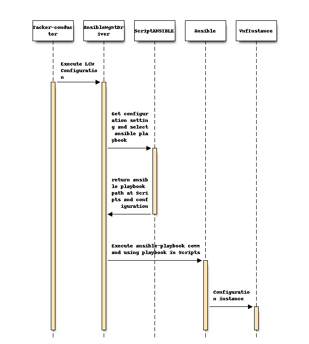

..
 This work is licensed under a Creative Commons Attribution 3.0 Unported
 License.

 http://creativecommons.org/licenses/by/3.0/legalcode

==========================================
Add sample ansible mgmt driver
==========================================

https://blueprints.launchpad.net/tacker/+spec/add-ansible-mgmt-driver-sample

This Specification describes a sample Mgmt Driver that enables VNF
Configuration using Ansible.

Problem description
===================

In the current community code, there is no Mgmt Driver which enables VNF
Configuration using Ansible.
Ansible is a general purpose configuration management tool.

Proposed change
===============

Enable VNF Configuration with specific LCMs and the following VNF Packages.

By using this driver, we can increase the configuration choices without
having to include specific setting in the VNF.
Since Ansible behaves according to Playbook, it has the advantage of
executing a uniform configuration when deploying multiple VNF from a single
VNF Package.

1) Support ansible driver configuration point of LCM
----------------------------------------------------

This sample ansible driver supports following configuration points of LCM.

- instantiation_end
- scale_start
- scale_end
- heal_end
- termination_start

2) Support VNF Package
----------------------

Perform VNF configuration using a VNF Package with the following structure.
There are two configuration points in Ansible Driver.

.. code-block:: console

  VNF Package
  !----TOSCA-Metadata
  !----Definitions
  !----Files
  !----Scripts
  !----ScriptANSIBLE
  !----BaseHOT
  !----UserData

ScriptANSIBLE
~~~~~~~~~~~~~

Contains the settings for running Ansible Script.
This includes the path to the Ansible Playbook that each LCM runs,
and the orders that should be executed according to each VDU, etc.
Also, here is defined the information for connecting to the host.
Connection username, SSH _ Key information, etc.

.. code-block:: yaml

 vdus:
  VDUA:
    config:
      order: 1
      vm_app_config:
        instantiation_end:
          - path: Scripts/VDUA-instantiation.yaml
            order: 0
        heal_end:
          - path: Scripts/VDUA-healing.yaml
            order: 0

  VDUB:
    config:
      order: 1
      vm_app_config:
        instantiation_end:
          - path: Scripts/VDUB-instantiation.yaml
            order: 0
        heal_end:
          - path: Scripts/VDUB-healing.yaml
            order: 0

BaseHOT
~~~~~~~

The user needs to set an IP address to connect to the VNF for VNF Configuration.
This sample driver uses the HOT outputs parameter to specify the Port used for VNF Configuration.

.. code-block:: yaml

  outputs:
    mgmt_ip-VDUA:
      value:
        get_attr:
        - CP1
        - fixed_ips
        - 0
        - ip_address

Scripts
~~~~~~~

Contains the Playbook to run on each LCM.
They execute the Playbook specified by the vnflcm driver and ScriptANSIBLE
during each LCM operation.

The Ansible Driver Sample runs using the Ansible service on the same server
as Tacker.

Alternatives
------------
None

Data model impact
-----------------
None

REST API impact
---------------
None

Security impact
---------------
None

Notifications impact
--------------------
None

Other end user impact
---------------------
None

Performance Impact
------------------
None

Other deployer impact
---------------------
None

Developer impact
----------------
None

Implementation
==============

Assignee(s)
-----------

Primary assignee:
  Wataru Juso <w-juso@nec.com>

Other contributors:
  Aldinson C. Esto <esto.aln@nec.com>

Work Items
----------

- Add parameter of mgmt_driver I/F in vnflcm_driver.py.
- Add ansible driver sample at tacker/samples/mgmt_driver/ansible

Dependencies
============
None

Testing
=======
None

Documentation Impact
====================

Complete the documentation for the user using this sample driver.

- How to find the prerequisites
- How to create a package
- How to operate LCM with this sample driver

References
==========
None
