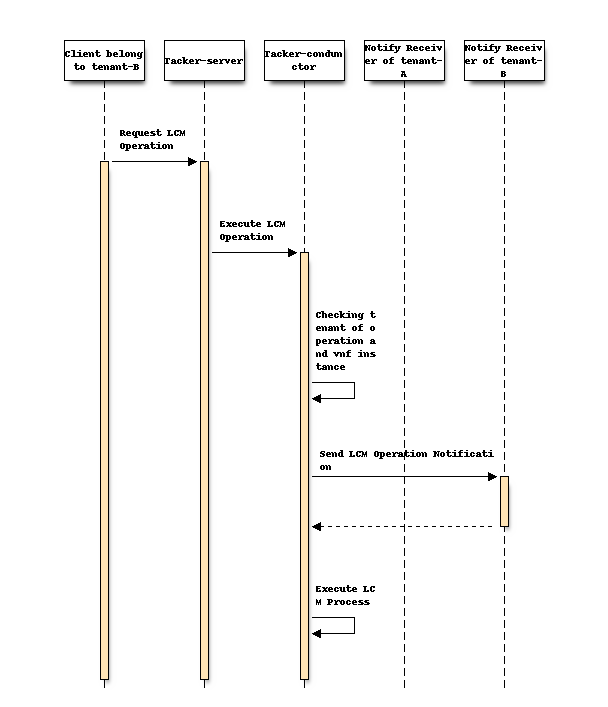
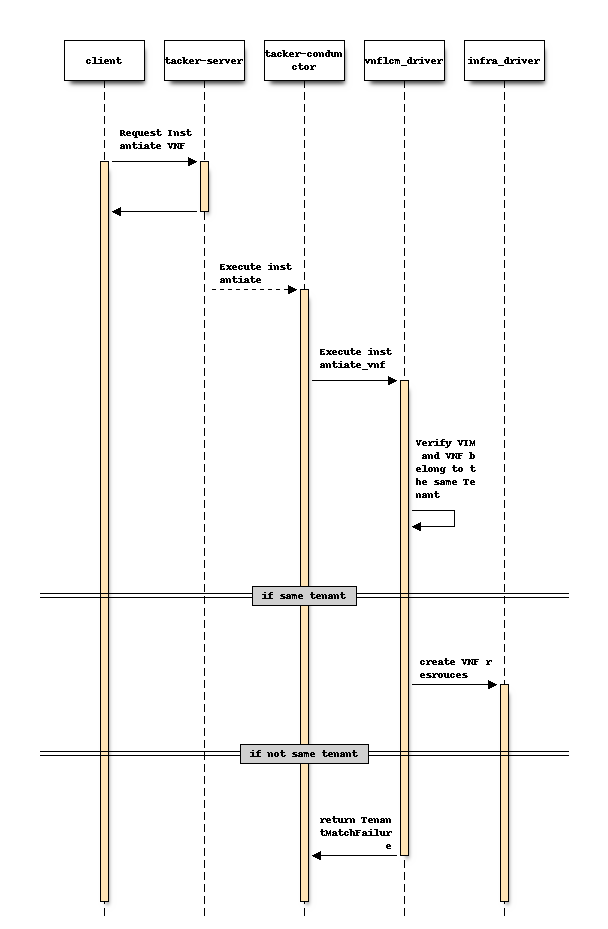
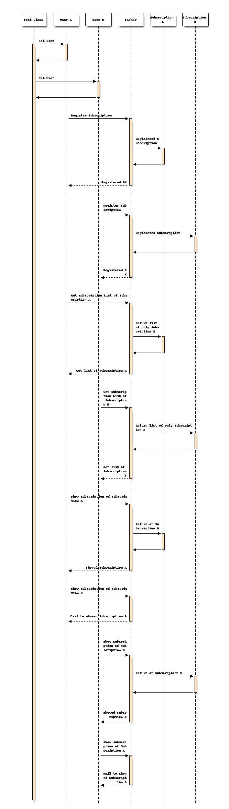
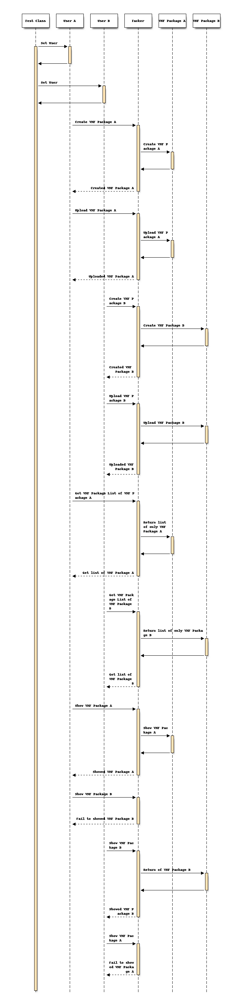
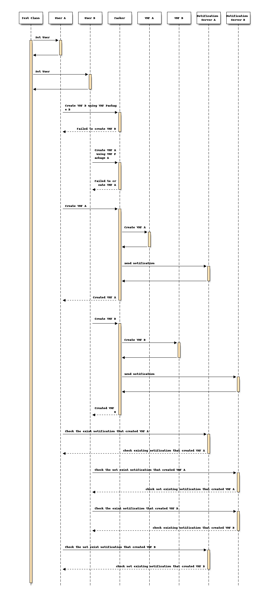
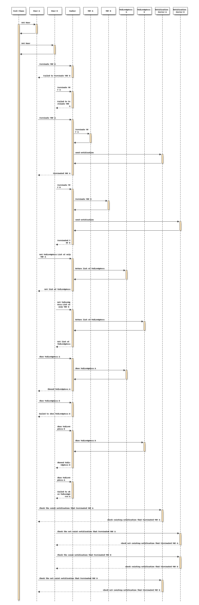
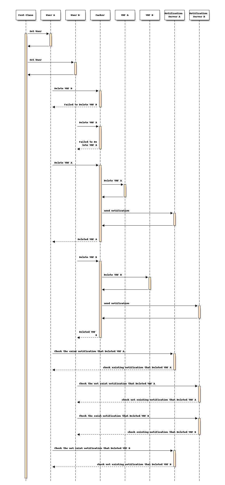
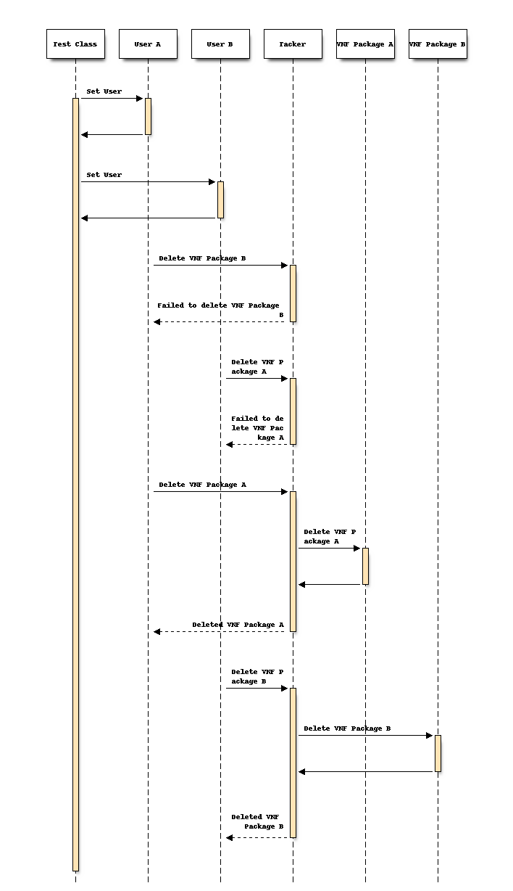
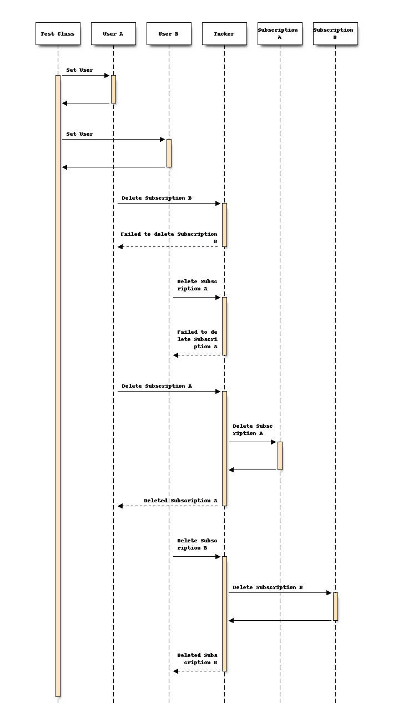
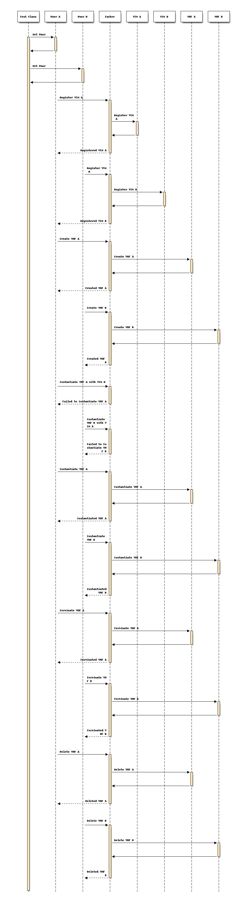

===============================================
Add multi-tenant policy on Lifecycle Management
===============================================

https://blueprints.launchpad.net/tacker/+spec/multi-tenant-policy

This spec shows problems in Lifecycle Management on multi-tenant case and
proposed changes to solve them.
The aim of this specification is to separate resources related to ETSI
NFV-SOL based VNF management by using tenant.
The target is the following resources.

- Virtualized Infrastructure Managers (VIMs)

  - /v1.0/vims

- Virtualized Network Function Packages (VNF packages)

  - /vnfpkgm/v1/vnf_packages

- Virtualized Network Function Lifecycle Management Interface (VNF LCM)

  - /vnflcm/v1/vnf_instances

  - /vnflcm/v1/vnf_lcm_op_occs

  - /vnflcm/v1/subscriptions

Problem description
===================

In the current Tacker implementation, resource separation using tenants
does not work correctly.
VNF LCMs and those used in their operation should be separated by tenants.
There are two problems in multi-tenant case.

1) No support for subscription, LCM operation occurrence on different tenants.
------------------------------------------------------------------------------

Subscription and LCM operation occurrence are not separated by tenant.
We cannot get the information for each tenant correctly.

We also have to be careful about notification.
Subscription API can only be set to Callback URL.
In such a case, Notification can be sent to show the status of Lifecycle
Management operations that occurred in different tenants.

2) No restriction in associating VIM and VNF with different tenants.
--------------------------------------------------------------------

Currently Tacker can associate a VIM with a VNF, even if both belong to
different tenants.

For example, admin user can instantiate VNF using VIM belonging to different
tenant than VNF.
A non-admin user cannot terminate VNF because the non-admin user doesn't belong
to the tenant of VIM.

#. The non-admin user creates a VNF.
#. The admin user instantiates the VNF by specifying a VIM to which the non-admin
   user doesn't belong.
#. The non-admin user cannot terminates the VNF.

It does not problem that the admin user can get resource information for VNF or
operate VNF LCM.
The problem is that the admin user can operate the LCM on a VIM that belongs to
a different tenant than the VNF belongs to tenant.

Proposed change
===============

In order to solve these problems, we propose the following changes.

1) Add tenant_id to VnfLcmSubscriptions and VnfLcmOpOccs:
---------------------------------------------------------

We add ``tenant_id`` field in DB tables ``vnf_lcm_subscriptions`` and
``vnf_lcm_op_occs`` as well as objects ``VnfLcmSubscriptions`` and
``VnfLcmOpOccs``.

Users can get the above information only in their own tenant.

2) Specifying tenant in sending notification:
---------------------------------------------

Notification is modified to check the tenant which is assigned during
subscription sequence and then notify events to the specified tenant.

3) Prohibiting VIM and VNF association created in different tenants:
--------------------------------------------------------------------

Tacker only allows associating a VIM with a VNF that belongs to the same
tenant as the VIM.

How to design Functional Testing
--------------------------------

To address these three proposed change, we need to confirm that the solution
is working in the multi tenant environment.
However, the existing functional test is only for single tenant verification,
and it can't be verified from the multi tenant perspective.
So we need to add a new test case to see the multi tenant.

To see multi tenant working, we need at least two different tenants.
This specification configures User, VIM, and VNF for each tenant, operates the
VNF Package and VNF LCM on each tenant, and verifies that notification of
operation results only reaches the subscription notification server belonging
to its tenant.

Multi Tenant Functional Test Directory
^^^^^^^^^^^^^^^^^^^^^^^^^^^^^^^^^^^^^^

Adding a test for this specification to an existing Functional Test has a large
impact and complicates the testing perspective.
Therefore, we will add a new test case for Multi Tenant.

.. code-block::

    tacker/tacker/tests/functional/
        legacy/
        sol/
        sol_kuberenates/
        sol_separatednfvo/
        sol_v2/
        sol_multi_tenant/   <--- new add test case

Test perspective for proposed changes (1) and (2)
^^^^^^^^^^^^^^^^^^^^^^^^^^^^^^^^^^^^^^^^^^^^^^^^^

In order to verify the operation of proposed changes (1) and (2) in this Spec,
the following test cases are added.

- Register, show, list Subscription
    - User A belongs to Project A registers Subscription A
      (Notification Server A)
    - User B belongs to Project B registers Subscription B
      (Notification Server B)
    - User A belongs to Project A gets the subscription list and confirms that
      only Subscription A is printed
    - User B belongs to Project B gets the subscription list and confirms that
      only Subscription B is printed
    - User A belongs to Project A gets information about Subscription A, and
      information about Subscription A is output.
    - User A belongs to Project A can't get information about Subscription B,
      and should not get information of Subscription B.
    - User B belongs to Project B gets information about Subscription B, and
      information about Subscription B is output.
    - User B belongs to Project B can't get information about Subscription A,
      and should not get information of Subscription A.

- Create, upload, show, list VNF Package
    - User A belongs to Project A create VNF Package A
    - User A belongs to Project A upload VNF Package A
    - User B belongs to Project B create VNF Package B
    - User B belongs to Project B upload VNF Package B
    - User A belongs to Project A gets the VNF Package list and confirms that
      only VNF Package A is output
    - User B belongs to Project B gets the VNF Package list and confirms that
      only VNF Package B is output
    - User A belongs to Project A show VNF Package A
    - User B belongs to Project B show VNF Package B
    - User A belongs to Project A show VNF Package B, and should fail
    - User B belongs to Project B show VNF Package A, and should fail

- Create VNF
    - User A belongs to Project A uses VNF Package B to create VNF Instance B,
      and should fail
    - User B belongs to Project B uses VNF Package A to create VNF Instance A,
      and should fail
    - User A belongs to Project A uses VNF Package A to create VNF Instance A
    - User B belongs to Project B uses VNF Package B to create VNF Instance B
    - Verify that Notification Server A is able to get the Create information
      for VNF Instance A
    - Verify that Notification Server B is unable to get the Create information
      for VNF Instance A
    - Verify that Notification Server B is able to get the Create information
      for VNF Instance B
    - Verify that Notification Server A is unable to get the Create information
      for VNF Instance B

- Instantiate VNF
    - User A belongs to Project A instantiate VNF Instance B, and should fail
    - User B belongs to Project B instantiate VNF Instance A, and should fail
    - User A belongs to Project A instantiate VNF Instance A
    - User B belongs to Project B instantiate VNF Instance B
    - User A belongs to Project A gets LcmOpOccs List, and should get
      LcmOpOccs of only VNF Instance A
    - User B belongs to Project B gets LcmOpOccs List, and should get
      LcmOpOccs of only VNF Instance B
    - User A belongs to Project A shows LcmOpOccs of VNF Instance A
    - User A belongs to Project A shows LcmOpOccs of VNF Instance B, and should
      not get information of LcmOpOccs of VNF Instance B
    - User B belongs to Project B shows LcmOpOccs of VNF Instance B
    - User B belongs to Project B shows LcmOpOccs of VNF Instance A, and should
      not get information of LcmOpOccs of VNF Instance A
    - Verify that Notification Server A is able to get the Instantiation
      information for VNF Instance A
    - Verify that Notification Server B is unable to get the Instantiation
      information for VNF Instance A
    - Verify that Notification Server B is able to get the Instantiate
      information for VNF Instance B
    - Verify that Notification Server A is unable to get the Instantiate
      information for VNF Instance B

- Terminate VNF
    - User A belongs to Project A terminate VNF Instance B, and should fail
    - User B belongs to Project B terminate VNF Instance A, and should fail
    - User A belongs to Project A terminate VNF Instance A
    - User B belongs to Project B terminate VNF Instance B
    - User A belongs to Project A gets LcmOpOcc List, and should get only
      LcmOpOcc of VNF Instance A
    - User B belongs to Project B gets LcmOpOcc List, and should get only
      LcmOpOcc of VNF Instance B
    - User A belongs to Project A shows LcmOpOcc of VNF Instance A
    - User A belongs to Project A shows LcmOpOcc of VNF Instance B, and should
      not get information of LcmOpOcc of VNF Instance B
    - User B belongs to Project B shows LcmOpOcc of VNF Instance B
    - User B belongs to Project B shows LcmOpOcc of VNF Instance A, and should
      not get information of LcmOpOcc of VNF Instance A
    - Verify that Notification Server A is able to get the Termination
      information for VNF Instance A
    - Verify that Notification Server B is unable to get the Termination
      information for VNF Instance A
    - Verify that Notification Server B is able to get the Termination
      information for VNF Instance B
    - Verify that Notification Server A is unable to get the Termination
      information for VNF Instance B

- Delete VNF
    - User A belongs to Project A deletes VNF Instance B, and should fail
    - User B belongs to Project B deletes VNF Instance A, and should fail
    - User A belongs to Project A deletes VNF Instance A
    - User B belongs to Project B deletes VNF Instance B
    - Verify that Notification Server A is able to retrieve Delete
      information for VNF Instance A
    - Verify that Notification Server B is unable to get Delete
      information for VNF Instance A

- Delete VNF Package
    - User A belongs to Project A deletes VNF Package B, and should fail
    - User B belongs to Project B deletes VNF Package A, and should fail
    - User A belongs to Project A deletes VNF Package A
    - User B belongs to Project B deletes VNF Package B

- Delete Subscription
    - User A belongs to Project A deletes Subscription B, and should fail
    - User B belongs to Project B deletes Subscription A, and should fail
    - User A belongs to Project A deletes Subscription A
    - User B belongs to Project B deletes Subscription B

Test perspective for proposed changes (3)
^^^^^^^^^^^^^^^^^^^^^^^^^^^^^^^^^^^^^^^^^

In order to verify the operation of proposed changes (3) in this Spec,
the following test cases are added.

- Filed to instantiate with different VIM
    - User A belongs to Project A registers VIM A for default VIM.
    - User B belongs to Project B registers VIM B for default VIM.
    - User A belongs to Project A create VNF Package A
    - User A belongs to Project A upload VNF Package A
    - User B belongs to Project B create VNF Package B
    - User B belongs to Project B upload VNF Package B
    - User A belongs to Project A uses VNF Package A to create VNF Instance A
    - User B belongs to Project B uses VNF Package B to create VNF Instance B
    - User A belongs to Project A instantiate VNF Instance A with VIM B, and should fail
    - User B belongs to Project B instantiate VNF Instance B with VIM A, and should fail
    - User A belongs to Project A instantiate VNF Instance A with VIM A
    - User B belongs to Project B instantiate VNF Instance B with VIM B
    - User A belongs to Project A terminate VNF Instance A
    - User B belongs to Project B terminate VNF Instance B
    - User A belongs to Project A deletes VNF Instance A
    - User B belongs to Project B deletes VNF Instance B

Alternatives
------------

None

Data model impact
-----------------

Add to Tacker Database tables as below.

vnf_lcm_subscriptions:

.. code-block:: python

   tenant_id varchar(64)

vnf_lcm_op_occs:

.. code-block:: python

   tenant_id varchar(64)

REST API impact
---------------

None

Security impact
---------------

None

Notifications impact
--------------------

None

Other end user impact
---------------------

None

Performance Impact
------------------

None

Other deployer impact
---------------------

None

Developer impact
----------------

None

Upgrade impact
--------------

None

Implementation
==============

Assignee(s)
-----------

Primary assignee:
  Koichi Edagawa <edagawa.kc@nec.com>

Work Items
----------

* Modify the tenant policy to prohibit associating a VIM with a VNF
  which belongs to the different tenant as the VIM.
* Modify Notification process to specify the tenant assigned during
  subscription sequence.
* Change notifying events so that Notification is sent to specified tenants
  only.

Dependencies
============

None

Testing
=======

Add a multi tenant functional testing case.
Details are provided in How to design Functional Testing.

Documentation Impact
====================

None

References
==========

None

History
=======

None
