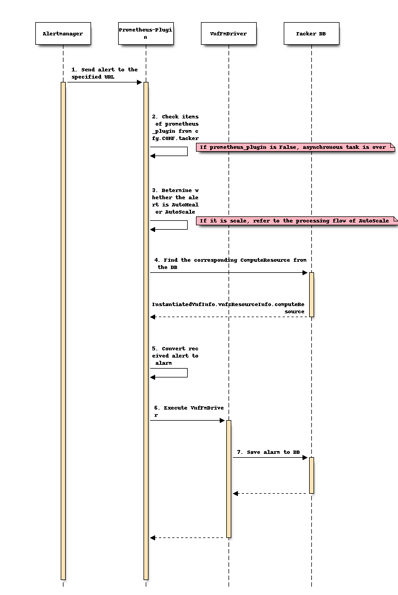

======================================================================================
Prometheus monitoring and AutoHeal support for Kubernetes Cluster VNF via FM Interface
======================================================================================

https://blueprints.launchpad.net/tacker/+spec/prometheus-monitoring

Problem description
===================

It is possible to heal a Master node or Worker node which is
a component of a deployed Kubernetes Cluster as a VNF instance
with VNF Lifecycle Management interface defined in ETSI
NFV-SOL003 v2.6.1 [#SOL003_v2.6.1]_ as described in
spec "MgmtDriver with Kubernetes cluster management OSS"
[#MgmtDriver_with_Kubernetes_cluster_management_OSS]_.

The Fault Management Interface is specified in ETSI NFV-SOL 003
v3.3.1 [#SOL003_v3.3.1]_, and the architecture is such that NFVO
takes the initiative in making decisions on the implementation of
operations such as heal based on failure information.

On the other hand, in the existing spec
"Alert server for Prometheus with Kubernetes cluster VNF_sample"
[#Alert_server_for_Prometheus_with_Kubernetes_cluster_VNF_sample]_,
it is targeted that the pod or Kubernetes Cluster deployed as VNF is
automatically scaled or healed in VNF by the autonomous monitoring
mechanism with prometheus.

This spec provides a sample implementation of Fault Management Interface,
including data model conversion related to Prometheus monitoring data,
based on the realization of AutoHeal of Master/Worker node in
Kubernetes Cluster.

The Fault Management Interface considers Polling mode and Notify mode
monitoring methods. The former is a method in which NFVO periodically
inquires about monitoring information from VNFM, and the latter is a
method in which VNFM notifies NFVO in the Subscribe/Notify subscription
model. In either case, it is necessary that the monitoring information
conforming to the data model specified in SOL003 [#SOL003_v3.3.1]_ is
managed on the Tacker DB.

.. note::

   * The Kubernetes Cluster VNF in this spec is based on this spec
     [#MgmtDriver_with_Kubernetes_cluster_management_OSS]_.
     The Kubernetes Cluster VNF is a single Master cluster,
     so it currently does not support heal operations on the Master node.
     It may be supported after HA is supported in the future, so
     in this spec, Master/Worker nodes are all included in Prometheus'
     monitoring targets for the future HA support.

   * If there are no special instructions, the Client described in
     this spec default to NFVO, and VNFM default to Tacker.

Proposed change
===============

The following changes are needed:

#. Add support for Fault Management interface specified in
   SOL003 [#SOL003_v3.3.1]_

   + Add VNF Fault Management interface:

     + Query Alarm(s)

       + GET /vnffm/v1/alarms to query all alarms.
       + GET /vnffm/v1/alarms/{alarmId} to query the specified alarm.

     + Acknowledge Alarm

       + PATCH /vnffm/v1/alarms/{alarmId}
         to change target Alarm to confirmed.

     + Subscribe

       + POST /vnffm/v1/subscriptions to create a new subscription.

     + Query Subscription(s)

       + GET /vnffm/v1/subscriptions to query all subscription.
       + GET /vnffm/v1/subscriptions/{subscriptionId}
         to query the specified subscription.

     + Delete Subscription

       + DELETE /vnffm/v1/subscriptions/{subscriptionId}
         to delete the specified subscription.

   + Send request to Client

     + POST <Client URI from subscriptions>
       to notify Client that Tacker received an alarm.
     + GET <Client URI from subscriptions>
       to confirm that the URI of Client is correct.

#. Add support for Modify Restful API for communications between
   Tacker and Alertmanager

   + Modify POST /alert/vnf_instances/{vnf_instance_id}
     to receive the alert sent from Alertmanager.

#. Create new DB tables

   + Convert from Prometheus specific data model to
     SOL003 [#SOL003_v3.3.1]_ compliant data model.

   + Store the subscription of FM in the DB.

#. MgmtDriver changes

   + instantiate_end

     + Prometheus is included in Kubernetes Cluster VNF

       + Deploy Prometheus.
       + Set up Prometheus.
       + Send monitor/alert rule files to Prometheus.
       + Add the hostname corresponding to each VM in the
         ``InstantiatedVnfInfo.vnfcResourceInfo.metadata`` field.

     + Prometheus is not included in Kubernetes Cluster VNF

       + Set up Prometheus.
       + Send monitor/alert rule files to Prometheus.
       + Add the hostname corresponding to each VM in the
         ``InstantiatedVnfInfo.vnfcResourceInfo.metadata`` field.

   + terminate_end

     + Prometheus is not included in Kubernetes Cluster VNF

       + Delete monitor/alert rules in Prometheus.

   + scale_start

     + The following are added for scale-in operation:

       + Remove monitoring target of Worker nodes.
       + Delete the hostname corresponding to the VM in the
         ``InstantiatedVnfInfo.vnfcResourceInfo.metadata`` field.

   + scale_end

     + The following are added for scale-out operation:

       + Set up Prometheus in new Worker nodes.
       + Add new monitoring target of Worker nodes.
       + Add the hostname corresponding to the VM in the
         ``InstantiatedVnfInfo.vnfcResourceInfo.metadata`` field.

   + heal_start

     + Heal of the entire VNF

       + Same change as terminate_end.

   + heal_end

     + Heal of the entire VNF

       + Same change as instantiate_end.

   .. note::

      When heal specifies with VNFC, the IP address and hostname of VNFC will
      not change, and the settings of Prometheus and the hostname saved in the
      DB do not need to be updated, so heal_start and heal_end do not need
      to be changed.

Tacker Alert Server
-------------------

The Prometheus Plugin is an optional feature. Tacker will decide whether
to enable it according to the content of the configuration file.
The detail of configuration file is described in
[#Alert_server_for_Prometheus_with_Kubernetes_cluster_VNF_sample]_.

Instantiate Kubernetes cluster VNF
----------------------------------

This section describes how to instantiate a Kubernetes cluster
with Prometheus server for AutoHeal.

The process is almost the same with "Instantiate Kubernetes cluster VNF"
chapter of the spec
[#Alert_server_for_Prometheus_with_Kubernetes_cluster_VNF_sample]_.

There are three differences:

* One is that for ``InstantiatedVnfInfo.vnfcResourceInfo``.

  * In ``instantiate_end``, add the hostname corresponding
    to each VM in the metadata field.
    Additional example: ``"metadata": { "hostname": "worker193" }``

* This monitoring does not need to deploy ``metrics-server``.

* The other is the addition of new Alert rule.

  * The following two examples show the additional Alert rule,
    nothing else changes.

Sample individual Alert rule config:

.. code-block:: yaml

  alert: KubeNodeNotReady
  expr: kube_node_status_condition{job="prometheus",
        condition="Ready",status="true"} == 0
  for: 15m
  labels:
    receiver_type: tacker
    function_type: vnffm
    vnf_instance_id: c61314d0-f583-4ab3-a457-46426bce02d3
    perceived_severity: WARNING
    event_type: EQUIPMENT_ALARM
  annotations:
    probable_cause: The server cannot be connected.

(Optional) Sample individual Alert rule ConfigMap:

.. code-block:: yaml

  kind: ConfigMap
  apiVersion: v1
  metadata:
    name: tacker-samplevnf-rules
  data:
    tacker-samplevnf-rules.yaml: |
      groups:
      - name: kubernetes-apps
        rules:
        - alert: KubeNodeNotReady
          annotations:
            probable_cause: The server cannot be connected.
          expr: |
            kube_node_status_condition{
              job="prometheus",condition="Ready",status="true"} == 0
          for: 15m
          labels:
            receiver_type: tacker
            function_type: vnffm
            vnf_instance_id: c61314d0-f583-4ab3-a457-46426bce02d3
            perceived_severity: WARNING
            event_type: EQUIPMENT_ALARM

AutoHeal Worker nodes on alert trigger
--------------------------------------

When the Prometheus server detects that the Worker node of Kubernetes
Cluster has failed, it will send alert messages to Tacker.
After Tacker receives the alert, it will convert the alert to alarm and
store it in the DB. At this time, according to
ETSI NFV-SOL 003 v3.3.1 [#SOL003_v3.3.1]_ 7. VNF Fault Management interface,
it supports two AutoHeal modes, Polling and Notify.

Design of heal operation in Polling mode
~~~~~~~~~~~~~~~~~~~~~~~~~~~~~~~~~~~~~~~~

The following is a schematic diagram of heal in Polling mode:

.. code-block:: console

                                  +------------------------+
                                  |                        |
                                  |   Client (NFVO etc.)   |
                                  |                        |
                                  +--+--------^+-----------+
                             6. Heal |        || 5. Query Alarms and return result
                              +------|--------||------------------------------------------------------------+
                              |      |        ||                                                       VNFM |
                              |  +---|--------||---------+ +---------------------------------+              |
                              |  |   |        ||  Tacker | |                      Tacker     |              |
                              |  |   |        ||  Server | |                      Conductor  |              |
                              |  |   |   +----+v------+  | |             +------------+      |   +--------+ |
                              |  |   |   | VnfFm      +------------------> VnfFm      +----------> Tacker | |
                              |  |   |   | Controller |  | |  +----------> Driver     +---------->   DB   | |
                              |  |   |   +------------+  | |  |          +------------+      |   +--------+ |
  +----------------+          |  |   |                   | |  | 4. Convert alert to alarm    |              |
  |                | 3. POST  |  |   |                   | |  |                              |              |
  |  Alertmanager  |    alert |  |   |   +------------+  | |  |          +------------+      |              |
  |                +---------------------> Prometheus +-------+    +-----> VmfLcm     |      |              |
  +--+-------------+          |  |   |   | Plugin     |  | |       |     | Driver     +--+   |              |
     ^                        |  |   |   +------------+  | |       |     +---------+--+  |   |              |
     | 2. Trigger alert       |  |   |                   | |       |               |     |   |              |
     |                        |  |   |                   | |       |               |     |   |              |
     |                        |  |   |   +------------+  | |       |     +---------v--+  |   |              |
     |                        |  |   +---> Vnflcm     +------------+     | MgmtDriver |  |   |              |
     |                        |  |       | Controller |  | |             |            |  |   |              |
     |                        |  |       +------------+  | |             +-+----------+  |   |              |
  +--+-------------+          |  |                       | |               |             |   |              |
  |                |          |  |                       | |               |  +----------v-+ |              |
  |  Prometheus    |          |  |                       | |               |  | OpenStack  | |              |
  |  Server        |          |  |                       | |               |  | Infra      | |              |
  |                |          |  |                       | |               |  | Driver     | |              |
  +--+-------------+          |  |                       | |               |  +----+-------+ |              |
     |                        |  |                       | |               |       |         |              |
     |                        |  +-----------------------+ +---------------|-------|---------+              |
     | 1. Pull metrics        +--------------------------------------------|-------|------------------------+
     |                                                                     |       |
     |                        +--------------------------------------------|-------|------------+
     |                        |  Kubernetes Cluster VNF                    |       |            |
     |                        |                  +---------------+---------+-------+            |
     |                        | 7. Delete failed |               | 8. Create new                |
     |                        |    Worker node   |               |    Worker node               |
     |                        |         +--------v----+   +------v------+    +-------------+    |
     |                        |         | +--------+  |   | +--------+  |    | +--------+  |    |
     +----------------------------------> | Worker |  |   | | Worker |  |    | | Master |  |    |
                              |         | +--------+  |   | +--------+  |    | +--------+  |    |
                              |         |          VM |   |          VM |    |          VM |    |
                              |         +-------------+   +-------------+    +-------------+    |
                              +-----------------------------------------------------------------+
                              +-----------------------------------------------------------------+
                              |                          Hardware Resources                     |
                              +-----------------------------------------------------------------+

#. Prometheus server collects metrics from Kubernetes Cluster.

#. Alertmanager receives alert sent from Prometheus Server.

#. Alertmanager sends POST request to Tacker with specified URL.

#. Tacker receives informed alert, converts it to alarm, and saves it to DB.

#. The Client sends a request at regular intervals to query
   the alarm in the Tacker.
   Tacker searches DB with the query condition specified by the Client,
   and returns the alarm that matches the condition to the Client.

#. The Client recognizes the failure of the Worker node from the alarm and
   sends a heal request of the failure node to the Tacker.

#. Heal operation is triggered, old Worker node is deleted.

#. New Worker node is created.

.. note::

   The URL that Alertmanager sends to Tacker's Prometheus Plugin follows the
   spec [#Alert_server_for_Prometheus_with_Kubernetes_cluster_VNF_sample]_.

Request parameters for operation in Polling mode
~~~~~~~~~~~~~~~~~~~~~~~~~~~~~~~~~~~~~~~~~~~~~~~~

The detail of API is described at `REST API impact`_.

Sequence for operation in Polling mode
~~~~~~~~~~~~~~~~~~~~~~~~~~~~~~~~~~~~~~

The following describes the processing flow of the Tacker after
the Alertmanager sends the alert.

1. Alertmanager receives alert sent from Prometheus Server and inform the
   alert to specified URL(Tacker Server).

   .. note::

      Alert management of Prometheus format is defined in Prometheus Server.

2. Prometheus Plugin obtains values from cfg.CONF.tacker.prometheus_plugin
   to determine whether to enable this function.

3. Prometheus Plugin judges what processing to perform according to
   the function_type field of the labels in the alert.

   * When the ``function_type`` field of ``labels`` is ``vnffm``,
     AutoHeal processing is performed.

   * When the ``function_type`` field of ``labels`` is not ``vnffm``,
     AutoScale processing is performed.

4. Prometheus Plugin finds the corresponding computeResource in
   ``InstantiatedVnfInfo.vnfcResourceInfo`` according to the
   value of the node label in the alert.

5. Prometheus Plugin converts the alert to an alarm.

6. Prometheus Plugin calls VnfFmDriver and sends the alarm to it.

7. VnfFmDriver saves the alarm in the DB.

The following describes the Client's processing flow for
Tacker using Polling mode to AutoHeal.

8. The Client sends a request to the Tacker to query
   the alarms of the specified conditions.

9. The query alarms are processed synchronously.

10. Tacker-conductor calls VnfFmDriver to query the alarm.

11. VnfFmDriver filters out the alarms that meet the conditions according
    to the conditions in the request, and returns the result.

12. After the Client obtains the VNFC information from the alarm,
    it sends a request to the Tacker to heal the VNFC.

13. From this step, it is completely the same with
    the default heal operation.

    * The only difference is that for
      ``InstantiatedVnfInfo.vnfcResourceInfo``, in ``heal_end``,
      update the hostname of the VM in the metadata field.

Design of heal operation in Notify mode
~~~~~~~~~~~~~~~~~~~~~~~~~~~~~~~~~~~~~~~

The following is a schematic diagram of heal in Notify mode:

.. code-block:: console

                                  +------------------------+
                                  |                        |       6. Send notify alarm
                                  |   Client (NFVO etc.)   <-------------------+
                                  |                        |                   |
                                  +--+---------+-----------+                   |
                             7. Heal |         | 1. Create subscription        |
                              +------|---------|-------------------------------|----------------------------+
                              |      |         |                               |                       VNFM |
                              |  +---|---------|---------+ +-------------------|-------------+              |
                              |  |   |         |  Tacker | |                   |  Tacker     |              |
                              |  |   |         |  Server | |                   |  Conductor  |              |
                              |  |   |   +-----v------+  | |             +-----+------+      |   +--------+ |
                              |  |   |   | VnfFm      +------------------> VnfFm      +----------> Tacker | |
                              |  |   |   | Controller |  | |  +----------> Driver     +---------->   DB   | |
                              |  |   |   +------------+  | |  |          +------------+      |   +--------+ |
  +----------------+          |  |   |                   | |  | 5. Convert alert to alarm    |              |
  |                | 4. POST  |  |   |                   | |  |                              |              |
  |  Alertmanager  |    alert |  |   |   +------------+  | |  |          +------------+      |              |
  |                +---------------------> Prometheus +-------+    +-----> VmfLcm     |      |              |
  +--+-------------+          |  |   |   | Plugin     |  | |       |     | Driver     +--+   |              |
     ^                        |  |   |   +------------+  | |       |     +---------+--+  |   |              |
     | 3. Trigger alert       |  |   |                   | |       |               |     |   |              |
     |                        |  |   |                   | |       |               |     |   |              |
     |                        |  |   |   +------------+  | |       |     +---------v--+  |   |              |
     |                        |  |   +---> Vnflcm     +------------+     | MgmtDriver |  |   |              |
     |                        |  |       | Controller |  | |             |            |  |   |              |
     |                        |  |       +------------+  | |             +-+----------+  |   |              |
  +--+-------------+          |  |                       | |               |             |   |              |
  |                |          |  |                       | |               |  +----------v-+ |              |
  |  Prometheus    |          |  |                       | |               |  | OpenStack  | |              |
  |  Server        |          |  |                       | |               |  | Infra      | |              |
  |                |          |  |                       | |               |  | Driver     | |              |
  +--+-------------+          |  |                       | |               |  +----+-------+ |              |
     |                        |  |                       | |               |       |         |              |
     |                        |  +-----------------------+ +---------------|-------|---------+              |
     | 2. Pull metrics        +--------------------------------------------|-------|----------------------- +
     |                                                                     |       |
     |                        +--------------------------------------------|-------|------------+
     |                        |  Kubernetes Cluster VNF                    |       |            |
     |                        |                  +---------------+---------+-------+            |
     |                        | 8. Delete failed |               | 9. Create new                |
     |                        |    Worker node   |               |    Worker node               |
     |                        |         +--------v----+   +------v--- --+    +-------------+    |
     |                        |         | +--------+  |   | +--------+  |    | +--------+  |    |
     +----------------------------------> | Worker |  |   | | Worker |  |    | | Master |  |    |
                              |         | +--------+  |   | +--------+  |    | +--------+  |    |
                              |         |          VM |   |          VM |    |          VM |    |
                              |         +-------------+   +-------------+    +-------------+    |
                              +-----------------------------------------------------------------+
                              +-----------------------------------------------------------------+
                              |                          Hardware Resources                     |
                              +-----------------------------------------------------------------+

* 1.The Client sends a request to the Tacker to create a subscription.

  .. note::

     During the create subscription, Tacker sends a Test Notification
     request to the Client's Callback url. The specific processing of
     the request is performed by the Client. By default, it is normal
     for the Client to return HTTP 204 No Content.

* 2-5.The processing is the same as 1-4 of the Polling mode.

* 6.VnfFmDriver finds all subscriptions in the DB and matches
  the alerts to them. If there is a subscription that can match
  successfully, the alarm is sent to the specified path of the
  Client. If the match is not successful, the processing ends.

* 7-9.The processing is the same as 6-8 of the Polling mode.

Request parameters for operation in Notify mode
~~~~~~~~~~~~~~~~~~~~~~~~~~~~~~~~~~~~~~~~~~~~~~~

The detail of API is described at `REST API impact`_.

Sequence for operation in Notify mode
~~~~~~~~~~~~~~~~~~~~~~~~~~~~~~~~~~~~~

The following describes the Client's processing flow for
Tacker using Notify mode to AutoHeal.

* 1.The Client sends a request to create a subscription to the Tacker.
  After Tacker receives the subscription, it will get the callback_uri in it.
  In order to verify the correctness of the callback_uri,
  VnfFmDriver sends a request to the callback_uri address of Client.
  After getting the normal response HTTP 204 No Content from the Client,
  the Tacker will save the subscription to the DB.

* 2-8.The processing is the same as 1-7 of the Polling method.

* 9.VnfFmDriver gets all the subscriptions in the DB.

* 10.VnfFmDriver judges whether the alarm can be matched with subscriptions,
  if it does not match, the processing ends.

* 11.If the match is successful, VnfFmDriver sends a Notify Alarm request
  to the Client's callback_uri address. After the Client receives the
  request and processes it, it returns HTTP 204 No Content by default.

* 12-14.The processing is the same as 12-14 of the Polling method.

Scale For Kubernetes cluster
----------------------------

The process is almost the same with
"Scale-out/in Worker nodes of Kubernetes cluster VNF"
chapter of the spec [#MgmtDriver_with_Kubernetes_cluster_management_OSS]_.

There is only one difference:

* For the processing of ``InstantiatedVnfInfo.vnfcResourceInfo``.

  * When scale in, in ``scale_start``,
    delete the hostname corresponding to the VM in the metadata field.
  * When scale out, in ``scale_end``,
    add the hostname corresponding to the VM in the metadata field.

Terminate For Kubernetes cluster
--------------------------------

The process is almost the same with "Terminate For Kubernetes cluster"
chapter of the spec
[#Alert_server_for_Prometheus_with_Kubernetes_cluster_VNF_sample]_.

Alternatives
------------

None

Data model impact
-----------------

Add below new db table in 'Tacker' database.

vnf_fm_alarms

.. code-block:: console

  `id` varchar(36) Pri

  `managed_object_id` varchar(36) NOT NULL

  `faulty_resource` JSON NULL

  `faulty_resource_type` varchar(32) NULL

  `alarm_raised_time` datetime NOT NULL

  `alarm_changed_time` datetime NULL

  `alarm_cleared_time` datetime NULL

  `alarm_acknowledged_time` datetime NULL

  `ack_state` varchar(32) NOT NULL

  `perceived_severity` varchar(32) NOT NULL

  `event_time` datetime NOT NULL

  `event_type` varchar(32) NOT NULL

  `fault_type` varchar(255) NULL

  `probable_cause` varchar(255) NOT NULL

  `is_root_cause` boolean NOT NULL

  `correlated_alarm_ids` text NULL

  `fault_details` text NULL

  `_links` JSON NOT NULL

  This table will have `id` as primary key.
  `managed_object_id` will be foreign
  key of `vnf_instances`.`id`.

vnf_fm_subscriptions

.. code-block:: console

  `id` varchar(36) Pri

  `fm_notifications_filter` JSON NULL

  `callback_uri` varchar(255) NOT NULL

  `_links` JSON NOT NULL

  `subscription_authentication` JSON NULL

  This table will have `id` as primary key.

REST API impact
---------------

The following Restful APIs are in compliance with
ETSI NFV-SOL 003 v3.3.1 [#SOL003_v3.3.1]_ 7.VNF Fault Management interface.

* Add new API - GET /vnffm/v1/alarms

  Query all alarms in the Tacker.

  Allow users to filter out alarms based on : id, managedObjectId,
  rootCauseFaultyResource/faultyResourceType, eventType, perceivedSeverity,
  probableCause query parameter in the request.

  For example, below URL query parameter will matching alarms with
  perceivedSeverity=WARNING

  .. code-block:: console

    GET /vnffm/v1/alarms?filter=(eq,perceivedSeverity,WARNING)

  Method type: GET

  Normal http response code : 200 OK

  Expected error http response codes

  .. code-block:: console

      400 Bad Request: Shall be returned when the attribute-based filter
      expression is invalid or there are too many alarms in the query,
      the response is too big.

      401 NotAuthorized: Shall be returned when authentication fails.

      403 Forbidden: Shall be returned when user is not authorized to call
      this REST API.

      404 NotFound: Shall be returned when the URL is wrong.

      405 Method Not Allowed: Shall be returned when the HTTP
      method is not supported.

      500 Internal Server Error: Shall be returned when an internal
      error occurs.

  Request - There is no request body.

  Response - Return ``Alarms`` parameter as shown below

  .. code-block:: json

     [
         {
             "id": "78a39661-60a8-4824-b989-88c1b0c3534a",
             "managedObjectId": "c61314d0-f583-4ab3-a457-46426bce02d3",
             "rootCauseFaultyResource": {
                 "faultyResource": {
                     "vimConnectionId": "0d57e928-86a4-4445-a4bd-1634edae73f3",
                     "resourceId": "4e6ccbe1-38ec-4b1b-a278-64de09ba01b3",
                     "vimLevelResourceType": "OS::Nova::Server"
                 },
                 "faultyResourceType": "COMPUTE"
             },
             "alarmRaisedTime": "2021-09-03 10:21:03",
             "alarmChangedTime": "",
             "alarmClearedTime": "",
             "alarmAcknowledgedTime": "",
             "ackState": "UNACKNOWLEDGED",
             "perceivedSeverity": "WARNING",
             "eventTime": "2021-09-03 10:06:03",
             "eventType": "EQUIPMENT_ALARM",
             "faultType": "",
             "probableCause": "The server cannot be connected.",
             "isRootCause": "false",
             "correlatedAlarmIds": [],
             "faultDetails": [],
             "_links": {
                 "self": "/vnffm/v1/alarms/78a39661-60a8-4824-b989-88c1b0c3534a",
                 "objectInstance": ""
             }
         }
     ]

* Add new API - GET /vnffm/v1/alarms/{alarmId}

  Query the alarm specified in the Tacker.

  Method type: GET

  Normal http response code : 200 OK

  Expected error http response codes

  .. code-block:: console

      401 NotAuthorized: Shall be returned when authentication fails.

      403 Forbidden: Shall be returned when user is not authorized to call
      this REST API.

      404 NotFound: Shall be returned when the alarmId does not exist.

      405 Method Not Allowed: Shall be returned when the HTTP method
      is not supported.

      500 Internal Server Error: Shall be returned when an internal
      error occurs.

  Request - There is no request body.

  Response - Return ``Alarm`` parameter as shown below

  .. code-block:: json

     {
         "id": "78a39661-60a8-4824-b989-88c1b0c3534a",
         "managedObjectId": "c61314d0-f583-4ab3-a457-46426bce02d3",
         "rootCauseFaultyResource": {
             "faultyResource": {
                     "vimConnectionId": "0d57e928-86a4-4445-a4bd-1634edae73f3",
                     "resourceId": "4e6ccbe1-38ec-4b1b-a278-64de09ba01b3",
                     "vimLevelResourceType": "OS::Nova::Server"
                 },
             "faultyResourceType": "COMPUTE"
         },
         "alarmRaisedTime": "2021-09-03 10:21:03",
         "alarmChangedTime": "",
         "alarmClearedTime": "",
         "alarmAcknowledgedTime": "",
         "ackState": "UNACKNOWLEDGED",
         "perceivedSeverity": "WARNING",
         "eventTime": "2021-09-03 10:06:03",
         "eventType": "EQUIPMENT_ALARM",
         "faultType": "",
         "probableCause": "The server cannot be connected.",
         "isRootCause": "false",
         "correlatedAlarmIds": [],
         "faultDetails": [],
         "_links": {
             "self": "/vnffm/v1/alarms/78a39661-60a8-4824-b989-88c1b0c3534a",
             "objectInstance": ""
         }
     }

* Add new API - PATCH /vnffm/v1/alarms/{alarmId}

  Modify the confirmation status of the alarm specified in the Tacker.

  Method type: PATCH

  Content-Type: application/mergepatch+json

  Normal http response code : 200 OK

  Expected error http response codes

  .. code-block:: console

      401 NotAuthorized: Shall be returned when authentication fails.

      403 Forbidden: Shall be returned when user is not authorized to call
      this REST API.

      404 NotFound: Shall be returned when the alarmId does not exist.

      405 Method Not Allowed: Shall be returned when the HTTP method
      is not supported.

      409 Conflict: Shall be returned when the ackState of alarm is
      already the value to be set.

      412 Precondition failed: Shall be returned when the ETag in the
      http header does not match.

      500 Internal Server Error: Shall be returned when an internal
      error occurs.

  Request - Receive ``AlarmModifications`` parameter as shown below

  .. code-block:: json

     {
         "ackState": "ACKNOWLEDGED"
     }

  Response - Return ``AlarmModifications`` parameter as shown below

  .. code-block:: json

     {
         "ackState": "ACKNOWLEDGED"
     }

* Add new API - POST /vnffm/v1/subscriptions

  Create a new subscription in the Tacker.

  Method type: POST

  Normal http response code : 201 Created

  Expected error http response codes

  .. code-block:: console

      303 See Other: Shall be returned when the same callback URI and
      the same filter already exists.

      401 NotAuthorized: Shall be returned when authentication fails.

      403 Forbidden: Shall be returned when user is not authorized to
      call this REST API.

      404 NotFound: Shall be returned when the URL is wrong.

      405 Method Not Allowed: Shall be returned when the HTTP method is
      not supported.

      500 Internal Server Error: Shall be returned when an internal
      error occurs.

  Request - Receive ``FmSubscriptionRequest`` parameter as shown below

  .. code-block:: json

     {
         "filter": {
             "vnfInstanceSubscriptionFilter": {
                 "vnfdIds": [
                     "b1db0ce7-ebca-1fb7-95ed-4840d70a9923"
                 ],
                 "vnfProductsFromProviders": [],
                 "vnfInstanceIds": [
                     "02e46e91-2722-4f2d-af91-313f5981a199"
                 ],
                 "vnfInstanceNames": []
             },
             "notificationTypes": [
                 "AlarmNotification"
             ],
             "faultyResourceTypes": [
                 "COMPUTE"
             ],
             "perceivedSeverities": [
                 "WARNING"
             ],
             "eventTypes": [
                 "EQUIPMENT_ALARM"
             ],
             "probableCauses": [
                 "The server cannot be connected."
             ]
         },
         "callbackUri": "/nfvo/notify/alarm",
         "authentication": {
             "authType": [
                 "BASIC"
             ],
             "paramsBasic": {
                 "userName": "nfvo",
                 "password": "nfvopwd"
             },
             "paramsOauth2ClientCredentials": {}
         }
     }

  Response - Return ``FmSubscription`` parameter as shown below

  .. code-block:: json

     {
         "id": "fb782658-af96-47e7-9faa-90ba8416e426",
         "filter": {
             "vnfInstanceSubscriptionFilter": {
                 "vnfdIds": [
                     "b1db0ce7-ebca-1fb7-95ed-4840d70a9923"
                 ],
                 "vnfProductsFromProviders": [],
                 "vnfInstanceIds": [
                     "02e46e91-2722-4f2d-af91-313f5981a199"
                 ],
                 "vnfInstanceNames": []
             },
             "notificationTypes": [
                 "AlarmNotification"
             ],
             "faultyResourceTypes": [
                 "COMPUTE"
             ],
             "perceivedSeverities": [
                 "WARNING"
             ],
             "eventTypes": [
                 "EQUIPMENT_ALARM"
             ],
             "probableCauses": [
                 "The server cannot be connected."
             ]
         },
         "callbackUri": "/nfvo/notify/alarm",
         "_links": {
             "self": "/vnffm/v1/subscriptions/fb782658-af96-47e7-9faa-90ba8416e426"
         }
     }

  .. note::

     When Tacker sends a request to the Client's callbackUri,
     the Client processes it and returns HTTP 204 No Content by default.

* Add new API - GET /vnffm/v1/subscriptions

  Query all subscriptions in the Tacker.

  Allow users to filter out subscriptions based on ``FmSubscription``
  query parameter in the request.

  For example, below URL query parameter will matching subscriptions
  with perceivedSeverities=WARNING

  .. code-block:: console

    GET /vnffm/v1/subscriptions?filter=(eq,filter/perceivedSeverity,WARNING)

  Method type: GET

  Normal http response code : 200 OK

  Expected error http response codes

  .. code-block:: console

      400 Bad Request: Shall be returned when the attribute-based
      filter expression is invalid or there are too many subscriptions
      in the query, the response is too big.

      401 NotAuthorized: Shall be returned when authentication fails.

      403 Forbidden: Shall be returned when user is not authorized to
      call this REST API.

      404 NotFound: Shall be returned when the URL is wrong.

      405 Method Not Allowed: Shall be returned when the HTTP method
      is not supported.

      500 Internal Server Error: Shall be returned when an internal
      error occurs.

  Request - There is no request body.

  Response - Return ``FmSubscription`` parameter as shown below

  .. code-block:: json

     [
         {
             "id": "fb782658-af96-47e7-9faa-90ba8416e426",
             "filter": {
                 "vnfInstanceSubscriptionFilter": {
                     "vnfdIds": [
                         "b1db0ce7-ebca-1fb7-95ed-4840d70a9923"
                     ],
                     "vnfProductsFromProviders": [],
                     "vnfInstanceIds": [
                         "02e46e91-2722-4f2d-af91-313f5981a199"
                     ],
                     "vnfInstanceNames": []
                 },
                 "notificationTypes": [
                     "AlarmNotification"
                 ],
                 "faultyResourceTypes": [
                     "COMPUTE"
                 ],
                 "perceivedSeverities": [
                     "WARNING"
                 ],
                 "eventTypes": [
                     "EQUIPMENT_ALARM"
                 ],
                 "probableCauses": [
                     "The server cannot be connected."
                 ]
             },
             "callbackUri": "/nfvo/notify/alarm",
             "_links": {
                 "self": "/vnffm/v1/subscriptions/fb782658-af96-47e7-9faa-90ba8416e426"
             }
         }
     ]

* Add new API - GET /vnffm/v1/subscriptions/{subscriptionId}

  Query the subscription specified in the Tacker.

  Method type: GET

  Normal http response code : 200 OK

  Expected error http response codes

  .. code-block:: console

      401 NotAuthorized: Shall be returned when authentication fails.

      403 Forbidden: Shall be returned when user is not authorized
      to call this REST API.

      404 NotFound: Shall be returned when the subscriptionId does
      not exist.

      405 Method Not Allowed: Shall be returned when the HTTP method
      is not supported.

      500 Internal Server Error: Shall be returned when an internal
      error occurs.

  Request - There is no request body.

  Response - Return ``FmSubscription`` parameter as shown below

  .. code-block:: json

     {
         "id": "fb782658-af96-47e7-9faa-90ba8416e426",
         "filter": {
             "vnfInstanceSubscriptionFilter": {
                 "vnfdIds": [
                     "b1db0ce7-ebca-1fb7-95ed-4840d70a9923"
                 ],
                 "vnfProductsFromProviders": [],
                 "vnfInstanceIds": [
                     "02e46e91-2722-4f2d-af91-313f5981a199"
                 ],
                 "vnfInstanceNames": []
             },
             "notificationTypes": [
                 "AlarmNotification"
             ],
             "faultyResourceTypes": [
                 "COMPUTE"
             ],
             "perceivedSeverities": [
                 "WARNING"
             ],
             "eventTypes": [
                 "EQUIPMENT_ALARM"
             ],
             "probableCauses": [
                 "The server cannot be connected."
             ]
         },
         "callbackUri": "/nfvo/notify/alarm",
         "_links": {
             "self": "/vnffm/v1/subscriptions/fb782658-af96-47e7-9faa-90ba8416e426"
         }
     }

* Add new API - DELETE /vnffm/v1/subscriptions/{subscriptionId}

  Delete the subscription specified in the Tacker.

  Method type: DELETE

  Normal http response code : 204 No Content

  Expected error http response codes

  .. code-block:: console

      401 NotAuthorized: Shall be returned when authentication fails.

      403 Forbidden: Shall be returned when user is not authorized
      to call this REST API.

      404 NotFound: Shall be returned when the subscriptionId does
      not exist.

      405 Method Not Allowed: Shall be returned when the HTTP method
      is not supported.

      500 Internal Server Error: Shall be returned when an internal
      error occurs.

  Request - There is no request body.

  Response - There is no response body.

* Add new request POST <Client URI from subscriptions>

  Notify Client that Tacker received an alarm.

  Method type: POST

  Normal http response code : 204 No Content

  The error http response codes are determined by the Client.

  Request - There are two types of request bodies.

  * ``AlarmNotification`` as shown below

  .. code-block:: json

     {
         "id": "87bea1ed-6ced-403e-8640-2c631eb55d08",
         "notificationType": "AlarmNotification",
         "subscriptionId": "fb782658-af96-47e7-9faa-90ba8416e426",
         "timeStamp": "2021-09-03 10:21:03",
         "alarm": {
             "id": "78a39661-60a8-4824-b989-88c1b0c3534a",
             "managedObjectId": "c61314d0-f583-4ab3-a457-46426bce02d3",
             "rootCauseFaultyResource": {
                 "faultyResource": {
                         "vimConnectionId": "0d57e928-86a4-4445-a4bd-1634edae73f3",
                         "resourceId": "4e6ccbe1-38ec-4b1b-a278-64de09ba01b3",
                         "vimLevelResourceType": "OS::Nova::Server"
                     },
                 "faultyResourceType": "COMPUTE"
             },
             "alarmRaisedTime": "2021-09-03 10:21:03",
             "alarmChangedTime": "",
             "alarmClearedTime": "",
             "alarmAcknowledgedTime": "",
             "ackState": "UNACKNOWLEDGED",
             "perceivedSeverity": "WARNING",
             "eventTime": "2021-09-03 10:06:03",
             "eventType": "EQUIPMENT_ALARM",
             "faultType": "",
             "probableCause": "The server cannot be connected.",
             "isRootCause": "false",
             "correlatedAlarmIds": [],
             "faultDetails": [],
             "_links": {
                 "self": {
                     "href": "/vnffm/v1/alarms/78a39661-60a8-4824-b989-88c1b0c3534a"
                 },
                 "objectInstance": {
                     "href": "/vnffm/v1/vnf_instances/c61314d0-f583-4ab3-a457-46426bce02d3"
                 }
             }
         },
         "_links": {
             "subscription": {
                 "href": "/vnffm/v1/subscriptions/fb782658-af96-47e7-9faa-90ba8416e426"
             }
         }
     }

  * ``AlarmClearedNotification`` as shown below

  .. code-block:: json

     {
         "id": "87bea1ed-6ced-403e-8640-2c631eb55d08",
         "notificationType": "AlarmClearedNotification",
         "subscriptionId": "fb782658-af96-47e7-9faa-90ba8416e426",
         "timeStamp": "2021-09-03 10:21:03",
         "alarmId": "78a39661-60a8-4824-b989-88c1b0c3534a",
         "alarmClearedTime": "2021-09-03 10:36:03",
         "_links": {
             "subscription": {
                 "href": "/vnffm/v1/subscriptions/fb782658-af96-47e7-9faa-90ba8416e426"
             },
             "alarm": {
                 "href": "/vnffm/v1/alarms/78a39661-60a8-4824-b989-88c1b0c3534a"
             }
         }
     }

  Response - There is no response body.

* Add new request GET <Client URI from subscriptions>

  Confirm that the URI of Client is correct.

  Method type: GET

  Normal http response code : 204 No Content

  The error http response codes are determined by the Client.

  Request - There is no response body.

  Response - There is no response body.

* Modify POST /alert/vnf_instances/{vnf_instance_id}

  Receive the alert sent from Alertmanager.

  The additional processing determines whether to perform AutoScale
  or AutoHeal based on the information in the alert.

  When the ``function_type`` field of ``labels`` is ``vnffm``,
  AutoHeal processing is performed.

  When the ``function_type`` field of ``labels`` is not ``vnffm``,
  AutoScale processing is performed.

  Sample of alert contents with Prometheus format is below

  .. code-block:: json

     {
         "receiver": "example",
         "status": "firing",
         "alerts": [
             {
                 "status": "firing",
                 "labels": {
                     "receiver_type": "tacker",
                     "function_type": "vnffm",
                     "vnf_instance_id": "c61314d0-f583-4ab3-a457-46426bce02d3",
                     "node": "worker193",
                     "perceived_severity": "WARNING",
                     "event_type": "EQUIPMENT_ALARM"
                 },
                 "annotations": {
                     "probable_cause": "The server cannot be connected."
                 },
                 "startsAt": "0000-00-00T00:00:00.000000000Z",
                 "endsAt": "0000-00-00T00:00:00.000000000Z",
                 "generatorURL": ""
             }
         ],
         "groupLabels": {},
         "commonLabels": {
             "alertname": "KubeNodeNotReady",
             "instance": "example_instance",
             "job": "example_job",
             "severity": "example"
         },
         "commonAnnotations": {
             "description": "description of alert",
             "summary": "summary content"
         },
         "externalURL": "",
         "version": "",
         "groupKey": "{}:{}"
     }

Security impact
---------------

None

Notifications impact
--------------------

None

Other end user impact
---------------------

None

Performance Impact
------------------

None

Other deployer impact
---------------------

None

Developer impact
----------------

None

Implementation
==============

Assignee(s)
-----------

Primary assignee:
  Masaki Ueno <masaki.ueno.up@hco.ntt.co.jp>

  Hirofumi Noguchi <hirofumi.noguchi.rs@hco.ntt.co.jp>

Other contributors:
  Yi Feng <fengyi@fujitsu.com>

  Yoshiyuki Katada <katada.yoshiyuk@fujitsu.com>

  Ayumu Ueha <ueha.ayumu@fujitsu.com>

Work Items
----------

* Implement Tacker server to support:

  * Add new Rest API ``GET /vnffm/v1/alarms`` to query all alarms.
  * Add new Rest API ``GET /vnffm/v1/alarms/{alarmId}`` to query
    the specified alarm.
  * Add new Rest API ``PATCH /vnffm/v1/alarms/{alarmId}`` to change
    target Alarm to confirmed.
  * Add new Rest API ``POST /vnffm/v1/subscriptions`` to create
    a new subscription.
  * Add new Rest API ``GET /vnffm/v1/subscriptions`` to query
    all subscription.
  * Add new Rest API ``GET /vnffm/v1/subscriptions/{subscriptionId}``
    to query the specified subscription.
  * Add new Rest API ``DELETE /vnffm/v1/subscriptions/{subscriptionId}``
    to delete the specified subscription.
  * Add new Request ``POST <Client URI from subscriptions>`` to notify
    Client that Tacker received an alarm.
  * Add new Request ``GET <Client URI from subscriptions>`` to confirm
    that the URI of Client is correct.
  * Modify Rest API ``POST /alert/vnf_instances/{vnf_instance_id}``
    to receive the alert sent from Alertmanager.

* Provide a sample script to perform the following tasks:

  * Add new Alert rule in configure Prometheus.
  * Add the hostname corresponding to each VM in the
    ``InstantiatedVnfInfo.vnfcResourceInfo.metadata`` field.

* Add new unit and functional tests.

Dependencies
============

LCM operations for the Kubernetes cluster depend on the following
specifications:

+ Instantiate/Scale/Heal/Terminate operation for the Kubernetes cluster

  Depends on spec "MgmtDriver with Kubernetes cluster management
  OSS" [#MgmtDriver_with_Kubernetes_cluster_management_OSS]_.

Testing
=======

Unit and functional tests will be added to cover cases required in the spec.

Documentation Impact
====================

* Complete user guide will be added to explain how to monitor by Prometheus.

* Update API documentation on the API additions mentioned in
  `REST API impact`_.

References
==========

.. [#SOL003_v2.6.1] https://www.etsi.org/deliver/etsi_gs/NFV-SOL/001_099/003/02.06.01_60/gs_nfv-sol003v020601p.pdf
.. [#MgmtDriver_with_Kubernetes_cluster_management_OSS] https://specs.openstack.org/openstack/tacker-specs/specs/xena/k8s-mgmtdriver-kubespray.html
.. [#SOL003_v3.3.1] https://www.etsi.org/deliver/etsi_gs/NFV-SOL/001_099/003/03.03.01_60/gs_nfv-sol003v030301p.pdf
.. [#Alert_server_for_Prometheus_with_Kubernetes_cluster_VNF_sample] https://review.opendev.org/c/openstack/tacker-specs/+/786573/1/specs/xena/prometheus-monitoring.rst
