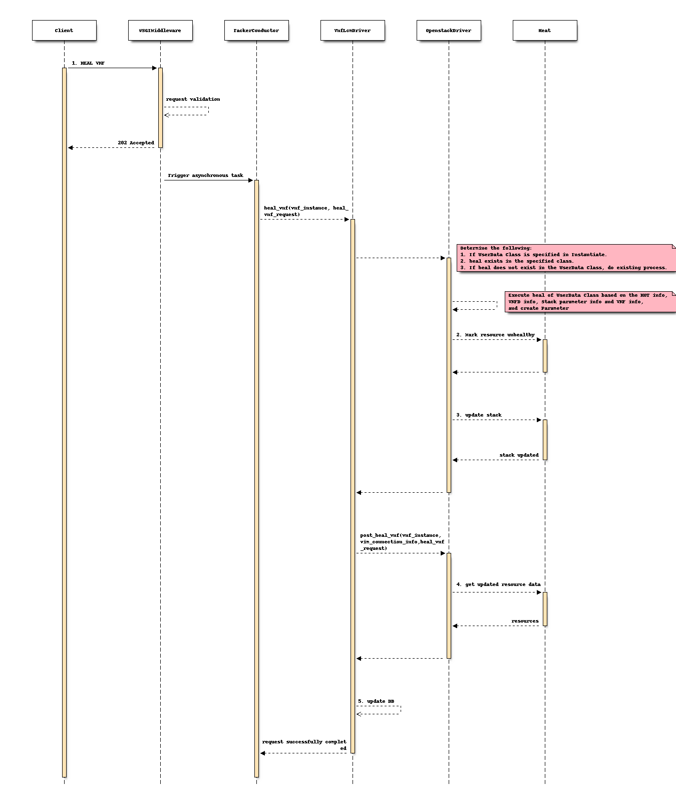
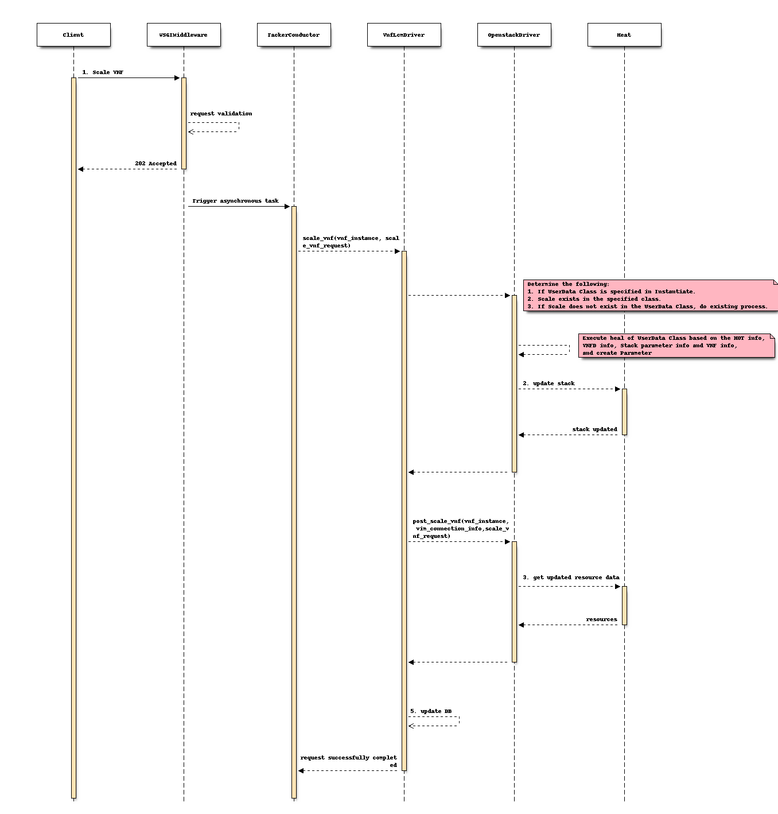

..
 This work is licensed under a Creative Commons Attribution 3.0 Unported
 License.
 http://creativecommons.org/licenses/by/3.0/legalcode

==============================================
Heal and scale method support of lcm_user_data
==============================================

Blueprints:

https://blueprints.launchpad.net/tacker/+spec/stack-parameter-customization

The aim of this specification is to provide support for stack parameter
customization during heal and scale operation.

Problem description
===================

As regards the stack parameter to be passed at the time of updating
the Heat, the user can create the stack parameter using lcm_user_data
during Instantiation, but during Heal and Scale, the creation of the
stack parameter is a fixed process and user cannot do the customization.

For example, at the time of scale, the desired_capacity value is
rewritten as a Tacker process by setting up a get_param naming convention
(VDU name_desired_capacity) on the HOT (Heat Orchestration Template)
without going through the lcm_user_data script. Since desired_capacity
is also in the scope of rewriting HOT with parameters, it needs to be
modified through the script of lcm_user_data.

Proposed change
===============

* At the time of stack parameter generation process before Heat Update in the Heal process, if the heal method exists in lcm_user_data, call it to get the stack parameters.
* At the time of stack parameter generation process before Heat Update in the Scale process, if the scale method exists in lcm_user_data, call it to get the stack parameters.

Below is the definition of scale and heal functions in user_lcm_data.py in VNF package.
The vnfc_resource_info in heal represent the vnfc resource list and resource_number represent number of resources to set as desired_capacity.

.. code-block:: python

   def heal(base_hot_dict=None,
            vnfd_dict=None,
            heal_vnf_request=None,
            vnf_instances=None,
            inst_vnf_info=None,
            param=None, vnfc_resource_info=None):

   def scale(base_hot_dict=None,
             vnfd_dict=None,
             scale_vnf_request=None,
             vnf_instances=None,
             inst_vnf_info=None,
             param=None, resource_number=None):

Flow of the Stack update process
--------------------------------

* Heal VNF instance (POST /vnf_instances/(vnfinstanceId)/heal)

Precondition: The resource representing the VNF instance has been created and instantiated.

* Scale VNF instance (POST /vnf_instances/{vnfInstanceId}/scale)

Precondition: The resource representing the VNF instance has been created and instantiated.

Data model impact
-----------------
None

REST API impact
---------------
None

Security impact
---------------

None

Notifications impact
--------------------

None

Other end user impact
---------------------

Users can now create stack parameters through the lcm_user_data script.

Performance Impact
------------------

None

Other deployer impact
---------------------

None

Developer impact
----------------

None

Implementation
==============

Assignee(s)
-----------

Renu Rani <renu.rani@gmail.com>

Work Items
----------
* Call heal method in lcm_user_data
* Call scale method in lcm_user_data
* Generation utility method of desired_capacity information
* Testing

Dependencies
============

None

Testing
=======

Unit and functional test cases will be added for heal and scale operation
with updated lcm_user_data script.

Documentation Impact
====================

Complete user guide will be added to explain how to use lcm_user_data script
for stack parameter update in heal and scale operation.

References
==========

None

History
=======

None
