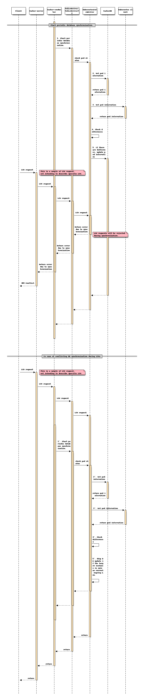

==========================================================
Database Synchronization between TackerDB and KubernetesDB
==========================================================

https://blueprints.launchpad.net/tacker/+spec/database-synchronization

Problem description
===================

In the current implementation, TackerDB and VIM DB(KubernetesDB)
such as etcd in Kubernetes are only synchronized when SOL002 heal is executed.
However, when Kubernetes auto-heals or auto-scales and the pod restarts,
the information is only reflected in the KubernetesDB and not in TackerDB.
As a result, the following problems occurs.

* When a user uses a command or API to get information about
  a Pod resource, they see the information stored in TackerDB
  and get an out-of-date output.

* If a user attempts to scale when the database is inconsistent, the Pod
  scales at a number that the user does not intend because it sees and
  processes old information.

.. note:: The existing heal process already supports the ability
          to synchronize information about a Pod.

This specification supposes the below changes:

* Adds periodic synchronization of Pod information between
  TackerDB and KubernetesDB

Proposed Change
===============

The following functions are incorporated in this specification.

+ Regularly retrieve information of pods that TackerDB and
  KubernetesDB hold, compare the data,
  and update TackerDB from KubernetesDB if there are differences.

  .. note:: When the TackerDB is updated by synchronization processing,
            the information is shown in a log.
            The log contains the name of the old pod and the new one.

+ Enable config to specify the frequency of synchronization.

The attributes in the TackerDB to be updated are as follows:

+ vnf_instantiated_info.scaleStatus.scaleLevel: Calculate the `scaleLevel`
  from the number of Pods retrieved from KubernetesDB and update it if it
  differs from TackerDB.
+ vnf_instantiated_info.vnfc_resource_info: If the number of
  running Pods changes, increase or decrease the number of data in
  `vnfcResourceInfo` to match the number of running Pods.
+ vnf_instantiated_info.vnfc_resource_info.computeResource.resourceId:
  Update resourceId with the new resource ID as Pod name.
+ VnfInstanceV2.instantiatedVnfInfo.scaleStatus.scaleLevel: Calculate
  the `scaleLevel` from the number of Pods retrieved from KubernetesDB
  and update it if it differs from TackerDB.
+ VnfInstanceV2.instantiatedVnfInfo.vnfcResourceInfo: If the number of
  running Pods changes, increase or decrease the number of data in
  `vnfcResourceInfo` and `VnfInstanceV2.instantiatedVnfInfo.vnfcInfo`
  to match the number of running Pods.
+ VnfInstanceV2.instantiatedVnfInfo.vnfcResourceInfo.
  computeResource.resourceId:
  Update resourceId with the new resource ID as Pod name.

.. note:: Get the following resource information from KubernetesDB

  * Pod
  * Deployment
  * Replicaset
  * Daemonset
  * StatefulSet

  Pods under the control of StatefulSet have static names,
  thus resourceId does not change even if they are recreated by
  Kubernetes. However, Tacker must fetch the current number of
  Pods to update ScaleStatus during DB synchronization.

Synchronizes between TackerDB and KubernetesDB
----------------------------------------------

Periodic database synchronization
~~~~~~~~~~~~~~~~~~~~~~~~~~~~~~~~~

This feature periodically synchronizes information related to
Pod resources between TackerDB and KubernetesDB.

The diagram below shows the database synchronization.

::

                                                    +----------------------------------------------------------+
                                                    |   VNFM                                                   |
                                                    |  +-----------------------+                               |
   +-------------------------------+                |  |    Tacker-conductor   |                               |
   |     Kubernetes                |                |  |  +--------------+     |                               |
   |                               |                |  |  | VnflcmDriver |     |                               |
   | +--------------------------+  |                |  |  | (v1/v2)      |     |                               |
   | |           Master         |  |                |  |  +---+----------+     |                               |
   | |                          |  |                |  |      | 1. Start periodic database synchronization     |
   | |                          |  |                |  |      |                |                               |
   | |                          |  |                |  |      |                |                               |
   | | +------+    +---------+  |  |                |  |  +---v----------+     |                               |
   | | | etcd |    |         |  |  |                |  |  | Kubernetes   |     |              +-----------+    |
   | | |      |<-->|kube-    |<---------------------------+ InfraDriver  +------------------->| TackerDB  |    |
   | | +------+    |apiserver|  |  | 3. Get pod     |  |  |              |     |              |           |    |
   | |             |         |  |  |    information |  |  +--------------+     |              +-----------+    |
   | |             |         |  |  |                |  |   4. Check difference |   2. Get pod information      |
   | |             |         |  |  |                |  |                       |                               |
   | |             |         |  |  |                |  |                       |   5. If there are difference, |
   | |             +---------+  |  |                |  |                       |      update pod information   |
   | |                          |  |                |  |                       |                               |
   | +--------------------------+  |                |  +-----------------------+                               |
   |                               |                |                                                          |
   +-------------------------------+                +----------------------------------------------------------+

Sequence for periodic database synchronization:

#. Start the database synchronization process periodically at
   intervals specified in Config

#. KubernetesInfraDriver retrieves Pod information stored in TackerDB

#. KubernetesInfraDriver retrieves information about currently running
   Pod name and number of Pod from KubernetesDB

#. KubernetesInfraDriver compares these two pieces of information

   Comparisons include:

   * Pod name

   * Number of running Pods

#. If there are differences, KubernetesInfraDriver updates the
   Pod information and scaleLevel to TackerDB.

   * Any LCM requests of target instances is rejected by HTTP 409
     (Conflict).

Step 1' to 5' describes the detail of conflict of DB synchronization during
LCM process. If DB synchronization is needed for the instance which is
affected by ongoing LCM procedure, DB synchronization will be skipped for that
instance.

Configuration for Interval timer
~~~~~~~~~~~~~~~~~~~~~~~~~~~~~~~~

Config can set a timer to synchronize pod information between
TackerDB and KubernetesDB.

This configuration is common to the v1 and v2 APIs.

The default is 300 seconds.

Data model impact
-----------------

None

REST API impact
---------------

None

Security impact
---------------

None

Notifications impact
--------------------

None

Other end user impact
---------------------

None

Performance impact
------------------

Contention may occur when database synchronization and LCM operations are
performed simultaneously.

+ If you perform an LCM operation on the same VNF instance while periodic
  database synchronization is taking place on that VNF instance, Tacker
  responds with "409 conflicts" and the LCM operation is not performed.
+ If database synchronization is performed for the same VNF instance during
  an LCM operation for a VNF instance, the database synchronization is skipped.

Other deployer impact
---------------------

None

Developer impact
----------------

None

Implementation
==============

Assignee(s)
-----------

Primary assignee:
 Masaki Ueno <masaki.ueno.up@hco.ntt.co.jp>

Other contributors:
 Hideki Matsuda <matsuda.hideki1@fujitsu.com>

 Ayumu Ueha <ueha.ayumu@fujitsu.com>

 Yoshiyuki Katada <katada.yoshiyuk@fujitsu.com>

 Yusuke Niimi <niimi.yusuke@fujitsu.com>

Work Items
----------

+ Support for periodic database synchronization

+ Add a new configuration about interval for checking database synchronization

+ Add new unit and functional tests

Dependencies
============

None

Testing
=======

Unit and functional tests will be added to cover cases required in the
specification.

Documentation Impact
====================

Complete configuration guide will be added to explain configuration
about specify the interval between synchronizations.

References
==========

None
