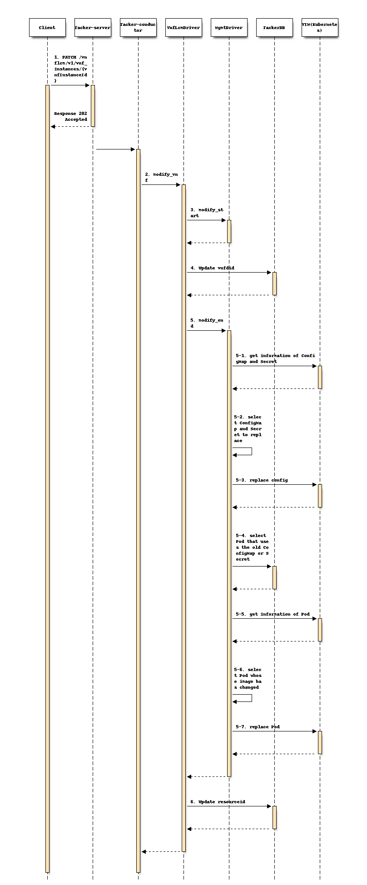

========================================
Enhancement of Container Update Function
========================================

https://blueprints.launchpad.net/tacker/+spec/enhancement-container-update

Problem description
===================
In the current implementation, when users invoke update operation of
ConfigMaps and Secrets, all Pods are restarted even if they don't use those
updated ConfigMaps and Secrets. This modification aims to remove this
limitation.

.. _proposed-change:

Proposed change
===============
This specification proposes the following changes:

+ Add process to Container Update operation [#container_update]_ to restart
  only the Pods that use updated ConfigMap or Secret.

  + ConfigMap and Secret can be used in a Pod either
    by setting the environment variable or mounting to volume.
    Therefore, the keys for searching the usage of ConfigMap and
    Secret are as follows:

    In the case of Pods,

    + ``spec.containers.env.valueFrom.configMapKeyRef.name``
    + ``spec.containers.env.valueFrom.secretKeyRef.name``
    + ``volumes.configMap.name``
    + ``volumes.secret.name``

    In the case of Deployments, ReplicaSets and DaemonSets,

    + ``spec.template.spec.containers.env.valueFrom.configMapKeyRef.name``
    + ``spec.template.spec.containers.env.valueFrom.secretKeyRef.name``
    + ``spec.template.volumes.configMap.name``
    + ``spec.template.volumes.secret.name``

  .. note:: If the image parameter of a manifest file changes,
            the Pod is replaced and the image is updated. In this case,
            the Pod is replaced regardless of whether the Pod has ConfigMap
            or Secret to update.

Design of operation
-------------------

The diagram is basically the same as container update [#container_update]_ ,
except that only pods that use the updated ConfigMap and Secret or whose image
has changed are selected for replacement.

Below is a diagram of the VNF Modify Information operation:

.. code-block::

                                         +---------------+ +--------+
                                         | Updated       | |  VNFD  |
                                         | manifest file | |        |
                                         +-------------+-+ +-+------+
                                                       |     |
                                                       |     |
                                                     +-v-----v--+  +------------------+
                                                     |   CSAR   |  | Modify Request   |
                                                     |          |  | with new vnfd_id |
                                                     +----+-----+  +-+----------------+
                                                         |          | 1. Modify VNF Information request
                                                         |          |
                                                   +-----+----------+----------------------------------------+
                                                   |     |          |        VNFM                            |
                                                   |  +--v----------v----------------+                       |
                                                   |  |   Tacker-server              |                       |
                                                   |  +--+---------------------------+                       |
                                                   |     |  2. Modify VNF Information request                |
                                                   |     |                                                   |
  +--------------------------+                     |  +--v------------------------------------------------+  |
  |  TackerDB                |                     |  |                                                   |  |
  |                          |4. Update vnfdId     |  |    +----------------------+                       |  |
  |                          <---------------------+--+----+  VnfLcmDriver        |                       |  |
  |                          |                     |  |    |                      |                       |  |
  |                          |6. Update resourceId |  |    |                      |                       |  |
  |                          <---------------------+--+----+                      |                       |  |
  |                          |                     |  |    |                      |                       |  |
  |                          <--+                  |  |    |                      |                       |  |
  +--------------------------+  |                  |  |    +-+------------------+-+                       |  |
                                | 5-4. Select the  |  |      |3. modify_start   |5. modify_end            |  |
  +--------------------------+  |      Pod to      |  |      |                  |                         |  |
  |                          |  |      replace     |  |    +-v------------------v-+                       |  |
  |  +--------------------+  |  +------------------+--+----+  MgmtDriver          |                       |  |
  |  |  Kubernetes        |  | 5-1. Get the        |  |    |                      |5-2. Select the        |  |
  |  |  ConfigMap/Secret  |  |      ConfigMap and  |  |    |                      |     ConfigMap and     |  |
  |  |                    |  |      Secret         |  |    |                      |     Secret to replace |  |
  |  |                    <--+---------------------+--+----+                      +---------------+       |  |
  |  |                    |  |                     |  |    |                      |               |       |  |
  |  |                    |  | 5-3. Replace config |  |    |                      |               |       |  |
  |  |                    <--+---------------------+--+----+                      <---------------+       |  |
  |  +--------------------+  |                     |  |    |                      |5-6. Select the Pod    |  |
  |                          |                     |  |    |                      |     whose image has   |  |
  |  +--------------------+  | 5-5. Get the Pod    |  |    |                      |     changed           |  |
  |  |                    <--+---------------------+--+----+                      +---------------+       |  |
  |  |                    |  |                     |  |    |                      |               |       |  |
  |  |  Kubernetes Pod    |  | 5-7. Replace Pod    |  |    |                      |               |       |  |
  |  |                    <--+---------------------+--+----+                      <---------------+       |  |
  |  |                    |  |                     |  |    +----------------------+                       |  |
  |  |                    |  |                     |  |                                                   |  |
  |  |                    |  |                     |  |   Tacker-conductor                                |  |
  |  +--------------------+  |                     |  +---------------------------------------------------+  |
  |                          |                     |                                                         |
  |    Kubernetes cluster    |                     +---------------------------------------------------------+
  +--------------------------+
  +--------------------------+
  |    Hardware Resources    |
  +--------------------------+

Request parameters for operation
--------------------------------
User gives following modify parameter to
"PATCH /vnflcm/v1/vnf_instances/{vnfInstanceId}" as
``VnfInfoModificationRequest`` data type in:

.. note:: The request parameters have not changed from the existing
          Container Update.

.. list-table:: Definition of the VnfInfoModificationRequest data type
    :widths: 15 10 30
    :header-rows: 1

    * - Attribute name
      - Cardinality
      - Parameter description
    * - vnfInstanceName
      - 0..1
      - String. "vnfInstanceName" attribute in "VnfInstance".
    * - vnfInstanceDescription
      - 0..1
      - String. "vnfInstanceDescription" attribute in "VnfInstance".
    * - vnfdId
      - 0..1
      - Identifier. "vnfdId" attribute in "VnfInstance".
    * - vnfConfigurableProperties
      - 0..1
      - KeyValuePairs. "vnfConfigurableProperties" attribute in "VnfInstance".
    * - metadata
      - 0..1
      - KeyValuePairs. "metadata" attribute in "VnfInstance".
    * - extensions
      - 0..1
      - KeyValuePairs. "extensions" attribute in "VnfInstance".
    * - vimConnectionInfo
      - 0..N
      - map (VimConnectionInfo). "vimConnectionInfo" attribute array in
        "VnfInstance".
    * - vimConnectionInfoDeleteIds
      - 0..N
      - Identifier. To be deleted from the "vimConnectionInfo" attribute array
        in "VnfInstance",

Following is a sample of request body:

.. code-block:: json

  {
    "vnfdId": "093c38b5-a731-4593-a578-d12e42596b3e"
  }

Using ConfigMap and Secret with Kubernetes
------------------------------------------

ConfigMap and Secret can be used in a Pod either by setting
the environment variable or mounting to volume.
The following are examples of the Kubernetes object file
when using ConfigMap and Secret.

.. note:: The usage of ConfigMap and Secret has not changed from the existing
          Container Update.

Sample file to define the Kubernetes ConfigMap and Secret:

.. code-block:: yaml

  ---
  apiVersion: v1
  kind: ConfigMap
  metadata:
    name: cm-data
  data:
    cmKey1.txt: |
      configmap data
      foo
      bar
  ---
  apiVersion: v1
  kind: Secret
  metadata:
    name: secret-data
  stringData:
    password: 1mbb1G968fb1CUg
    secKey1.txt: |
      secret data
      baz

Sample file of Kubernetes object when using ConfigMap and Secret
as environment variables:

.. code-block:: yaml

   apiVersion: v1
   kind: Pod
   metadata:
     name: env-test
   spec:
     containers:
     - image: alpine
       name: alpine
       env:
       - name: CMENV
         valueFrom:
           configMapKeyRef:
             name: cm-data
             key: cmkey1.txt
       - name: SECENV
         valueFrom:
           secretKeyRef:
             name: secret-data
             key: password
       envFrom:
       - prefix: CM_
         configMapRef:
           name: cm-data
       - prefix: SEC_
         secretRef:
           name: secret-data
   terminationGracePeriodSeconds: 0

Sample file of Kubernetes object when using ConfigMap and Secret
by mounting to volume:

.. code-block:: yaml

   apiVersion: v1
   kind: Pod
   metadata:
     name: modify-VNF-volume-test
   spec:
     containers:
     - image: alpine
       name: alpine
       volumeMounts:
       - name: cm-volume
         mountPath: /config
       - name: sec-volume
         mountPath: /etc/secrets
     volumes:
     - name: cm-volume
       configMap:
         name: cm-data
         defaultMode: 0666
         items:
         - key: cmKey1.txt
           path: cm/config.txt
     - name: secret-volume
       secret:
         secretName: secret-data
         defaultMode: 0600
         items:
         - key: secKey1.txt
           path: creds/secret.txt
   terminationGracePeriodSeconds: 0

Sequence for operation
----------------------

1. The Client sends a PATCH request to the "Individual VNF instance" resource.

2. Tacker-conductor sends modify VNF request to VnfLcmDriver.

3. VnfLcmDriver calls modify_start of MgmtDriver.

4. VnfLcmDriver updates VnfInstance.vnfdId in the TackerDB to the ID of the
   new VNFD.

5. VnfLcmDriver calls modify_end of MgmtDriver.
   modify_end uses the replace API to replace ConfigMap, Secret, and Pod.

   5-1. MgmtDriver sends request to get information of ConfigMap and Secret to
   the VIM (Kubernetes).

   5-2. MgmtDriver selects ConfigMap and Secret if the information retrieved
   in 5-1 differs from the new information.

   .. note:: ConfigMap and Secret is selected for replacement if there is a
             difference in parameters between the retrieved and new ones.

   5-3. MgmtDriver sends request to replace config of ConfigMap and Secret
   selected in 5-2 to the VIM (Kubernetes).

   5-4. MgmtDriver sends request to select Pod that uses the old ConfigMap or
   Secret to TackerDB.

   .. note:: The ideal way to retrieve information about pods
             that have the ConfigMap and Secret name selected in 5-2,
             is using field-selector mechanism implemented in Kubernetes.
             However, current implementation of Kubernetes does not support
             field-selectors for the parameters described in
             :ref:`proposed-change` section.

   5-5. MgmtDriver sends request to get information of Pod to the
   VIM (Kubernetes).

   5-6. MgmtDriver selects Pod whose image has changed.

   5-7. MgmtDriver sends request to replace Pod selected in 5-4 and 5-6 to the
   VIM (Kubernetes).

   .. note:: If the image parameter in the manifest file for the Pod,
             Deployment, ReplicaSet and DaemonSet has changed,
             the image will be replaced when the Pod is
             replaced. If parameters other than image is changed in the Pod or
             Deployment manifest file, the change is not applied.

6. VnfLcmDriver updates
   VnfInstance.instantiatedVnfInfo.vnfcResourceInfo.computeResource.resourceId
   in the TackerDB to the ID of the replaced Pod.

Alternatives
------------
None

Data model impact
-----------------
None

REST API impact
---------------
None

Security impact
---------------
None

Notifications impact
--------------------
None

Other end user impact
---------------------
None

Performance Impact
------------------
None

Other deployer impact
---------------------
None

Developer impact
----------------
None

Implementation
==============

Assignee(s)
-----------

Primary assignee:
  Masaki Ueno<masaki.ueno.up@hco.ntt.co.jp>

Other contributors:
  Yusuke Niimi<niimi.yusuke@fujitsu.com>

  Yoshiyuki Katada<katada.yoshiyuk@fujitsu.com>

  Ayumu Ueha<ueha.ayumu@fujitsu.com>

Work Items
----------
Add process to Container Update operation to restart only the Pods that use
updated ConfigMap and Secret.

Dependencies
============
None

Testing
=======
Unit and functional tests will be added to cover cases required in the spec.

Documentation Impact
====================
Complete user guide will be added to explain modifying VNF information from
the perspective of VNF LCM APIs.

References
==========

.. [#container_update] https://specs.openstack.org/openstack/tacker-specs/specs/yoga/container-update.html
