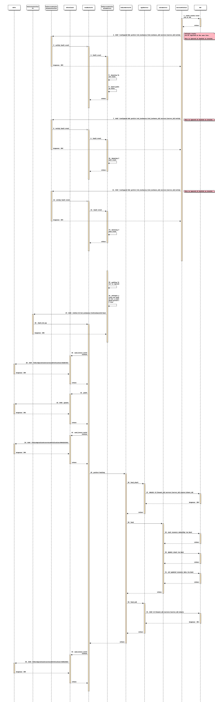

======================================================
Support VNF AutoHealing triggered by FaultNotification
======================================================

https://blueprints.launchpad.net/tacker/+spec/support-autoheal-queue

Problem description
===================

This spec provides an implementation for supporting AutoHealing using
FaultNotification interface between Tacker and VIM.

When fault events occur in VIM, VIM notifies fault event to Tacker
via the interface.

Tacker takes initiative of AutoHealing. According to configuration,
Tacker checks faultID attribute in the fault event and determines
whether AutoHealing should be performed. In case of performing
AutoHealing, VMs are deleted or created via Heat [#Openstack_Heat]_.

The FaultNotification interface can be alerted by multiple events.
To prevent invoking multiple heal operations to single VNF,
the FaultNotification requests to Tacker are packed for a configured
period of time.

Proposed change
===============

The following changes are needed:

#. Add support of RESTful API for FaultNotification between
   Tacker and VIM

   + POST `<configured URI prefix>/vnf_instances/{vnf_instance_id}
     /servers/{server_id}/notify`
     for notification of fault event from VIM to Tacker.

   + Support queueing and packing of multiple requests for above API.

#. Add MgmtDriver support for FaultNotification destination handling

   + instantiate_end

     + Set FaultNotification destination URI with VIM
       via `<ServerNotifier URI prefix>/v2/{tenant_id}/
       servers/{server_id}/alarms`
       for created VMs.

   + terminate_start

     + Delete alarmID
       via `<ServerNotifier URI prefix>/v2/{tenant_id}
       /servers/{server_id}/alarms/{alarm_id}`
       for deleted VMs.

   + scale_start

     + In case of Scale-in, delete alarmID
       via `<ServerNotifier URI prefix>/v2/{tenant_id}
       /servers/{server_id}/alarms/{alarm_id}`
       for deleted VMs.

   + scale_end

     + In case of Scale-out, set FaultNotification destination URI with VIM
       via `<ServerNotifier URI prefix>/v2/{tenant_id}
       /servers/{server_id}/alarms`
       for added VMs.

   + heal_start

     + Delete alarmID
       via `<ServerNotifier URI prefix>/v2/{tenant_id}
       /servers/{server_id}/alarms/{alarm_id}`
       for failure VMs.

   + heal_end

     + Set FaultNotification destination URI with VIM
       via `<ServerNotifier URI prefix>/v2/{tenant_id}
       /servers/{server_id}/alarms`
       for added VMs.

AutoHeal VNF on FaultNotification trigger
-----------------------------------------

AutoHealing is mainly composed of two services.

The Server Notifier is a monitoring service that may have dedicated interfaces
implemented by each operators, thus it is not included in Tacker.
When the Server Notifier detects fault events in VIM, it will send
FaultNotification to Tacker.

Within the Tacker, VnfServerNotificationController has external interface
of RESTful API. VnfServerNotificationDriver decides whether AutoHealing
should be performed. After that, it is almost same as manual healing
that is performed by VnfLcmDriverV2.

Design of AutoHealing operation on FaultNotification trigger
~~~~~~~~~~~~~~~~~~~~~~~~~~~~~~~~~~~~~~~~~~~~~~~~~~~~~~~~~~~~

The following is a schematic diagram of
AutoHealing on FaultNotification trigger:

.. code-block:: console

                              +------------------------+
                              |                        |
                              |    Client (NFVO)       <--------+
                              |                        |        |
                              +------------------------+        | 8,18.POST VnfLcmOperationOccurrenceNotification
                                                                | 9.POST grants
                            +-----------------------------------|-------------------------------------------+
                            |                                   |                                      VNFM |
                            |  +-------------------------+ +----|----------------------------+              |
                            |  |                  Tacker | |    |                  Tacker    |              |
                            |  |                  Server | |    |                  Conductor |              |
                            |  |                         | |  +-+-------------+              |              |
                            |  |                         | |  | NfvoClient    |              |              |
                            |  |                         | |  +-^-------------+              |              |
                            |  |                         | |    |                            |              |
                            |  |     +--------------+    | |  +-+-------------+              |              |
                            |  |     | Vnflcm       +---------> ConductorV2   |              |              |
                            |  |     | ControllerV2 <--+ | |  +-+-^---+-------+              |              |
                            |  |     +--------------+  | | |    | |   |                      |              |
    4.POST                  |  |             7.perform | | |    | |   | +--+ 6.check faultID,|              |
    <configured URI prefix> |  |               healing | | |    | |   | |  | pack multiple   |              |
    /vnf_instances          |  |                       | | |    | |   | |  | requests        |              |
    /{vnf_instance_id}      |  |     +--------------+  | | |    | | +-v-+--v--------+        |   +--------+ |
    /servers                |  |     | VnfServer    |  +------------+ VnfServer     +------------> Tacker | |
    /{server_id}/notify     |  |     | Notification |    | |    | | | Notification  |    +-------> DB     | |
             +-----------------------> Controller   +-------------+ | Driver        |    |   |   +--------+ |
             |              |  |     +--------------+    | |    |   +---------------+    |   |   2,17.Save  |
             |              |  |                  5.post | |    |                        |   |   parameters |
             |              |  |            notification | |    |                        |   |   12.Delete  |
             |              |  |                         | |    |                        |   |   parameters |
             |              |  |                         | |    |    +--------------+    |   |              |
             |              |  |                         | |    +----> VnfLcm       +----+   |              |
             |              |  |                         | |         | DriverV2     |        |              |
             |              |  |                         | |         +----+------+--+        |              |
             |              |  |                         | | 10.heal_start|      |           |              |
             |              |  |                         | | 15.heal_end  |      |           |              |
             |              |  |                         | |   +----------v-+ +--v---------+ |              |
             |              |  |                         | |   | Mgmt       | | Infra      | |              |
             |              |  |                         | |   | Driver     | | Driver     | |              |
             |              |  |                         | |   +----+-------+ +---+--------+ |              |
             |              |  +-------------------------+ +--------|-------------|----------+              |
             |              +---------------------------------------|-------------|-------------------------+
             |       +----------------------------------------------+             |
      +------|-------|------------------------------------------------------------|--------------+
      |      |       | 1,16.Set FaultNotification destination URI                 |     VIM/NFVI |
      |      |       | 11.Delete alarmID                                          |              |
      |      |       |                                   +---------------+--------+              |
      |      |       |              13.Delete failed VNF |               | 14.Create new VNF     |
      |   +--+-------v--+                       +--------v----+   +------v------+                |
      |   | Server      | 3.Detects fault event | +--------+  |   | +--------+  |                |
      |   | Notifier    +-------------------------> VNF    |  |   | | VNF    |  |                |
      |   |             |                       | +--------+  |   | +--------+  |                |
      |   |             |                       |          VM |   |          VM |                |
      |   +-------------+                       +-------------+   +-------------+                |
      +------------------------------------------------------------------------------------------+

* ``1-2.`` Tacker sets FaultNotification destination URI and faultIDs
  to VIM for each VM when a VNF is instantiated (see note 1.).
  In return, an alarmID is obtained. Then, ServerNotifier URI and
  faultIDs are saved on ``VnfInstance.instantiatedVnfInfo.metadata``,
  and obtained alarmID is saved on
  ``VnfInstance.instantiatedVnfInfo.vnfcResourceInfo.metadata``.

* ``3.`` Server Notifier watches and detects fault events on VNF.

* ``4-5.`` Server Notifier notifies fault event to Tacker via
  the FaultNotification interface. VnfServerNotificationController forwards
  the notification to VnfServerNotificationDriver via ConductorV2.

* ``6.`` VnfServerNotificationDriver checks if its faultID attribute is
  included in faultIDs being set in term 1 above.
  In case of alerting by multiple events, to prevent invoking
  multiple heal operations to single VNF, the fault events are packed into
  a single heal request for a configured period of time (see note 2.).

* ``7-9.`` The remaining process is same as the manual healing. VnfLcmDriverV2
  sends VnfLcmOperationOccurrenceNotification and grants to the Client.
  This process is specified in [#spec_lcm_y]_, [#spec_lcm_v]_.

* ``10-12.`` Tacker deletes alarmID for new VNF. It also removes alarmID on DB
  (``VnfInstance.instantiatedVnfInfo.vnfcResourceInfo.metadata``)
  at the same time.

* ``13-14.`` Failed VNF is deleted and new VNF is created. This process is
  performed by Heat interface of OpenStack [#Openstack_Heat]_.

* ``15-17.`` Tacker sets FaultNotification destination URI for new VNF.
  It saves alarmID on DB
  (``VnfInstance.instantiatedVnfInfo.vnfcResourceInfo.metadata``).
  at the same time.

* ``18.`` VnfLcmDriverV2 sends VnfLcmOperationOccurrenceNotification
  to the Client. This process is specified in [#spec_lcm_y]_, [#spec_lcm_v]_.

.. note::
  #. ServerNotifier URI and faultIDs are set in
     ``InstantiateVnfRequest.additionalParams`` field of VNF LCM interface.
     (see `REST API impact`_)
     This additionalParams field is defined as key/value pair in ETSI
     NFV-SOL003 v3.3.1 [#SOL003_v3.3.1]_

  #. When a single VNF raises multiple fault events for its VNFCs
     at a moment, Tacker targets these VNFCs and performs healing all at once.
     In this healing operation, ``HealVnfRequest.vnfcInstanceId`` includes
     all these VNFCs. So that, VnfLcmOperationOccurrenceNotification and
     grants are performed only once.

Request parameters for AutoHealing operation on FaultNotification trigger
~~~~~~~~~~~~~~~~~~~~~~~~~~~~~~~~~~~~~~~~~~~~~~~~~~~~~~~~~~~~~~~~~~~~~~~~~

The detail of API is described at `REST API impact`_.

Sequence for AutoHealing operation on FaultNotification trigger
~~~~~~~~~~~~~~~~~~~~~~~~~~~~~~~~~~~~~~~~~~~~~~~~~~~~~~~~~~~~~~~

The following describes the processing flow of the
AutoHealing triggered by FaultNotification.

* ``1.`` ServerNotifier watches and detects fault events on VNF.

* ``2-5.`` VNF notifies fault event to Tacker via the FaultNotification
  interface. Tacker ignores it when faultID is invalid.
  fault events are queued temporarily.

* ``6-14.`` In case of alerting by multiple events, fault events are
  packed into a single request for a configured period of time.

* ``15-16.`` When timer expires,
  the fault events are packed into a single request.

* ``17-18.`` VnfServerNotificationDriver requests healing to
  VnflcmControllerV2 and healing operations are started.

* ``19-24.`` Tacker sends
  VnfLcmOperationOccurrenceNotification(STARTING,PROCESSING) to the Client
  and grants. This process is specified in
  [#spec_lcm_y]_, [#spec_lcm_v]_

* ``25.`` VnfLcmDriverV2 performs healing.

  .. note::
    In this heal operation, ``additionalParams.all`` cannot be specified from
    users, thus only the VNFC itself (i.e. storages are not included) will be
    the target of heal operation. See [#spec_lcm_y]_ for the detail of
    behavior of ``additionalParams.all``.

* ``26-27.`` Tacker deletes alarmID for new VNF.

* ``28-31.`` Failed VNF is deleted and new VNF is created. This process is
  performed by Heat interface of OpenStack [#Openstack_Heat]_.

* ``32-33.`` Tacker sets FaultNotification destination URI for new VMs
  (see note).

* ``34-35.`` Tacker sends
  VnfLcmOperationOccurrenceNotification(COMPLETE) to the Client.
  This process is specified in [#spec_lcm_y]_, [#spec_lcm_v]_.

  .. note::
    * ServerNotifier URI and faultIDs are set in
      ``InstantiateVnfRequest.additionalParams`` field of VNF LCM interface.
      (see `REST API impact`_)
      This additionalParams field is defined as key/value pair in
      ETSI NFV-SOL003 v3.3.1 [#SOL003_v3.3.1]_

Alternatives
------------

None

Data model impact
-----------------

None

REST API impact
---------------

VIM sends following RESTful API to notify fault event to Tacker.

* | **Name**: Notify fault event
  | **Description**: notifies Tacker with fault event
                     when a fault event occur in VIM.
  | **Method type**: POST
  | **URL for the resource**: <configured URI prefix>/vnf_instances/
                              {vnf_instance_id}/servers/{server_id}/notify
  | **Path parameters**:

  .. list-table::
    :header-rows: 1
    :widths: 18 10 50

    * - Name
      - Cardinality
      - Description
    * - <configured URI prefix>
      - 1
      - Prefix of URI for notifying fault event on Tacker.
        This parameter is described ``fault_notification_uri``
        in tacker.conf file.
    * - vnf_instance_id
      - 1
      - VNF instance ID.
    * - server_id
      - 1
      - VM ID.

  | **Request**:

  .. list-table::
    :header-rows: 1
    :widths: 18 10 50

    * - Data type
      - Cardinality
      - Description
    * - ServerNotification
      - 1
      - fault information to Tacker when a fault event occur in VIM.

  .. list-table::
    :header-rows: 1
    :widths: 18 18 10 50

    * - Attribute name (ServerNotification)
      - Data type
      - Cardinality
      - Description
    * - notification
      - Structure (inlined)
      - 1
      -
    * - >host_id
      - Identifier
      - 0..1
      - Physical server ID. Specified only in case that fault
        is occurred on physical server.
    * - >alarm_id
      - Identifier
      - 1
      - ID to identify alarm.
    * - >fault_id
      - String
      - 1
      - Target fault IDs
    * - >fault_type
      - String
      - 1
      - Fault type.
        "10": Physical server fault,
        "11": Physical server OUS,
        "20": Inconsistency of VM status,
        "21": VM reboot detection.
    * - >fault_option
      - KeyValuePairs
      - 0..1
      - Optional information for fault.

  | **Response**:

  .. list-table::
    :header-rows: 1
    :widths: 18 10 18 50

    * - Data type
      - Cardinality
      - Response Codes
      - Description
    * - n/a
      - 1
      - Success: 204
      - Shall be returned when ServerNotification has
        been accepted successfully.
    * - n/a
      - 1
      - Error: 400
      - Malformed request syntax.
    * - n/a
      - 1
      - Error: 404
      - The server can not find the requested resource.
    * - n/a
      - 1
      - Error: 500
      - The server has encountered a situation it does not know how to
        handle.
    * - n/a
      - 1
      - Error: 503
      - This error response means that the server, while working as
        a gateway to get a response needed to handle the request, got
        an invalid response.

The LCM interface is modified to set parameters for ServerNotifier.

* | **Name**: Instantiate VNF task
  | **Description**: This task resource represents the "Instantiate VNF"
    operation. The client can use this resource to instantiate a VNF instance.
    ``Only the additionalParams for FaultNotification are described here``.
  | **Method type**: POST
  | **URL for the resource**: /vnflcm/v2/vnf_instances/
                              {vnfInstanceId}/instantiate
  | **Request**:

  .. list-table::
    :header-rows: 1
    :widths: 18 18 10 50

    * - Attribute name (InstantiateVnfRequest)
      - Data type
      - Cardinality
      - Description
    * - additionalParams
      - 0..1
      - KeyValuePairs (inlined)
      - Additional input parameters for the instantiation process,
        specific to the VNF being instantiated.
    * - >ServerNotifierUri
      - 1
      - String
      - Base Uri for ServerNotifier. The latter part of Uri
        (the part of "v2/{tenant_id}/..." as described in
        `Notifications impact`_)
        is added internally by Tacker, so only the first part should be set.
    * - >ServerNotifierFaultID
      - 1..N
      - String
      - List of string that indicates which type of alarms to detect.

Security impact
---------------

None

Notifications impact
--------------------

Tacker sends notifications below to set/unset ServerNotifier configuration:

* | **Name**: Set FaultNotification destination URI from VNFM to VIM
  | **Description**: set FaultNotification destination URI from VNFM to VIM
  | **Method type**: POST
  | **URL for the resource**: v2/{tenant_id}/servers/{server_id}/alarms
  | **Path parameters**:

  .. list-table::
    :header-rows: 1
    :widths: 18 10 50

    * - Name
      - Cardinality
      - Description
    * - tenant_id
      - 1
      - tenant ID.
    * - server_id
      - 1
      - VM ID.

  | **Request Header**:

  .. list-table::
    :header-rows: 1
    :widths: 18 50

    * - Name
      - Description
    * - Authorization
      - Access token provided via Keystone

  | **Request**:

  .. list-table::
    :header-rows: 1
    :widths: 18 10 50

    * - Data type
      - Cardinality
      - Description
    * - ServerNotificationRegisterRequest
      - 1
      - URI and filter for Fault Management.

  .. list-table::
    :header-rows: 1
    :widths: 18 18 10 50

    * - Attribute name (ServerNotificationRegisterRequest)
      - Data type
      - Cardinality
      - Description
    * - fault_action
      - String
      - 0..1
      - FaultNotification destination URI for fault occurrence.
        Either fault_action or recovery_action must be specified.
    * - recovery_action
      - String
      - 0..1
      - FaultNotification destination URI for fault recovery.
        Either fault_action or recovery_action must be specified.
        (This attribute is for future use and is not used currently.)
    * - fault_id
      - String
      - 0..n
      - Target fault IDs.

  | **Response**:

  .. list-table::
    :header-rows: 1
    :widths: 18 10 18 50

    * - Data type
      - Cardinality
      - Response Codes
      - Description
    * - ServerNotificationRegisterResponse
      - 1
      - Success: 201
      - Shall be returned when ServerNotificationRegisterRequest has
        been registered successfully.
    * - n/a
      - 1
      - Error: 400
      - Malformed request syntax.
    * - n/a
      - 1
      - Error: 404
      - The server can not find the requested resource.
    * - n/a
      - 1
      - Error: 408
      - The server is shutting down its connection.
    * - n/a
      - 1
      - Error: 500
      - The server has encountered a situation it does not know how to
        handle.
    * - n/a
      - 1
      - Error: 503
      - This error response means that the server, while working as
        a gateway to get a response needed to handle the request, got
        an invalid response.

  .. list-table::
    :header-rows: 1
    :widths: 18 18 10 50

    * - Attribute name (ServerNotificationRegisterResponse)
      - Data type
      - Cardinality
      - Description
    * - fault_action
      - String
      - 0..1
      - FaultNotification destination URI for fault occurrence.
        Either fault_action or recovery_action must be specified.
    * - recovery_action
      - String
      - 0..1
      - FaultNotification destination URI for fault recovery.
        Either fault_action or recovery_action must be specified.
        (This attribute is for future use and is not used currently.)
    * - fault_id
      - String
      - 0..n
      - Target fault IDs.
    * - alarm_id
      - Identifier
      - 1
      - ID to identify alarm destination.

* | **Name**: Delete alarmID from VNFM to VIM
  | **Description**: delete alarmID from VNFM to VIM
  | **Method type**: DELETE
  | **URL for the resource**: v2/{tenant_id}/servers/
                              {server_id}/alarms/{alarm_id}
  | **Path parameters**:

  .. list-table::
    :header-rows: 1
    :widths: 18 10 50

    * - Name
      - Cardinality
      - Description
    * - tenant_id
      - 1
      - tenant ID.
    * - server_id
      - 1
      - VM ID.
    * - alarm_id
      - 1
      - alarm ID.

  | **Request Header**:

  .. list-table::
    :header-rows: 1
    :widths: 18 50

    * - Name
      - Description
    * - Authorization
      - Access token provided via Keystone

  | **Request**:

  .. list-table::
    :header-rows: 1
    :widths: 18 10 50

    * - Data type
      - Cardinality
      - Description
    * - n/a
      -
      -

  | **Response**:

  .. list-table::
    :header-rows: 1
    :widths: 18 10 18 50

    * - Data type
      - Cardinality
      - Response Codes
      - Description
    * - n/a
      - 1
      - Success: 204
      - Shall be returned when the registered
        resource has been deleted successfully.
    * - n/a
      - 1
      - Error: 400
      - Malformed request syntax.
    * - n/a
      - 1
      - Error: 404
      - The server can not find the requested resource.
    * - n/a
      - 1
      - Error: 408
      - The server is shutting down its connection.
    * - n/a
      - 1
      - Error: 500
      - The server has encountered a situation it does not know how to
        handle.
    * - n/a
      - 1
      - Error: 503
      - This error response means that the server, while working as
        a gateway to get a response needed to handle the request, got
        an invalid response.

.. note::
  * When using above set/delete API,
    Access Token should be obtained via Keystone in advance
    for authentication.

Other end user impact
---------------------

None

Performance Impact
------------------

None

Other deployer impact
---------------------

None

Developer impact
----------------

None

Implementation
==============

Assignee(s)
-----------

Primary assignee:
  Masaki Ueno <masaki.ueno.up@hco.ntt.co.jp>

Other contributors:
  Koji Shimizu <shimizu.koji@fujitsu.com>

  Yoshiyuki Katada <katada.yoshiyuk@fujitsu.com>

  Ayumu Ueha <ueha.ayumu@fujitsu.com>

  Yusuke Niimi <niimi.yusuke@fujitsu.com>

Work Items
----------

Implement Tacker to support:
  + Add new Rest API |post-fault-event| to
    notify fault event to Tacker when a fault event occur in VIM.

    .. |post-fault-event| replace::
      ``POST <configured URI prefix>/vnf_instances/{vnf_instance_id}/servers/
      {server_id}/notify``

  + Tacker sends ``POST v2/{tenant_id}/servers/{server_id}/alarms``
    to set FaultNotification destination URI with VIM.

  + Tacker sends |delete-alarm| to delete FaultNotification destination
    URI with VIM.

    .. |delete-alarm| replace::
      ``DELETE v2/{tenant_id}/servers/{server_id}/alarms/{alarm_id}``

  + Add MgmtDriver support for FaultNotification destination URI handling:

    + instantiate_end to set FaultNotification destination URI
      and get alarmID.

    + terminate_start to delete alarmID.

    + scale_start to delete alarmID.

    + scale_end to set FaultNotification destination URI and get alarmID.

    + heal_start to delete alarmID.

    + heal_end set FaultNotification destination URI with VIM and get alarmID.

Add new unit and functional tests.

Dependencies
============

None.

Testing
=======

Unit and functional tests will be added to cover cases required in the spec.

Documentation Impact
====================

* Complete user guide will be added to explain how to configure
  AutoHealing operation on FaultNotification trigger.

* Update API documentation on the API additions mentioned in
  `REST API impact`_.

References
==========

.. [#Openstack_Heat] https://docs.openstack.org/heat/latest/
.. [#SOL003_v3.3.1] https://www.etsi.org/deliver/etsi_gs/NFV-SOL/001_099/003/03.03.01_60/gs_nfv-sol003v030301p.pdf
.. [#spec_lcm_y] https://specs.openstack.org/openstack/tacker-specs/specs/yoga/enhance-nfv-solv3-lcm-operation.html
.. [#spec_lcm_v] https://specs.openstack.org/openstack/tacker-specs/specs/victoria/support-notification-api-based-on-etsi-nfv-sol.html
