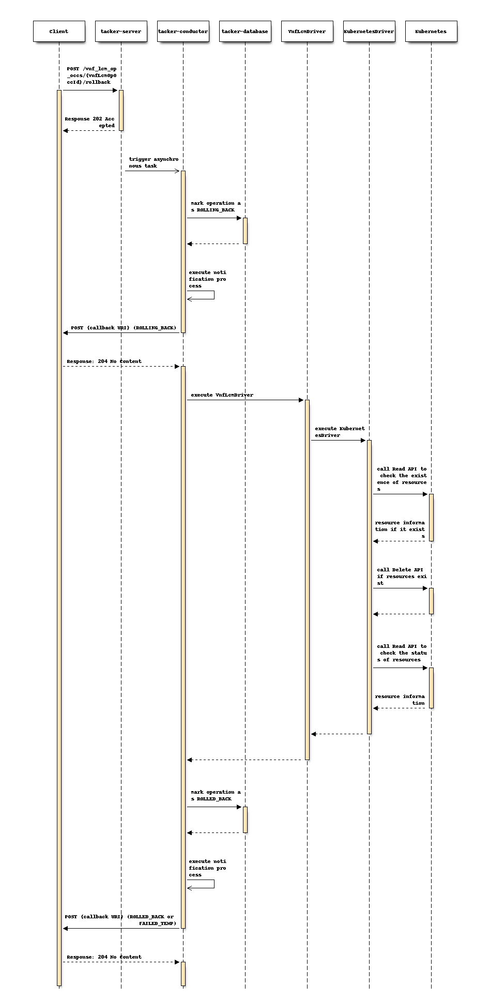
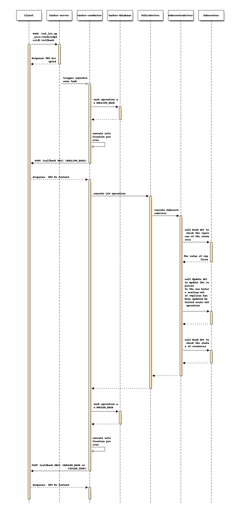

..
 This work is licensed under a Creative Commons Attribution 3.0 Unported
 License.
 http://creativecommons.org/licenses/by/3.0/legalcode

==================================
Support CNF Rollback in v2 LCM API
==================================

.. Blueprints:

https://blueprints.launchpad.net/tacker/+spec/support-nfv-solv3-error-handling

This specification enhances
version 2 (v2) of Rollback API for supporting CNF.

Problem description
===================

Yoga release supported VNF Lifecycle Management (LCM) operations
defined in ETSI NFV SOL002 v3.3.1 [#NFV-SOL002_331]_
and SOL003 v3.3.1 [#NFV-SOL003_331]_.
It also supported CNF Lifecycle Management with v2 APIs
such as Instantiate API, Terminate API, and ChangeCurrentVnfPackage API.

However, v2 Rollback API has not completely supported CNF LCM yet.
Supporting CNF in v2 LCM API makes Tacker more powerful generic VNFM.

Proposed change
===============

This specification enhances the following API to support CNF.

* Rollback VNF Task (POST /vnf_lcm_op_occs/{vnfLcmOpOccId}/rollback)

v2 Rollback for Change Current VNF Package
has already been supported in Yoga release.
Also, Modify VNF Information for CNF
has already supported in v2 LCM API
because there is only common processing with VNF.
Therefore, this specification proposes
supporting v2 CNF Rollback for following APIs.

* Instantiate VNF
* Scale-out VNF

.. note:: Change external VNF connectivity for CNF and its rollback
         are not supported because the related
         standard specification has not been defined by ETSI NFV yet.

Rollback for Instantiation
--------------------------

There is no change from the current implementation except for
InfraDriver (KubernetesDriver) processing.

The procedure consists of the following steps as illustrated in above sequence:

Precondition: VNF lifecycle management operation occurrence is
in "FAILED_TEMP" state.

#. The Client sends a POST request with an empty body to the "Rollback operation"
   resource.
#. VNFM sends endpoints such as Client a VNF lifecycle management operation occurrence
   notification with the "ROLLING_BACK" state to indicate the processing occurrence
   of the lifecycle management operation.
#. VNFM sends Kubernetes a Read request to check the existence of resources.
#. If resources has been created by failed instantiate operation,
   VNFM sends Kubernetes a Delete request to delete the resources.
#. VNFM sends Kubernetes a Read request
   to check whether resources were deleted.
#. On successful rollback, VNFM sends endpoints such as Client
   a VNF lifecycle management operation occurrence notification
   with the "ROLLED_BACK" state to indicate successful completion of the operation.
#. On unsuccessful rollback, VNFM sends endpoints
   such as Client a VNF lifecycle management operation occurrence notification
   with the "FAILED_TEMP" state to indicate
   an intermediate error (rollback failed) of the operation.

Postcondition: The VNF lifecycle management operation occurrence
is in one of the following states: "FAILED_TEMP", "ROLLED_BACK".

KubernetesDriver calls following API to delete resources and check status of them.

+------------------------+----------+-------------------------------------+
| API Group              | Type     | API method                          |
+========================+==========+=====================================+
| ApiregistrationV1Api   | Read     | read_<kind>                         |
|                        +----------+-------------------------------------+
|                        | Delete   | delete_<kind>                       |
+------------------------+----------+-------------------------------------+
| AppsV1Api              | Read     | read_namespaced_<kind>              |
|                        +----------+-------------------------------------+
|                        | Delete   | delete_namespaced_<kind>            |
+------------------------+----------+-------------------------------------+
| AutoscalingV1Api       | Read     | read_namespaced_<kind>              |
|                        +----------+-------------------------------------+
|                        | Delete   | delete_namespaced_<kind>            |
+------------------------+----------+-------------------------------------+
| BatchV1Api             | Read     | read_namespaced_<kind>              |
|                        +----------+-------------------------------------+
|                        | Delete   | delete_namespaced_<kind>            |
+------------------------+----------+-------------------------------------+
| CoordinationV1Api      | Read     | read_namespaced_<kind>              |
|                        +----------+-------------------------------------+
|                        | Delete   | delete_namespaced_<kind>            |
+------------------------+----------+-------------------------------------+
| CoreV1Api              | Read     | read_namespaced_<kind>              |
|                        +----------+-------------------------------------+
|                        | Delete   | delete_namespaced_<kind>            |
|                        +----------+-------------------------------------+
|                        | Read     | read_<kind>                         |
|                        +----------+-------------------------------------+
|                        | Delete   | delete_<kind>                       |
+------------------------+----------+-------------------------------------+
| NetworkingV1Api        | Read     | read_namespaced_<kind>              |
|                        +----------+-------------------------------------+
|                        | Delete   | delete_namespaced_<kind>            |
+------------------------+----------+-------------------------------------+
| RbacAuthorizationV1Api | Read     | read_namespaced_<kind>              |
|                        +----------+-------------------------------------+
|                        | Delete   | delete_namespaced_<kind>            |
|                        +----------+-------------------------------------+
|                        | Read     | read_<kind>                         |
|                        +----------+-------------------------------------+
|                        | Delete   | delete_<kind>                       |
+------------------------+----------+-------------------------------------+
| SchedulingV1Api        | Read     | read_<kind>                         |
|                        +----------+-------------------------------------+
|                        | Delete   | delete_<kind>                       |
+------------------------+----------+-------------------------------------+
| StorageV1Api           | Read     | read_<kind>                         |
|                        +----------+-------------------------------------+
|                        | Delete   | delete_<kind>                       |
+------------------------+----------+-------------------------------------+

The argument of Read API is ``name``.
Also, some APIs additionally require the ``namespace``.

The arguments of Delete API are ``name`` and ``body``.
Also, some APIs additionally require the ``namespace``.
In the case of rollback operation, the body is not set.

Rollback for Scale-out
----------------------

There is no change from the current implementation except for
InfraDriver processing.

The procedure consists of the following steps as illustrated in above sequence:

Precondition: VNF lifecycle management operation occurrence is
in "FAILED_TEMP" state.

#. The Client sends a POST request with an empty body
   to the "Rollback operation" resource.
#. VNFM sends endpoints such as Client
   a VNF lifecycle management operation occurrence notification
   with the "ROLLING_BACK" state to indicate
   the processing occurrence of the lifecycle management operation.
#. VNFM sends Kubernetes a Read request to check the replicas of the resources.
#. If replicas has been updated by failed scale-out operation,
   VNFM sends Kubernetes a Update request to update the replicas
   to the one before scaling-out.
#. VNFM sends Kubernetes a Read request
   to check whether resources were deleted.
#. On successful rollback, VNFM sends endpoints
   such as Client a VNF lifecycle management
   operation occurrence notification with the "ROLLED_BACK" state
   to indicate successful completion of the operation.
#. On unsuccessful rollback, VNFM sends endpoints
   such as Client a VNF lifecycle management
   operation occurrence notification with the "FAILED_TEMP" state
   to indicate an intermediate error (rollback failed) of the operation.

Postcondition: The VNF lifecycle management operation occurrence
is in one of the following states: "FAILED_TEMP", "ROLLED_BACK".

.. note:: v2 VNF Rollback for Scale-out using OpenStack VIM deletes
   added resources by scale-out operation.
   However, v2 CNF Rollback for Scale-out using Kubernetes VIM
   cannot specify deleted VNFC because the order of deletion
   cannot be controlled due to Kubernetes's functionality.
   This is also a constraint for v2 CNF scale-in.

KubernetesDriver calls following API
to get current number of replicas of target resources,
updates the number of replicas, and check status of the resources.

+------------------------+----------+-------------------------------------+
| API Group              | Type     | API method                          |
+========================+==========+=====================================+
| AppsV1Api              | Read     | read_namespaced_<kind>         　　 |
|                        +----------+-------------------------------------+
|                        | Update   | patch_namespaced_<kind>_scale       |
+------------------------+----------+-------------------------------------+

The arguments of Read API are ``name`` and ``namespace``.

The arguments of Update API are ``name``, ``namespace``, and ``body``.
The body is set to be the updated value of "spec.replicas" with the returned
value in Read API.

Data model impact
-----------------

None

REST API impact
---------------

None

Security impact
---------------

None

Notifications impact
--------------------

None

Other end user impact
---------------------

None

Performance Impact
------------------

None

Other deployer impact
---------------------

None

Developer impact
----------------

None

Implementation
==============

Assignee(s)
-----------

Hirofumi Noguchi <hirofumi.noguchi.rs@hco.ntt.co.jp>

Work Items
----------

* Implement KubernetesDriver processes running on Tacker-conductor.
* Add new unit and functional tests.
* Update the Tacker user guide.

Dependencies
============

Tacker SPEC: Support ETSI NFV-SOL_v3 error-handling operation
[#SPEC-NFV-SOL_v3-LCM]_

Testing
========

Unit and functional test cases will be added
for v2 CNF rollback operations using Kubernetes VIM.

Documentation Impact
====================

Description about v2 CNF rollback operations
will be added to the Tacker user guide.

References
==========

.. [#NFV-SOL002_331]
  https://www.etsi.org/deliver/etsi_gs/NFV-SOL/001_099/002/03.03.01_60/gs_nfv-sol002v030301p.pdf
  (Chapter 5: VNF Lifecycle Management interface)
.. [#NFV-SOL003_331]
  https://www.etsi.org/deliver/etsi_gs/NFV-SOL/001_099/003/03.03.01_60/gs_nfv-sol003v030301p.pdf
  (Chapter 5: VNF Lifecycle Management interface)
.. [#SPEC-NFV-SOL_v3-LCM]
  https://specs.openstack.org/openstack/tacker-specs/specs/yoga/support-nfv-solv3-error-handling.html
